# Java基础开篇

## 1.DOS的原理——相对路径与绝对路径：

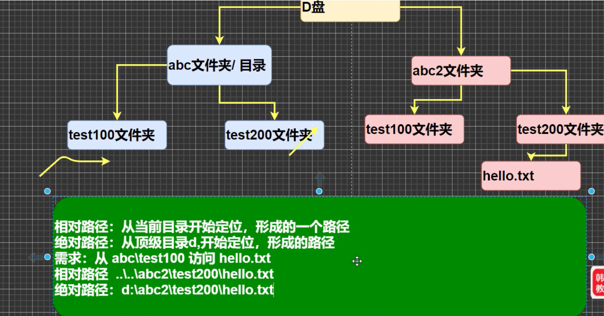

## 2.+的用法

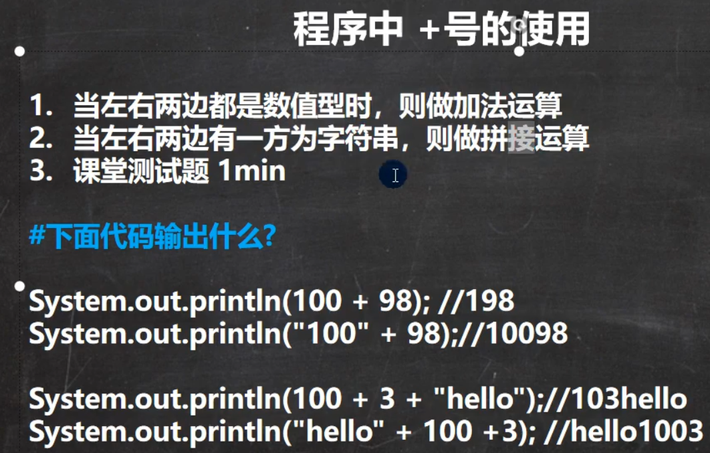

```Java
//注意最后一句
System.out.println("Hello" + 100 + 3);
//按照由左向右的顺序 先做Hello和100的拼接得到Hello100 然后再次拼接成为Hello1003
```


## 3.基本数据类型与运算符

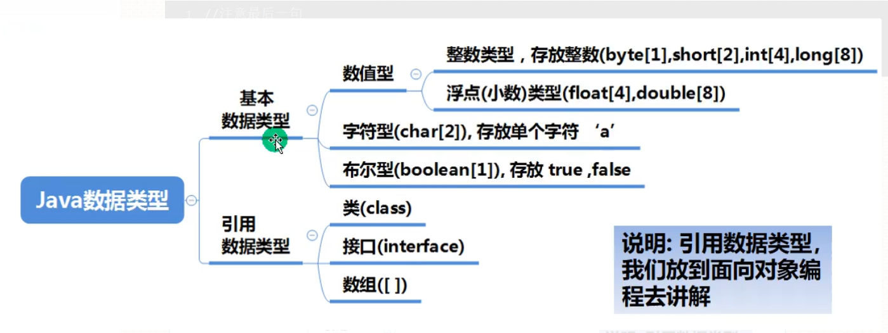

### （1）字符类型

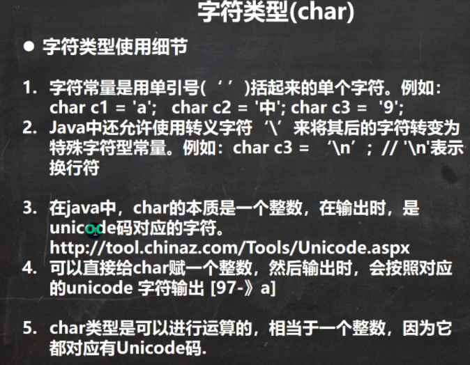

```Java

//char类型难点

public class chardetails{
  
  public static void main(String[] args){
    char c1 = 'a' + 1;//a的ASCII是97
    System.out.println((int)c1);//98
    System.out.println(c1);//b
  } 
}
```


### （2）boolean类型

- 在Java中，boolean型只能存在true与false，不能用0和非0的数来表示。

### （3）基本数据类型自动转换

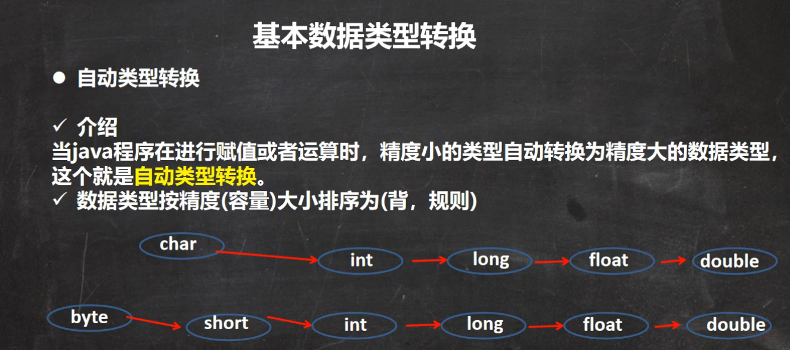

### （4）逻辑运算符&&与&的介绍

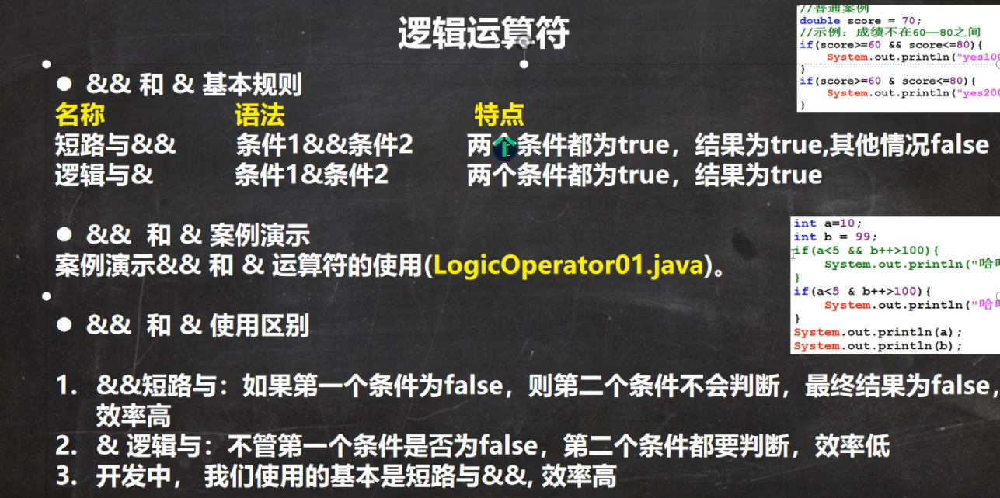

### （5）逻辑运算符||与|的区别

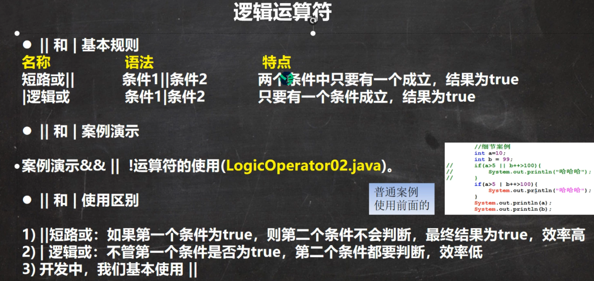

### （6）^逻辑异或

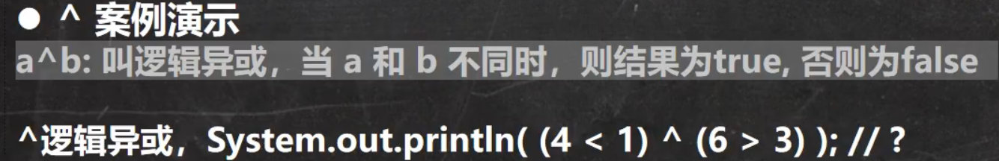

### （7）复合赋值运算符注意事项

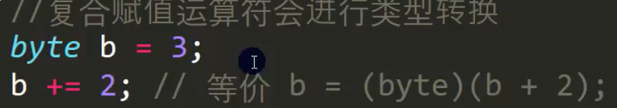

### （8）有关%的用法


## 4.命名规范

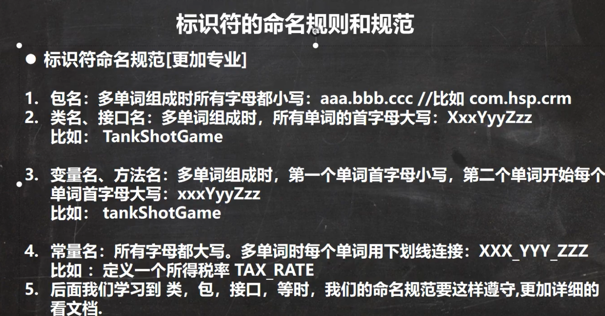

## 5.输入

```Java
//表示把java.until下的Scanner类导入
import java.util.Scanner;
public class Input{

  public static void main(String[] args){
    //步骤如下
    //Scanner类 表示简单文本扫描器 在java.util包
    //1.引入Scanner类所在的包
    //2.创建Scanner对象  ， new 创建一个对象
    Scanner myScanner = new Scanner(System.in);
    System.out.println("输入姓名");
    String name = myScanner.next();
    System.out.println("输入年龄");
    int age = myScanner.nextInt();
    System.out.println("输入成绩");
    double grade = myScanner.nextDouble();

    System.out.println("name："+name+" age:"+age+" grade"+grade);

  }
}
```


## 6.原码反码补码&位运算符

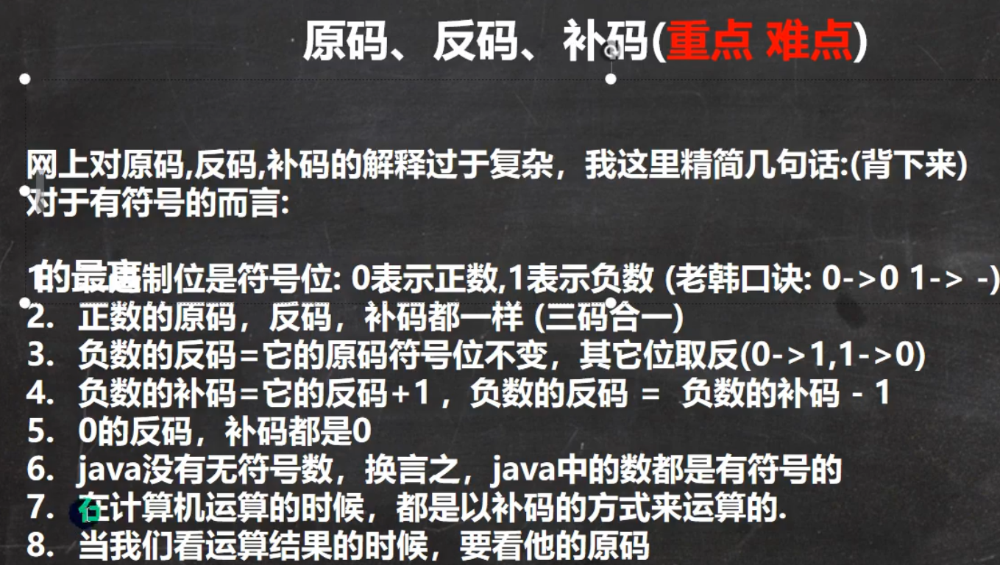


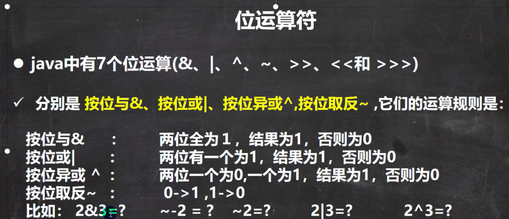

**案例：** 

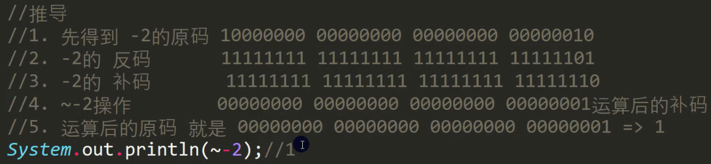

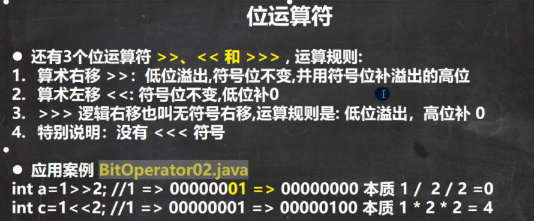


## 7.数组的使用

### （1）数组使用方法——动态初始化与静态初始化

```Java
动态初始化：
int a[] = new int [5]; //创建一个数组 ，名字为a ，存放5个int数据**

//或是：

int a[] ; a = new int [5]; int b[] = new int[]{3 , 3 , 4 , 64};**

//静态初始化：

int[] a = {0 , 2 , 2 , 4 , 3}; // int a[]与int[] a 等价**
```


### （2）数据的输入：

```Java
import java.util.Scanner;
int a[] = new int [5];
Scanner myScanner = new Scanner(System.in);
for(int i=0;i<5;i++){
    a[i]=myScanner.nextInt();
}
```


### （3）数组赋值机制

- 数组在默认条件下为引用传递，赋值为地址，赋值方式是引用赋值

```Java
int array1[] = new int[5];
int array2[];
array2 = array1; //array2会影响到array1
```


### （4）二维数组使用方法——动态初始化

```Java
int a[][] = new int[2][5];
```


或者：

```Java
int a[][]; a = new int[2][5]; // int a[][] 与 int[][] a 与 int[] a[] 等价
```


列数不确定时：

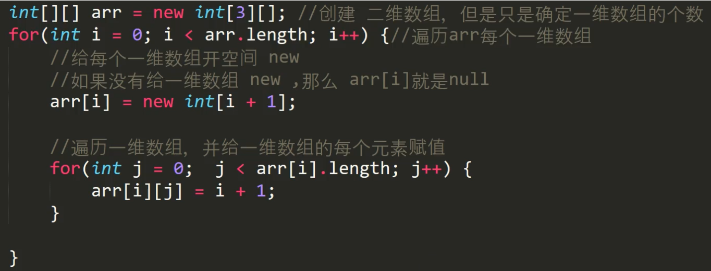

### （5）二维数组存储

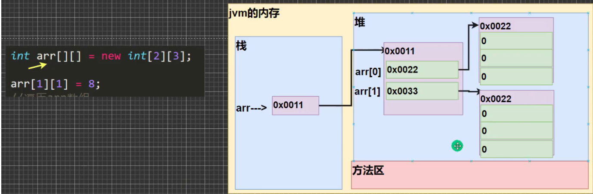

## 9.面向对象——基础部分

### （1）类与对象的创建

```Java
public class CatClass{

  public static void main(String[] args){

    Cat cat1 = new Cat();
    cat1.name = "Kate";
    cat1.age = 3;
    cat1.color = "white";

    System.out.println("cat1.name: "+cat1.name+" cat1.age: "+cat1.age+" cat1.color: "+cat1.color);
  }
}

class Cat{

  String name; //属性 也叫 成员变量 = field 
  int age; //省略了访问修饰符 public static protected private
  String color;
}
```


### （2）对象的存在形式

- **基本数据类型（如cat的age）存放在堆中** 

- **引用数据类型存放在方法区的常量池里 （从 jkd1.7 开始 ， 常量池移到堆中了 而到了 jkd 1.8 又移到方法区而此时方法区改名元空间）** 

### （3）对象的属性

- 对象的属性默认值遵循数组的规则：

|**int** |**0** |
|---|---|
|**short** |**0** |
|**long** |**0** |
|**float** |**0** |
|**double** |**0** |
|**char** |**\u000** |
|**boolean** |**false** |
|**String** |**null** |


### （4）类与对象的内存分配机制

**1）先加载Person类信息（属性和方法信息，只加载一次）；** 

**2）在堆中分配空间，进行默认初始化** 

**3）把地址赋给p，p指向对象** 

**4）进行初始化** 

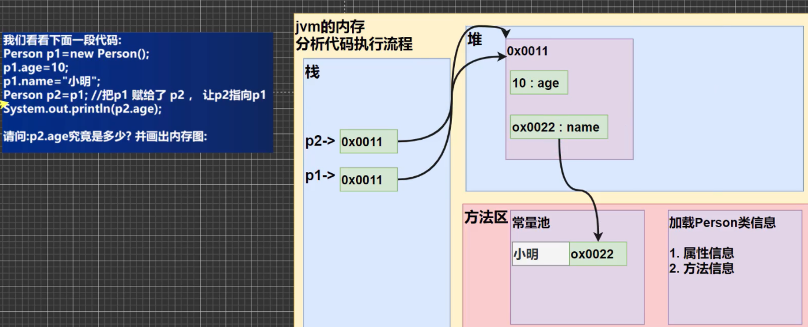

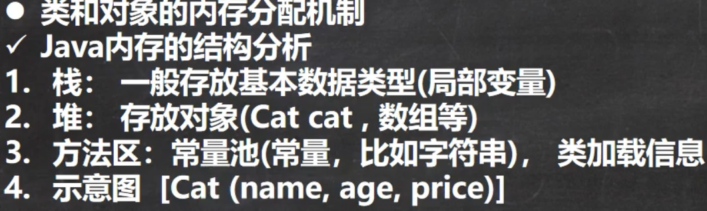

## 10.成员方法——简称方法

### （1）方法快速入门

- 类似于C++的成员函数——能够完成一定的任务

### （2）方法调用机制

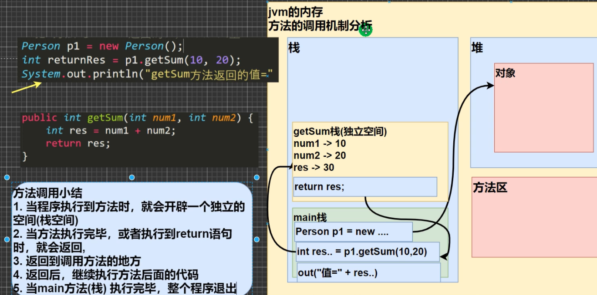

### （3）方法名规范

- **采用驼峰命名法**  **如 getSum** 

### （4）方法的调用

- 同一个类中方法调用，不必创建对象，直接调用即可

```Java
class A{
    public void Show(){
        System.out.println("This is a method called Show");    
    }
    
    Show(); //直接调用
}
```


- 跨类时，如在类B中调用类A的方法，需要通过对象名调用，即先创建类A后调用方法

```Java
class A{
    public void Show(){
        System.out.println("This is a method called Show");    
    }
}

class B{
    A a = new A(); 
    a.Show();  //先创建类A后调用方法
}
```


### （5）方法传参机制（重点）

[韩老师讲解方法传参机制](https://www.bilibili.com/video/BV1fh411y7R8?p=213)

## 11.方法的递归调用

### （1）方法的递归调用机制

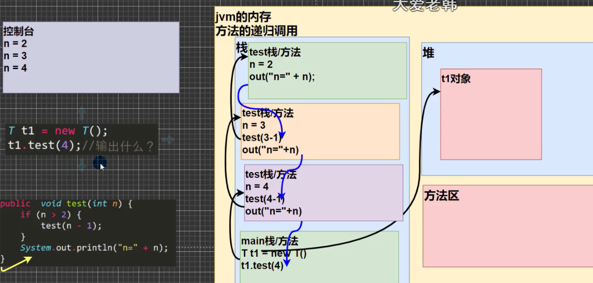

### （2）方法递归的细节

- 递归必须向退出递归的条件逼近，否则就是无限递归，会出现Stack OverflowError;

- 如果方法中的是引用变量类型（如数组 ，对象），则会共享该引用类型的数据；

- 当一个方法执行完毕，或者遇到return就会返回，遵循谁调用，就将结果返回给谁，同时当方法执行完毕或返回时，该方法也就执行完毕。

### (3）递归难点应用

汉诺塔问题：

```Java
import java.util.Scanner;
public class HanoiTower{

    static int times = 0;
public static void main(String[] args){

    char c1 = 'A';
    char c2 = 'B';
    char c3 = 'C';

    System.out.print("输入一个数：");
    Scanner myScanner = new Scanner(System.in);
    int num = myScanner.nextInt();

    System.out.println("执行过程如下：");
    hanoi(num,c1,c2,c3);


}
  
public static void hanoi(int num , char a , char b , char c){
    //表示共 num 个盘子 ，从a柱，借助b柱，转移至c柱
    if(num == 1){        
      move(1,a,c);      //此时即最上面一个盘直接从a->c
    }else{
      hanoi(num-1 ,a,c,b); //先把上面num-1个盘子由a借助c转到b
      move(num,a,c);       //打印移动的方法
      hanoi(num-1,b,a,c);    //再将num-1个盘子从b借助a转到c
    }
}

  public static void move(int n , char from , char to){
    System.out.println("Step "+ (++times) + " " + from + "->" + to);
  }
}

```


## 12.重载

### （1）细节问题

- **方法名必须相同** 

- **形参列表必须不同（形参类型或个数或顺序，至少一个不同，参数名无要求）** 

- **返回类型无要求** 

### （2）可变参数

- **Java允许将同一个类中多个同名同功能的但参数个数不同的方法，封装成一个方法，可通过可变参数来实现。** 

```Java
class SumMethod(){
    
    public int Sum(int n1){
        return n1;    
    }
    
    public int Sum(int n1,int n2,int n3){
        return n1+n2;    
    }
    
    public int Sum(int n1,int n2,int n3){
        return n1+n2+n3;    
    }

    //以上方法均是负责几个int的求和->使用可变参数优化
    
    public int Sum(int... nums){           //1.int...表示的是可变参数，类型是int
      int res = 0;                    //2.使用可变参数时，可把nums当做数组使用
      for(int i=0;i<nums.length;i++){
        res += nums[i];
      }
      return res;
    }      
}
```


### （3）可变参数细节：

- **可变参数个数可以为0个与任意多个** 

- **可变参数可以是数组** 

- **可变参数本质时数组** 

- **可变参数可与普通参数一起传入，但可变参数放在最后** 

- **一个形参列表中，可变参数只能有一个** 

## 13.作用域——全局变量（属性）与局部变量

- **局部变量通常是指在成员方法中定义的变量** 

- **全局变量（属性），作用域为整个类体** 

- **局部变量，也就是除了属性外的变量，作用域存在于其所处的代码块** 

- **全局变量可以不赋值直接使用（有初始值，规则见10.（3）），局部变量必须赋值才可使用** 

- **全局变量和局部变量可以重名，访问时遵循就近访问** 

- **全局变量可被其他类使用（通过对象引用）** 

- **全局变量可加修饰符（public private... ...），而局部变量不行** 

## 14.构造方法/构造器 constructor

&ensp;&ensp;&ensp;&ensp;——完成对象的初始化

### （1）基本语法

```纯文本
[修饰符] 方法名 (形参列表){ //方法体; }
```


- **修饰符可以默认** 

- **没有返回值，也不能写void** 

- **方法名必须和类名一致** 

- **构造器的调用系统完成** 

### （2）细节问题

- 可以有多个构造器，即构造器的重载

- 若没有定义构造器，系统会自动给类生成一个默认无参构造**器** 

- 一但定义了构造器，**默认构造器就会被覆盖** **，** 就不能再用无参构造器，除非显式再定义一下无参构造器

```Java
public class Constuctor{
    
    public static void main(String[] args){
        People p1 = new People(); //采用无参构造器
        People p2 = new People("Scott",19);//采用含参数的构造器                
    }        
}
class People{
  String name;
  int age;

  public People(){
      name = "NULL";
      age = 0;    
  }

  public People(String name_,age_){
            name = name_;
          age = age_;
  }
}
```


### (3)创建对象的过程

```Java
class People{
  String name;
  int age = 10;

  public People(String name_,age_){
            name = name_;
          age = age_;
  }
}
Person p = new Person("Jack",20);
```


分析：

1) 加载Person类信息，只会加载一次

2) 在堆中分配空间（地址）

3) 完成对象初始化 [3.1默认初始化 age=0 name=null 3.2显式初始化age=10 name=null 3.3构造器的初始化age=20 name=Jack]

4) 在对象在堆中的地址，返回给p（p是对象名，也可以理解成是对象的引用）

## 15.this关键字

### （1）引出

```Java
class People{
  String name;
  int age;

  public People(String name,age){  //当形参与属性名相同时
     name = name;      //根据变量的作用域，在构造器中 name 和 age均是局部变量
     age = age;     //此时左右两边的name均为局部变量
  }               //进而10行中 初始化不能成功完成 所以属性 name = null age = 0
}
Person p = new Person("Jack",20);
```


用 this 解决

```Java
class People{
  String name;
  int age;

  public People(String name,age){  
     this.name = name;   //this 表示当前对象
     this.age = age;    
  }  
}
Person p = new Person("Jack",20);
```


### （2）对 this 的理解

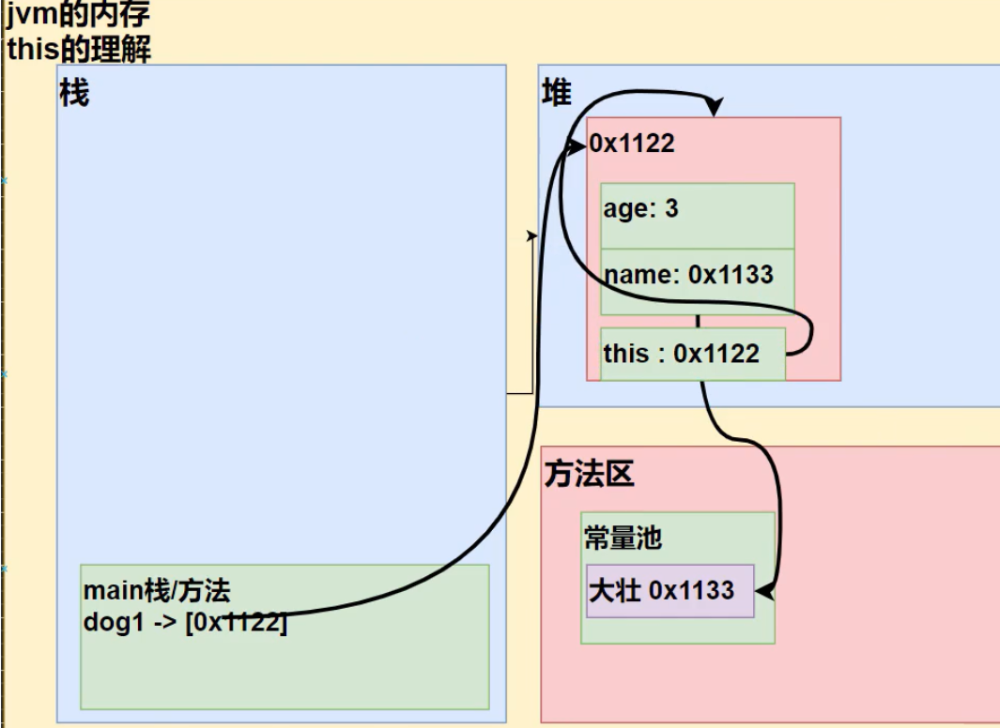

**注：** this.hashcode（）可简单视为当前对象的“地址”，但是由于Java是在虚拟机上运行，所以是不能写出地址的，

      hashcode（）会针对不同的对象返回不同的整数，这通常通过将对象的内部地址转换为整数来实现。

- 此处我们可以用hashcode（）来理解 this 指向的对象与当前对象的关系 —— 同一地址

简单小结：哪个对象调用，this就代表哪个对象

### （3）this 使用细节

- this 关键字可以用来访问本类的属性、方法、构造器

- this 用于区分当前类的属性和局部变量

- 访问成员方法的语法： this.方法名（参数列表）

- 访问构造器语法： this（参数列表）

**注意只能在构造器中使用** （即只能在构造器中访问另外一个构造器，必须放在第一条语句）

- this不能在类定义的外部使用，只能在类定义的方法中使用。


