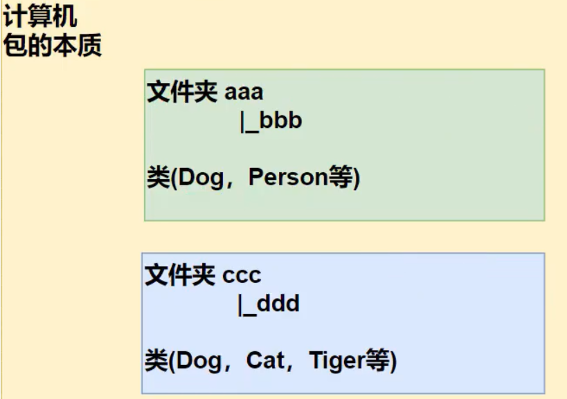
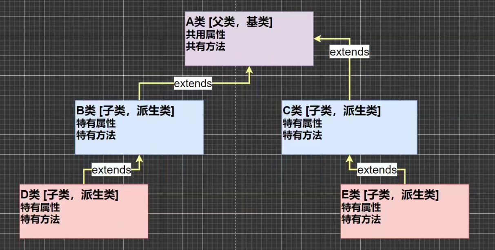
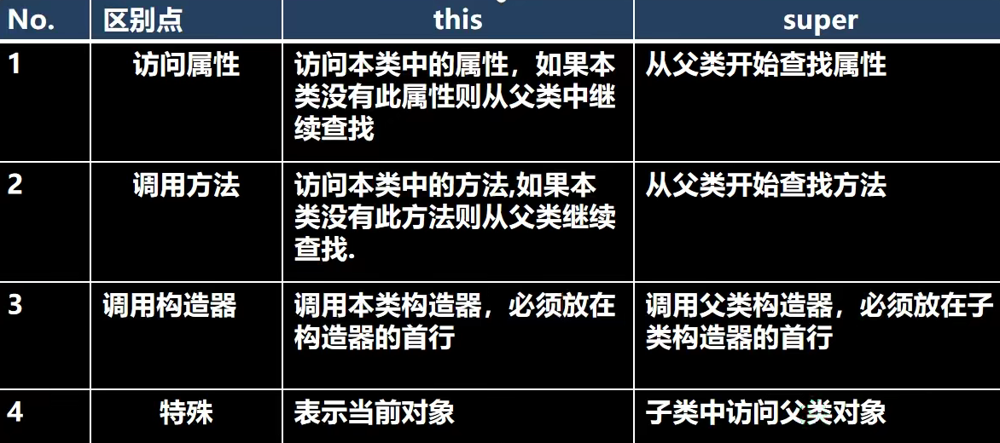
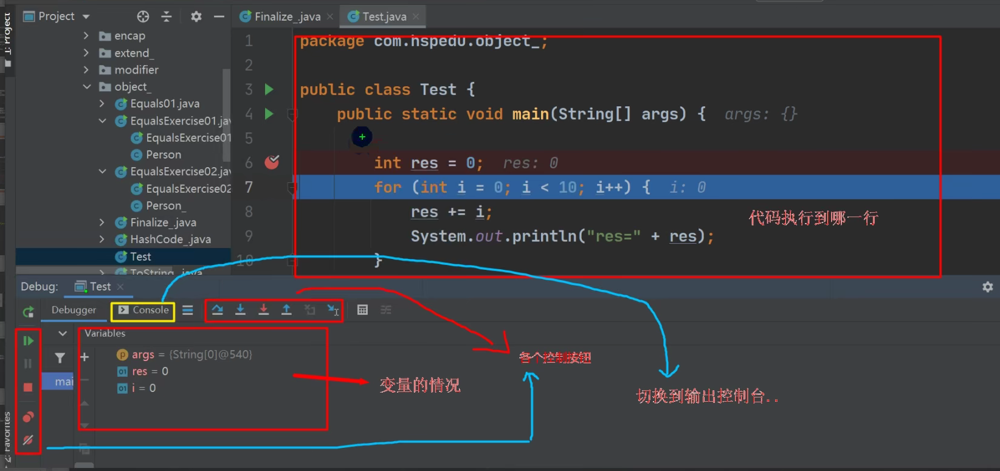
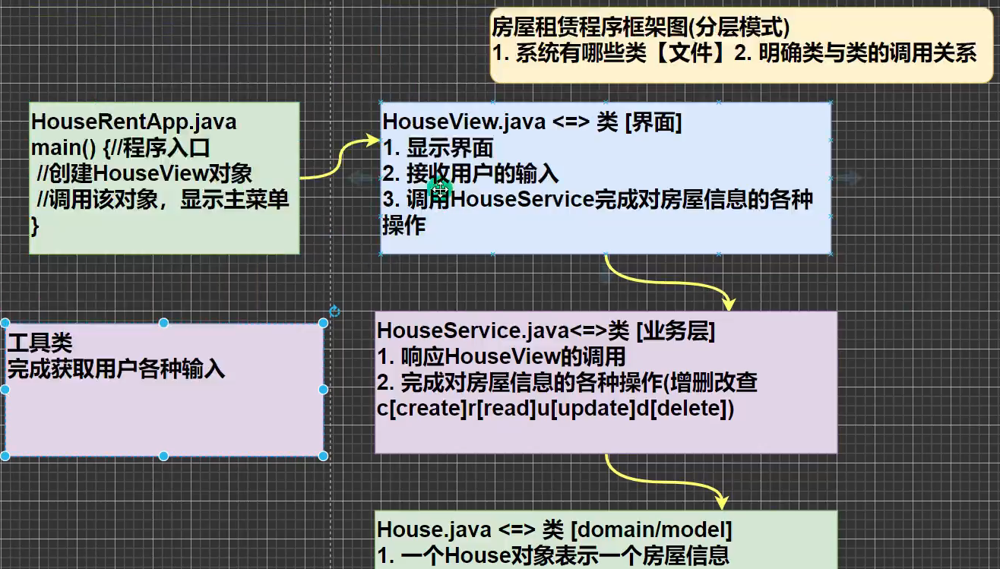

# Java基础与面向对象编程（中级篇）


# 1.IDEA的使用

## （1）常用快捷键（存在自我修改后的键）

- 删除当前行 Ctrl + D

- 复制当前行 Ctrl + Alt + ↓

- 添加/取消注释 Ctrl + /

- 补全代码 Alt + /

- 导入改行需要的类 Alt + Enter

- 快速格式化代码 Ctrl + Alt + L

- 查看类的继承关系 先把光标移到类名处然后 Ctrl + H

- 生成构造器 Alt + Insert

- 快速定位方法所在类 Ctrl + B

- 自动分配变量名 在后面加.var 回车

- **模板快捷键**  如 

```Java
fori ：   一个for循环语句
```


```Java
souf：    System.out.printf（"END");
```


```Java
sout：    System.out.println("END");
```


# 2.包

## （1）简单介绍

作用：

- 区分相同名字的类

- 类很多时，可以很好管理类

- 控制访问范围

基本语法：

package com.tommy    package是关键字（打包） com.tommy是包名

包的本质：创建不同文件夹，来保存类文件。



## （2）具体使用

- 在project里面的src目录下创建一个package，在不同的package里面可以定义同名的类

- 例如 分别在com目录下的DogA和DogB目录里添加Dog类后，在另一个名叫Test的类中调用

```Java
import com.DogA.Dog;
//import com.DogB.Dog; 不可再次导入DogB的Dog

public class Test{
    public static void main(String[] args){
        Dog dog = new Dog();//导入了包，所以这样写
        com.DogB.Dog dog1 = new com.DogB.Dog();//没导入相应的包，需完整写出            
    }
}
```


## （3）命名规则与规范

规则：只能包含数字、字母、下划线、小圆点，而且不可用数字开头，不能是关键字或保留字

规范：一般是小写字母+小圆点 com.公司名.项目名.业务模块

## （4）常用的包

java.lang : lang包是基本包，默认引入了

java.util :  util包，系统提供的工具包，含有如Scanner类

[java.net](http://java.net) :  网络包，负责网络开发

java.awt : 做Java的界面开发，GUI

## （5）包的使用细节

1）包的引用方式

```Java
import java.util.Scanner //表示只会引入java.util包下的Scanner
import java.util.* //表示会引入java.util包下的所有类
```


**建议** ：通常只导入需要的类，而不用第二种方法

2）包的使用注意事项和细节

- package作用是声明当前类的所在包，需要放在类的最上面，一个类中最多只有一个package

- import指令放在package语句下，类定义之前，可以有多句，且没有顺序要求

```Java
package com.tommychan.p1; //package作用是声明当前类的所在包，需要放在类的最上面，
import java.util.Arrays;  //一个类中最多只有一个package
                      //import指令放在package语句下，类定义之前，可以有多句，且没有顺序要求
public class import1 {
    public static void main(String[] args) {
        int[] arr = {4,64,23,2,44,2};
        Arrays.sort(arr);//排序方法

        for (int i = 0; i < arr.length; i++) {
            System.out.printf(arr[i]+" ");
        }
    }
}
```


```Java
Output ：2 2 4 23 44 64
```


# 3.访问修饰符

## （1）访问范围

|访问级别|访问修饰符|同类|同包|子类|不同包|
|---|---|---|---|---|---|
|公开|public|可|可|可|可|
|受保护|protected|可|可|可|不可|
|默认|无修饰符|可|可|不可|不可|
|私有|private|可|不可|不可|不可|


## （2）使用的注意事项

- 修饰符可以先用来修饰类中的属性，成员方法以及类

- **只有默认和public才可修饰类** ，需遵循以上访问范围

- 成员方法的访问与属性一致

# 4.封装

## （1）基本介绍

**概念：** 封装就是把抽象出的数据［属性］和对数据的操作［方法］封装在一起，数据被保护在内部，程序的其它部分只有通过被授权的操作［方法］，才能对数据进行操作。

**好处：** 

- 隐藏实现细节

- 可以对数据进行验证，保证安全

## （2）实现过程

1）将属性私有化

2）提供一个公共的set方法，用于对属性进行判断并赋值

```Java
public void setXXX(类型 参数名){ //加入数据验证的业务逻辑 属性 = 参数名; }
```


3)提供一个公共的get方法，用于获取属性的值

```Java
public void getXXX(){ return xx; }
```


## （3）构造器与封装

**为了保证构造器不会破坏属性判断机制，则通常在构造器中写入set方法** 

# 5.继承

## （1）关系图解



1）子类会自动拥有父类定义的属性和方法

2）父类又叫超类，基类

3）子类又叫派生类

## （2）基本语法

```Java
class 子类 extends 父类{
    //...
}
```


## （3）继承使用细节

1）子类继承了所有的属性和方法，但是私有属性和方法不能在子类直接访问，可通过父类提供的公共的方法访问

2）子类必须调用父类的构造器，完成父类的初始化 super（) ; 这句代码来调用父类的无参构造器，通常系统会自己生成

3）当创建子类对象时，不管使用子类的哪个构造器，默认情况下总会去调用父类的无参构造器

4）如果父类没有提供无参构造器，则必须在子类的构造器中用 super（参数列表) ; 去指定使用父类的哪个构造器完成对父类的初始化工作，否则编译不会通过

5）如果希望指定去调用父类的某个构造器，则显式的调用一下：super（参数列表) ;

6）super（参数列表) ;  在使用时，**必须放在构造器第一行** 

7）super（参数列表) ;  和 this() ; （this（）用于访问本类的构造方法）都只能放在构造器第一行，**因此这两个方法不能共存在一个构造器** 

8）object类是所有类的基类

9）子类最多只能有一个父类（指直接继承），即Java中是单继承机制

10）不能滥用继承，子类父类需要满足is-a的逻辑关系

- Music extends Person 错误

- Cat extends Animal 正确

## （4）继承的本质


 

```Java
public class ExtendsTheory{
    public static void main(String[] args){
        Son son = new Son();
        System.out.println(son.name);    //输出的是Son类的name 即 大头儿子
        System.out.println(son.age);     //输出的是Father类的age 即 39
        System.out.println(son.hobby);   //输出的是GrandPa类的hobby 即 旅游
    }
}
```


**查找关系：** 

1) 首先看子类是否有该属性

2) 如果子类有这个属性，并且可以访问，则返回信息

3) 如果子类没有这个属性，就看父类有没有这个属性(如果父类有该属性，并且可以访问，就返回信息..)

4) 如果父类没有就按照(3)的规则，继续找上级父类，直到0bject...

# 6.super关键字

## （1）基本介绍

介绍：super表示对父类的引用，用于访问父类的属性、方法、构造器

基本语法：

- 可以访问父类的属性、方法，但**不能访问私有的属性、方法** 

- 用法

```Java
super.age;        //**访问属性** 
super.getAge();   //**访问方法** 
super();          //**访问父类无参构造器** 
super(参数);       //**访问父类有参构造器** 
```


## （2）**使用细节：** 

- 调用父类构造器来实现构造器复用，即子类所继承的父类属性由父类的构造器初始化

- 当子类中有和父类中的成员（属性和方法）重名时，为了访问父类的成员，必须通过super.如果没有重名，使用super， this、直接访问是一样的效果！**（演示如下）** 

- 在查找过程中找到了但是无法访问，则会报错

- super不限于直接父类，如果直接上级类与本类也有同名的成员（方法或属性），也可以使用super去访问上级类的同名成员，同样遵循“就近原则”，遵循访问权限规则


```Java
class A{
    //...
    **publi** c void test(){
    //...
    }
    
}

class B extends A{
    //...
    test();//按照**查找规则** 进行查找
    this.test();//**与上述一致 ** 
    super.test();//**直接查找父类  即  this 是针对本类  super 是针对父类** 
}
```


## （3）super与this




## （4）instanceof

> instanceof是Java的一个保留关键字，左边是对象，右边是类，返回类型是Boolean类型。它的具体作用是测试左边的对象**是否是右边类或者该类的子类创建的实例对象** ，是，则返回true，否则返回false。


# 7.方法重写/覆盖

## （1）快速入门

**简单概念：** 方法覆盖（重写）就是子类有一个方法，和父类的某个方法的**名称、返回类型（有(2)所述特殊要求）、参数** 一样，那么我们就说子类的这个方法覆盖了父类的方法

## （2）注意事项及细节

- 子类的方法的参数，方法名称，要和父类方法的**参数，方法** 名称完全一样。

- **子类方法的返回类型和父类方法返回类型一样，** **或者是父类返回类型的子类** 

```Java
public Object getInfo(){ } //比如 父类 返回类型是Object，
public String getInfo(){ } //    子类方法返回类型是String
```


- 子类方法不能缩小父类方法的访问权限——public > protected > 默认 > private

```Java
public void Show() {...}; //父类
void Show() {...}; //子类              **此时缩小了访问权限，故不可构成重写** 
```


# 8.多态 polymorphic

## （1）基本介绍

概念：方法或对象具有多种形态，是面向对象的第三大特征，多态是建立在封装和继承基础之上的

## （2）在方法中的具体体现

- **方法的重载体现多态** 

```Java
public int sum(int a.int b) { return a+b;}
public int sum(int a.int b,int c) { return a+b+c;} //传入不同参数调用不同方法

```


- **方法的重写体现多态** 

```Java
class A{
  public int show() { System.out.println("A is called");}
}

class B extends A{
  public int show() { System.out.println("B is called");}
}

//main方法中

A a = new A();
B b = new B();

a.show();
b.show();
```


## （3）在对象中的体现

- 一个对象的编译类型和运行类型可以不一致

- 编译类型在定义对象时就**确定** 了，不能改变

- 运行类型是**可以变化** 的

- 编译类型看定义时＝号的左边，运行类型看＝号的右边

```Java
class Animal{ }
class Dog extends Animal{  }
class Cat extends Animal{  }

Animal ani = new Dog();  //编译类型是Animal 运行类型是Dog
ani = new Cat();         //编译类型不变 运行类型变成Cat

```


## （4）注意事项与细节

多态的前提**：**  两个对象（类）中间存在继承关系

多态的向上转型：

1）本质：父类的引用指向了子类的对象

2）语法：**父类类型 引用名 = new 子类类型（）** 

3）特点：编译类型看左边，运行类型看右边。可以调用父类中的所有成员（需遵守访问权限），**不能调用子类中特有成员** ；最终运行效果看子类的具体实现！

多态的向下转型：

1）语法：**子类类型 引用名= （子类类型）父类引用；** 
2）只能强转父类的引用，不能强转父类的对象
3）要求父类的引用必须指向的是当前目标类型的对象
4）当向下转型后，**可以调用子类类型中所有的成员（也就包含了特有成员）** 

属性：

- 属性没有重写的说法，属性的值看**编译类型** 

```Java
class Base{ int n = 10; }
class Sub extends Base{ int n = 20;}
//主方法中：
Base base = new Sub();
System.out.println("n="+base.n);  输出的是 n=10;
```


instanceof：

比较操作符，用于判断对象的**运行类型**  是否是XX类型 或 XX类型的子类型

```Java
class A{  }
class B extends A{ }
//main 方法中：

A a = new B();
System.out.print(a instanceof B); //true
System.out.print(a instanceof A); //true

```


## （5）动态绑定机制 📌

- 当调用对象方法的时候，该方法会和该对象的*内存地址／运行类型*  绑定

- 当调用对象属性时，没有动态绑定机制，哪里声明，那里使用

- 举例案例：

[https://www.bilibili.com/video/BV1fh411y7R8?p=315&spm_id_from=pageDriver](https://www.bilibili.com/video/BV1fh411y7R8?p=315&spm_id_from=pageDriver)


## （6）多态数组

定义**：** 数组的定义类型是父类类型，里面保存的实际元素是子类类型

使用案例：在Person类数组中存入Student和Teacher类，并分别调用其特有方法（用到向下转型）

```Java
package com.tommylearning.PloyArray;

public class Person {
    private String name;
    private int age;

    public Person(String name, int age) {
        this.name = name;
        this.age = age;
    }

    public String getName() {
        return name;
    }

    public int getAge() {
        return age;
    }

    public String say(){
        return "Name:"+name+" Age:"+age;
    }
}

public class Student extends Person {
    private double score;
    private String grade;

    public Student(String name, int age, double score,String grade) {
        super(name, age);
        this.score = score;
        this.grade = grade;
    }

    public String say(){
        return "Student "+super.say()+" Score:"+score;
    }

    public void showGrade() {
        System.out.println(" Grade:" + grade);
    }
}


public class Teacher extends Person {
    private int salary;
    private String course;

    public Teacher(String name, int age, int salary,String course) {
        super(name, age);
        this.salary = salary;
        this.course = course;
    }

    public String say(){
        return "Teacher "+super.say()+" Salary:"+salary;
    }

    public void showCourse(){
        System.out.println(" Teach:"+course);
    }
}

```


```Java
package com.tommylearning.PloyArray;

public class PloyArray {
    public static void main(String[] args) {

        Person[] person = new Person[5];
        person[0] = new Person("Jack",18);
        person[1] = new Student("Mike",19,99.5,"Mid1");
        person[2] = new Student("Kate",19,89.5,"Mid2");
        person[3] = new Teacher("Tomson",29,9000,"Math");
        person[4] = new Teacher("David",56,12000,"PE");

        for (int i = 0; i < 5; i++) {

            if(person[i] instanceof Student){
                System.out.print(person[i].say());
                Student stu = (Student) person[i];
                stu.showGrade();
            }else if(person[i] instanceof Teacher){
                System.out.print(person[i].say());
                Teacher teacher = (Teacher) person[i];
                teacher.showCourse();
            }else{
                System.out.println(person[i].say());
            }

        }
    }
}

```


## （7）多态参数

定义：方法定义的形参类型为父类类型，实参类型允许为子类类型 (实质是多态的向上传递)

实例**：** 代码见Project ChapterMiddle.src......polyParameter

定义员工类Employee，包含姓名和月工资［private］，以及计算年工资getAnnual 的方法。普通员工和经理继承了员工，经理类多了奖金bonus属性和管理manage方法，普通员工类多了work方法，普通员工和经理类要求分别写getAnnual方法
测试类中添加一个方法showEmpAnnal（Employee e），实现获取任何员工对象的年工资，并在main方法中调用该方法［e.getAnnual（）］
测试类中添加一个方法，testWork，如果是普通员工，则调用work方法，如果是经理，则调用manage方法


```Java
package com.tommylearning.ployParameter;

public class Worker extends Employee{
    public Worker(String name, int salary) {
        super(name, salary);
    }

    public void work(){
        System.out.println(getName()+" is working");
    }

    public int getAnnual(){
        return super.getAnnual();
    }
}

```


```Java
package com.tommylearning.ployParameter;

public class Manager extends Employee{
    private int bonus;

    public Manager(String name, int salary, int bonus) {
        super(name, salary);
        this.bonus = bonus;
    }

    public void manage(){
        System.out.println(getName()+" is a Manager");
    }

    @Override
    public int getAnnual() {
        return super.getAnnual()+bonus;
    }
}

```


```Java
package com.tommylearning.ployParameter;

public class Employee {
    private String name;
    private int salary;

    public Employee(String name, int salary) {
        this.name = name;
        this.salary = salary;
    }

    public int getAnnual() {
        return salary*12;
    }

    public String getName() {
        return name;
    }
}

```


```Java
package com.tommylearning.ployParameter;

public class Test {
    public static void main(String[] args) {
        Worker worker = new Worker("Tom",2000);
        Manager manager = new Manager("Daison",18000,100000);
        Test test = new Test();
        test.ShowEmpAnnual(worker);
        test.ShowEmpAnnual(manager);
        System.out.println("==============");
        test.testWorker(worker);
        test.testWorker(manager);
    }

    public void ShowEmpAnnual(Employee employee){
        System.out.println("Name:"+employee.getName()+" Annual:"+employee.getAnnual());
    }

    public void testWorker(Employee employee){
        if(employee instanceof Worker){
            Worker worker = (Worker) employee;
            worker.work();
        }else{
            Manager manager = (Manager) employee;
            manager.manage();
        }
    }
}

```


# 9.Object类详解

## （1）equals方法

- **equals和 == 的区别** 

1） == 既可以判断基本类型，又可以判断引用类型

2） == 如果判断基本类型，判断的是值是否相等。示例： int i=10； double d=10.0；

3） == **如果判断引用类型，判断的是地址是否相等，即判定是不是同一个对象** 【案例说明】

```Java
class B{}
class A extends B{}

//in main

A a = new A();
A b = new A();
B objB = new A();

System.out.println(a == b); //true
System.out.println(objB == b); //true
```


4)  equals ：是Object类中的方法，只能判断引用类型 (如何看Jdk源码 选中方法名，Ctrl+B）

5)  默认判断的是地址是否相等，子类中往往重写该方法，用于判断内容是否相等, 比如Integer，String


**JDK源代码**    Object类的equals方法

```Java
public boolean equals(Object obj) {
        return (this == obj);
}
```


## （2）重写equals方法

应用实例：判断两个Person对象的内容是否相等，如果两个Person对象的各个属性值都一样,则返回true,反之false
class Person{

private String name; private int age; private char gender; 

}
代码测试详细见：Project ChapterMiddle.src......equalsRewrite

```Java
package com.tommylearning.equalsRewrite;

public class Person {
    private String name;
    private char gender;
    private int age;

    public boolean equals(Object obj){
        if(this == obj){ **//如果所比较的俩对象是同一对象 则直接返回true** 
            return true;
        }
        if(this instanceof Object){
            Person p = (Person) obj; **//向下转型 访问Person类特有属性** 
            if(this.age==p.age&&this.gender==p.gender&&this.name==p.name){
                return true;
            }
        }
        return false;
    }

    public Person(String name, char gender, int age) {
        this.name = name;
        this.gender = gender;
        this.age = age;
    }
}
```


## （3）hashCode方法浅析

hashCode小结：

1）提高具有哈希结构的容器的效率！
2）两个引用，如果指向的是同一个对象，则哈希值肯定是一样的！
3）两个引用，如果指向的是不同对象，则哈希值是不一样的
4）哈希值主要根据地址号来的！，不能完全将哈希值等价于地址。
5）后面在集合，中hashCode 如果需要的话，也会重写**（见hashCode详解）** 


## （4）toString方法

object的toString 源码


```Java
public String toString() {
        return getClass().getName() + "@" + Integer.toHexString(hashCode());
}

//(1) getClass().getName() 类的全类名（包名+类名）
//(2) Integer.toHexString(hashCode()) 将对象的hashCode转换成16进制字符串
```


重写toString方法

- 打印对象或拼接对象时，都会自动调用该对象的toString形式

- 当直接输出一个对象时， toString方法会被默认的调用


```Java
package com.tommylearning.toStringLearning;

public class test {
    public static void main(String[] args) {
        Worker worker = new Worker("Jack","Cleaner");
        System.out.println(worker.toString());
        System.out.println(worker);** ** 
        **//当直接输出一个对象时， toString方法会被默认的调用** **
    }** 
}

class Worker{
    private String name;
    private String job;

    @Override **//alt+insert 默认重写生成的toString（），一般是把对象的属性值输出 也可自己定制** 
    public String toString() {
        return "Worker{" +
                "name='" + name + '\'' +
                ", job='" + job + '\'' +
                '}';
    }

    public Worker(String name, String job) {
        this.name = name;
        this.job = job;
    }
}
```


**Output：** 

```Java
Worker{name='Jack', job='Cleaner'}
Worker{name='Jack', job='Cleaner'}
```


## （5）finalize方法

开发中几乎不会运用，但是面试中可能问到

- 当对象被回收时，系统自动调用该对象的finalize方法。子类可以重写该方法，做一些释放资源的操作

- 什么时候被回收：当某个对象没有任何引用时，则jvm就认为这个对象是一个垃圾对象，就会使用垃圾回收机制来销毁该对象，在销毁该对象前，会先调用finalize方法

- 垃圾回收机制的调用，是由系统来决定（），也可以通过System.gc( ) 主动触发垃圾回收机制


# 10.断点调试

## （1）基本介绍

重要提示：在断点调试过程中，是运行状态，是以对象的运行类型来执行的

介绍：

- 断点调试是指在程序的某一行设置一个断点，调试时，程序运行到这一行就会停住，然后你可以一步一步往下调试，调试过程中可以看各个变量当前的值，出错的话，调试到出错的代码行即显示错误，停下。进行分析从而找到这个Bug

- 断点调试是程序员必须掌握的技能

- 断点调试也能帮助我们查看java底层源代码的执行过程，提高程序员的Java水平

快捷键及工作区域 :

F7（跳入）：跳入方法内

F8（跳过）: 逐行执行代码

shift＋F8（跳出）：跳出方法

F9（resume，执行到下一个断点）





Debug追JDK码：

- 强制进入方法（force step into） shift + alt + F7  （不推荐）

- 经过设置可以用step into进入

Debug跳出JDK码：

- step out 即F8

Debug跳入下一个断点处：

- Resume Program F9

# 11.房屋出租系统

## （1）程序框架图



