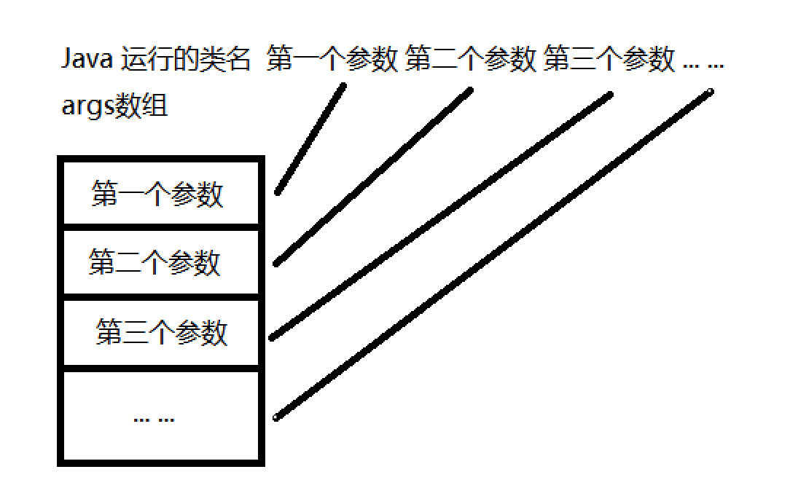
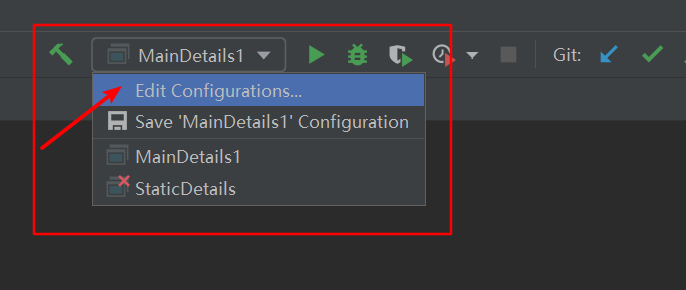
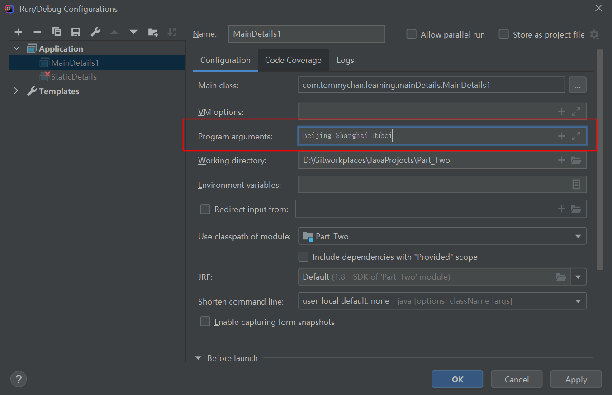

# Java基础与面向对象编程（高级篇）

# 1.类变量 (静态变量)

## （1）基本介绍

概念**：** 类变量也叫静态变量/静态属性，是该类的所有对象共享的变量，任何一个该类的对象去访问它时，取到的都是相同的值，同样任何一个该类的对象去修改它时，修改的也是同一个变量。

定义语法：

```Java
访问修饰符 static 数据类型 变量名* * [推荐]
static 访问修饰符 数据类型 变量名 
```


访问方式**：** 

```Java
类名.类变量名 [推荐]
对象名.类变量名   （访问修饰符的访问权限遵循普通属性的访问权限规则）
```


特点**：** 在一个类中，将一个变量用static修饰，该变量被该类所有对象共享 , 在类加载时候生成。

存放位置的两种说法**：** （看Jdk版本）

- 存放在方法区（Jdk 7及以前版本）

- 存放在堆里 (Jdk 8及以后版本)

（无论存放在堆还是方法区，都是共享的，不影响对静态变量的使用）

实例**：** 

```Java
class Child{
  private String name;
  public static int count = 0; //记载孩子的总数
}
```


# 2.类方法（静态方法）

## （1）基本介绍

定义语法：

```Java
访问修饰符 static 返回类型 方法名（）{}// [推荐]
static 访问修饰符 返回类型 方法名（）{}
```


访问方式**：** 

```Java
类名.类方法名 [推荐]
对象名.类方法名   （访问修饰符的访问权限遵循普通属性的访问权限规则）
```


特点：

- 静态方法可以调用静态属性

## （2）使用细节

类方法经典的使用场景：当方法中不涉及到任何和对象相关的成员，则可以将方法设计成静态方法，提高开发效率。比如：工具类中的方法 utils ，Math类、Arrays类、Collections 集合类
在程序员实际开发，往往会将一些通用的方法，设计成静态方法，这样我们不需要创建对象就可以使用了，比如打印一维数组，冒泡排序，完成某个计算任务等

注意事项**：** 

- 类方法和普通方法都是随着类的加载而加载，将结构信息存储在方法区：**类方法中无this的参数** 
普通方法中隐含着this的参数。

- 类方法可以通过类名调用，也可以通过对象名调用。

- 普通方法和对象有关，需要通过对象名调用，比如对象名．方法名（参数），不能通过类名调用。

- **类方法中不允许使用和对象有关的关键字，比如this和super.普通方法（成员方法）可以。** 

- **类方法中只能访问静态变量或静态方法** 。

- 普通成员方法，既可以访问普通变量（方法），也可以访问静态变量（方法）。


# 3.main方法

## （1）语法说明

解释main方法的形式： public static void main（String[] args）{ }

1. main方法是虚拟机调用，java虚拟机需要调用类的main（）方法，所以该方法的访问权限必须是public

2. java虚拟机在执行main（）方法时不必创建对象，所以该方法必须是static

3. 该方法接收String类型的数组参数，该数组中保存执行java命令时传递给所运行的类的参数

4. java执行的程序参数1参数2参数3 ... 实际是传入String[] args




## （2）特别说明

- 在main（）方法中，我们可以直接调用main方法所在类的静态方法或静态属性。

- 但是，不能直接访问该类中的非静态成员，必须创建该类的一个实例对象后，才能通过这个对象去访问类中的非静态成员

```Java
package com.tommychan.learning.mainDetails;

import sun.applet.Main;

public class MainDetails1 {
    public static void main(String[] args) {
        Method1();
        MainDetails1.Method1();
        //Method2(); 不能直接访问该类中的非静态成员
        //必须创建该类的一个实例对象后，才能通过这个对象去访问类中的非静态成员
        MainDetails1 mainDetails1 = new MainDetails1();
        mainDetails1.Method2();

    }
    //在main（）方法中，我们可以直接调用main方法所在类的静态方法或静态属性。
    public static void Method1(){
        System.out.println("Method1 is called");
    }

    //不能直接访问该类中的非静态成员
    //必须创建该类的一个实例对象后，才能通过这个对象去访问类中的非静态成员
    public void Method2(){
        System.out.println("Method2 is called");
    }
}

```


在IDEA（2020.3 Profession）下如何传入参数到main函数里：

**操作：** 






Code：

```Java
public static void main(String[] args) {
        for (int i = 0; i < args.length; i++) {
            System.out.println("第"+i+"个参数："+args[i]);
        }

    }
```


**输出：** 


# 4.代码块

## （1）基本介绍

概念：代码化块又称为初始化块，属于类中的成员［即是类的一部分］，类似于方法，将逻辑语句封装在方法体中，通过｛｝包围起来。
但和方法不同，没有方法名，没有返回，没有参数，只有方法体，而且不用通过对象或类显式调用，而是加载类时，或创建对象时隐式调用。

基本语法：

```Java
[修饰符]{
  /*code*/
};
```


- 修饰符可选,要写的话,也只能写static

- 代码块分为两类，使用static修饰的叫静态代码块，没有static修饰的，叫普通代码块。

- 逻辑语句可以为任何逻辑语句（输入、输出、方法调用、循环、判断等）

- ; 号可以写上，也可以省略。

## （2）优点及演示案例

**代码块优点：** 

- 相当于另外一种形式的构造器（对构造器的补充机制），可以做初始化的操作

- 场景：如果多个构造器中都有重复的语句，可以抽取到初始化块中，提高代码的重用性

**案例：** 

```Java
package com.tommychan.learning.codeBlocks1;

public class Movie {
    private String name;
    private double price;

    {
        System.out.println("电影即将开始");
        System.out.println("广告时间");
        System.out.println("电影正式开始");
    }
//    下面的三个构造器都有相同的语句
//    这时我们可以把相同的语句，放入到一个代码块中，即可
//    这样当我们不管调用哪个构造器，创建对象，都会先调用代码块的内容代码块调用的顺序优先于构造器。。

    public Movie(String name) {
        this.name = name;
        System.out.println("public Movie(String name) is called");
    }

    public Movie(String name, double price) {
        this.name = name;
        this.price = price;
        System.out.println("public Movie(String name, double price) is called");
    }

}

```


```Java
package com.tommychan.learning.codeBlocks1;

public class CodeBlocks1 {
    public static void main(String[] args) {
        Movie love_is_over = new Movie("Love is over");
        System.out.println("================");
        Movie flipped = new Movie("Flipped",35);
    }
}
```


输出：

```纯文本
电影即将开始
广告时间
电影正式开始
public Movie(String name) is called
================
电影即将开始
广告时间
电影正式开始
public Movie(String name, double price) is called
```


## （3）注意事项及细节

-   静态代码块只能直接调用静态成员（静态属性和静态方法），普通代码块可以源用任意成员。

-    static代码块也叫静态代码块，作用就是对类进行初始化，而且它随着**类的加载** 而执行，并且只会**执行一次** 。如果是普通代码块，每创建一个对象，就执行一次。

&ensp;&ensp;&ensp;&ensp; Tips: JVM---类加载（类只需要加载一次就可以，不需要反复加载）

-    **类什么时候被加载(截止目前所学) :** 

&ensp;&ensp;&ensp;&ensp;1) 创建对象实例时（new）

&ensp;&ensp;&ensp;&ensp;2) 创建子类对象实例，父类也会被加载 (父类先加载,子类后加载)

&ensp;&ensp;&ensp;&ensp;3) 使用类的静态成员时（静态属性，静态方法）

-    普通的代码块，在创建对象实例时，会被隐式的调用。被创建一次，就会调用一次。如果只是使用类的静态成员时，普通代码块并不会执行。

&ensp;&ensp;&ensp;&ensp;案例:

```Java
package com.tommychan.learning.codeBlocksDetails;

public class CodeBlocksDetails {
    public static void main(String[] args) {

        //如果只是使用类的静态成员时，因为存在类的加载，类代码块会执行，普通代码块并不会执行。
        System.out.println("static n = "+A.n); //此时类加载已完成
        System.out.println("===============");
        
        //普通的代码块，在创建对象实例时，会被隐式的调用。被创建一次，就会调用一次。
        //此过程对普通代码块的调用与类加载无关
        A a = new A(); //而此时因为类已经加载完毕，类代码块将不再执行
        A a1 = new A();
    }
}

class A{
    public static int n = 10;

    static {
        System.out.println("static codeblocks is called");
    }

    {
        System.out.println("codeblocks is called");
    }
}
```


&ensp;&ensp;&ensp;&ensp;输出:

```纯文本
static codeblocks is called
static n = 10
===============
codeblocks is called
codeblocks is called

```


## （4）难点部分

&ensp;&ensp;&ensp;&ensp;### 难点1创建一个对象时，在一个类调用顺序（难点）

&ensp;&ensp;&ensp;&ensp;&ensp;&ensp;&ensp;&ensp;1. 调用静态代码块和静态属性初始化（注意：静态代码块和静态属性初始化调用的优先级一样，如果有多个静态代码块和多个静态变量初始化，则按他们定义的顺序调用）

&ensp;&ensp;&ensp;&ensp;&ensp;&ensp;&ensp;&ensp;2. 调用普通代码块和普通属性的初始化（注意：普通代码块和普通属性初始化调用的优先级一样，如果有多个普通代码块和多个普通属性初始化，则按定义顺序调用）

&ensp;&ensp;&ensp;&ensp;&ensp;&ensp;&ensp;&ensp;3. 调用构造方法

&ensp;&ensp;&ensp;&ensp;&ensp;&ensp;&ensp;&ensp;案例分析：

```Java
package com.tommychan.learning.codeBlocksDetails;

public class CodeBlocksDetails01 {
    public static void main(String[] args) {
        B b = new B();
    }
}

class B{
//创建一个对象时，在一个类调用顺序是：
//    (1)调用静态代码块和静态属性初始化
//    注意：静态代码块 和 静态属性初始化 调用的优先级一样，如果有多个静态代码块和多个静态变量初始化，则按他们定义的顺序调用
//    (2)调用普通代码块和普通属性的初始化
//    注意：普通代码块和普通属性初始化调用的优先级一样，如果有多个普通代码块和多个普通属性初始化，则按定义顺序调用
//    (3)调用构造方法

    public static int n1 = getN1(); //静态属性（静态变量）初始化

    static {                        //静态代码块
        System.out.println("static codeblocks is called");
    };

    public static int getN1(){
        System.out.println("getN1() is called");
        return 10;
    }

    {                                //普通代码块
        System.out.println("normal codeblocks is called");
    };

    private int n2 = getN2();        //普通属性初始化

    public int getN2() {
        System.out.println("getN2() is called");
        return 20;
    }

    public B() {                     //构造方法
        System.out.println("Constructor_B is called");
    }
}
```


&ensp;&ensp;&ensp;&ensp;&ensp;&ensp;&ensp;&ensp;

&ensp;&ensp;&ensp;&ensp;&ensp;&ensp;&ensp;&ensp;输出：

```纯文本
getN1() is called
static codeblocks is called
normal codeblocks is called
getN2() is called
Constructor_B is called
```


### 难点2 

构造方法（构造器）的最前面其实隐含了super（）和调用普通代码块。静态相关的代码块，属性初始化，在类加载时，就执行完毕因此是优先于构造器和普通代码块执行的。

案例：

```Java
package com.tommychan.learning.codeBlocksDetails;

public class CodeBlocksDetails03 {
    public static void main(String[] args) {
        D d = new D();
    }
}

class C {
    public C() {
        //存在隐藏的执行要求
        //(1)super() -> 去找C的父类 Object 但Object类操作
        //(2)调用本类的普通代码块
        System.out.println("Constructor_C is called");
    }

    {
        System.out.println("Normal codeblocks of C is called");
    };
}

class D extends C {
    public D() {
        //存在隐藏的执行要求
        //(1)隐含的super() -> 去找D的父类 C
        //(2)调用本类的普通代码块
        System.out.println("Constructor_D is called");
    }

    {
        System.out.println("Normal codeblocks of D is called");
    };
}
```


输出：

```纯文本
Normal codeblocks of C is called
Constructor_C is called
Normal codeblocks of D is called
Constructor_D is called
```


### 难点3 调用顺序问题总结

**我们看一下创建一个子类对象时（继承关系），他们的静态代码块，静态属性初始化，普通代码块，普通属性初始化，构造方法的调用顺序如下：** 

1. 父类的静态代码块和静态属性（优先级一样，按定义顺序执行）

2. 子类的静态代码块和静态属性（优先级一样，按定义顺序执行）

3. 父类的普通代码块和普通属性初始化（优先级一样，按定义顺序执行）

4. 父类的构造方法

5. 子类的普通代码块和普通属性初始化（优先级一样，按定义顺序执行）

6. 子类的构造方法

案例：

```Java
package com.tommychan.learning.codeBlocksDetails;

public class CodeBlocksDetails03 {
    public static void main(String[] args) {
        F f = new F();
    }
}
//创建一个子类对象时（继承关系），他们的静态代码块，静态属性初始化，普通代码块，普通属性初始化，构造方法的调用顺序
//        1. 父类的静态代码块和静态属性（优先级一样，按定义顺序执行）
//        2. 子类的静态代码块和静态属性（优先级一样，按定义顺序执行）
//        3. 父类的普通代码块和普通属性初始化（优先级一样，按定义顺序执行）
//        4. 父类的构造方法
//        5. 子类的普通代码块和普通属性初始化（优先级一样，按定义顺序执行）
//        6. 子类的构造方法
class E{
    static {                                        //父类的静态代码块
        System.out.println("Father(E)'s static CodeBlocks is called");
    }

    {                                               //父类的普通代码块
        System.out.println("Father(E)'s Normal CodeBlocks is called");
    }
    private static int N2_E = getN2_E();
    private int N_E = getN_E();                      //父类的普通属性初始化

    public int getN_E(){
        System.out.println("public int getN_E() is called");
        return 10;
    }

    public static int getN2_E(){
        System.out.println("public static int getN2_E() is called");
        return 10;
    }

    public E() {                                     //父类的构造方法
        System.out.println("Father(E)'s Constructor is called");
    }
}

class F extends E{
    static {                                        //子类的静态代码块
        System.out.println("Son(F) static CodeBlocks is called");
    }

    {                                               //子类的普通代码块
        System.out.println("Son(F) Normal CodeBlocks is called");
    }

    private static int N2_F = getN2_F();
    private int N_F = getN_F();                      //子类的普通属性初始化

    public int getN_F(){
        System.out.println("public int getN_F() is called");
        return 10;
    }

    public static int getN2_F(){
        System.out.println("public static int getN2_F() is called");
        return 10;
    }

    public F() {                                    //子类的构造方法
        System.out.println("Son(F)'s Constructor is called");
    }
}
```


输出：

```纯文本
Father(E)'s static CodeBlocks is called  
public static int getN2_E() is called
Son(F) static CodeBlocks is called
public static int getN2_F() is called
Father(E)'s Normal CodeBlocks is called
public int getN_E() is called
Father(E)'s Constructor is called
Son(F) Normal CodeBlocks is called
public int getN_F() is called
Son(F)'s Constructor is called
```


# 5.单例设计模式

## （1）设计模式概念

基本概念：

- 静态方法和属性的经典使用

- 设计模式是在大量的实践中总结和理论化之后优选的代码结构、编程风格、以及解决问题的思考方式。设计模式就像是经典的棋谱，不同的棋局，我们用不同的棋谱，免去我们自己再思考和摸索。

## （2）单例设计模式

概念**：** 所谓类的单例设计模式，就是采取一定的方法保证在整个的软件系统中，对某<br />个类只能存在一个对象实例，并且该类只提供一个取得其对象实例的方法。
两种方式**：**  1）饿汉式   2）懒汉式

## （3）实现方法

### ［饿汉式］步骤：  

1．将构造器私有化  

2．在类的内部直接创建对象（该对象是static）  

3．提供一个公共的static方法，返回 girlFriend对象

案例：

```Java
package com.tommychan.learning.singleTon;

public class singleTon01 {
    public static void main(String[] args) {
        System.out.println(GirlFriend.getInstance().toString());;
    }
}

//步骤［单例模式—饿汉式］
// 1．将构造器私有化
// 2．在类的内部直接创建对象（该对象是static）
// 3．提供一个公共的static方法，返回 girlFriend对象

class GirlFriend{

    private String name;
    //在类的内部直接创建对象（该对象是static）
    //对象girlFriend为什么用static ：因为返回的对象的方法是静态方法 只能访问静态变量
    private static GirlFriend girlFriend = new GirlFriend("Julia");

    private GirlFriend(String name){         //将构造器私有化
        this.name = name;
    }

    //方法为什么用static ：因为该单例模式会组织用户在类外 new 对象
    //没有对象的情况下 只可用 类名.方法名() 来调用静态方法
    //提供一个公共的static方法，返回 girlFriend对象
    public static GirlFriend getInstance(){  
        return girlFriend;
    }

    @Override
    public String toString() {
        return "GirlFriend{" +
                "name='" + name + '\'' +
                '}';
    }
}
```


输出：

```纯文本
GirlFriend{name='Julia'}
```


分析：

饿汉式通常是重量级的对象，可能造成创建了对象，但是没有使用的后果


### ［懒汉式］步骤：  

1．仍然将构造器私有化  

2．定义一个static的对象

3．提供一个公共的static方法，可以的返回一个对象

案例：

```Java
package com.tommychan.learning.singleTon;

public class singleTon02 {
    public static void main(String[] args) {
        System.out.println(BoyFriend.n); //此时并没有初始化对象boyFriend 也没有调用构造器
        System.out.println("================");
        System.out.println(BoyFriend.getInstance().toString()); //初始化boyFriend ->调用构造器
        System.out.println("================");
        System.out.println(BoyFriend.getInstance().toString()); //再次调用 此时不会再调用构造器
    }
}

//［懒汉式］步骤：
//1．仍然将构造器私有化
//2．定义一个static的对象
//3．提供一个公共的static方法，可以的返回一个对象
/*  只有当调用 getInstance() 时才会调用构造器来创建对象 并返回 后面再次调用时 会放回上次创建的对象*/
class BoyFriend{
    private String name;
    public static int n = 1;
    private static BoyFriend boyFriend; //默认为 null

    private BoyFriend(String name){ //仍然将构造器私有化
        System.out.println("Constructor is called");
        this.name = name;
    }

    public static BoyFriend getInstance(){ //提供一个公共的static方法，可以的返回一个对象
        if (boyFriend == null){
            boyFriend = new BoyFriend("Tommy");
        }
        return boyFriend;
    }

    @Override
    public String toString() {
        return "BoyFriend{" +
                "name='" + name + '\'' +
                '}';
    }
}
```


输出：

```纯文本
1
================
Constructor is called
BoyFriend{name='Tommy'}
================
BoyFriend{name='Tommy'}
```


## （4）总结

饿汉式VS懒汉式：

- 二者最主要的区别在创建对象的时机不同：饿汉式是在类加载就创建了对象实例，而懒汉式是在使用时才创建。

- 饿汉式不存在线程安全问题，懒汉式存在线程安全问题。（详解见后面线程部分）

- 饿汉式存在浪费资源的可能。因为如果程序员一个对象实例都没有使用，那么饿汉式创建的对象就浪费了，懒汉式是使用时才创建，就不存在这个问题。

- 在我们javaSE标准类中，java.lang.Runtime就是经典的单例模式。 


# 6.final关键字

## （1）基本介绍

&ensp;&ensp;&ensp;&ensp;final可以修饰类、属性、方法和局部变量.
&ensp;&ensp;&ensp;&ensp;在某些情况下，程序员可能有以下需求，就会使用到final：

- 当不希望类被继承时，可以用final修饰 

- 当不希望父类的某个方法被子类覆盖/重写（override）时，可以用final关键字修饰。

- 当不希望类的的某个属性的值被修改，可以用final修饰.

- 当不希望某个局部变量被修改，可以使用final修饰

```Java
final class A {  //（1）A类不能被继承
  
}
//class B extends A{
//    
//}


class C {           //(2)不希望父类C的hi()被子类D覆盖/重写（override）用final关键字修饰。
    public final void hi(){
        System.out.println("C hi() is called");
    }
}
class D extends C{

//    public void hi() {
//        System.out.println("D hi() is called");
//    }
}

class E {  //(3)当不希望类的的某个属性的值被修改，可以用final修饰.
    public final double TAX_RATE = 0.08;
}

class F {  //(4)当不希望某个局部变量被修改，可以使用final修饰
    public void get_Rate(){
        final double RATE = 0.08;
        //RATE = 0.09;
    }
}

```


## （2）使用细节与注意事项

1. final修饰的属性又叫常量，一般用XX_XX_XX来命名
2. final修饰的属性在定义时，**必须赋初值** ，并且以后不能再修改，赋值可以在如下位置之一【选择一个位置赋初值即可】：

- 定义时

- 在构造器中

- 在代码块中

```Java
class AA{
    public final double TAX_RATE = 0.08; // 定义时
    public final double TAX_RATE2;
    public final double TAX_RATE3;

    public AA() {
        TAX_RATE2 = 0.02; // 在构造器中
    }

    {
        TAX_RATE3 = 0.04; //在代码块中
    }
}
```


3. 如果final修饰的属性是静态的，不能在构造器中赋值，初始化的位置只能是

- 定义时

- 在静态代码块

```Java
class BB{
    public static final double Oil_RATE = 0.08; // 定义时
    public static final double Oil_RATE2;
    

    static{
        Oil_RATE2 = 0.09;          //静态代码块中
    }
}
```


4. final类不能继承，但是可以实例化对象
5. 如果类不是final类，但是含有final方法，则该方法虽然不能重写，但是可以被继承

6. 一般来说，如果一个类已经是final类了，就没有必要再将方法修饰成final方法。
7. final不能修饰构造方法（即构造器）
8. final 和 static 往往搭配使用，效率更高，不会导致类加载，底层编译器做了优化处理。
9. 包装类（Integer，Double，Float，Boolean等都是final），String也是final类。


# 7.抽象类

## （1）基本介绍

引入：当父类的一些方法不能确定时，可以用abstract关键字来修饰该方法，这个方法就是抽象方法，用abstract来修饰该类就是抽象类。

介绍:

- 用abstract关键字来修饰一个类时，这个类就叫抽象类

```Java
访问修饰符 abstract 类名 {

}
```


- 用abstract关键字来修饰一个方法时，这个方法就是抽象方法

```Java
访问修饰符abstract返回类型 方法名（参数列表）;
//没有方法体
```


- 抽象类的价值更多作用是在于设计，是设计者设计好后，让子类继承并实现抽象类 ()

- 抽象类，是考官比较爱问的知识点，在框架和设计模式使用较多


## （2）细节与注意事项

- 抽象类不能被实例化

- 抽象类不一定要包含abstract方法。也就是说，抽象类可以没有abstract方法

- 一旦类包含了abstract方法，则这个类必须声明为abstract

- abstract只能修饰类和方法，不能修饰属性和其它的

实例：

```Java
package com.tommychan.learning.abstractDetails;

public class AbstractDetails01 {
    public static void main(String[] args) {
//        new A();  抽象类不能被实例化

    }
}

abstract class A{
//    抽象类不一定要包含abstract方法,也就是说,抽象类可以没有abstract方法
}

abstract class B{
    abstract public void Show(); //一旦类包含了abstract方法，则这个类必须声明为abstract
    //abstract private int age; abstract只能修饰类和方法，不能修饰属性和其它的
}

```


- 抽象类可以有任意成员【**抽象类本质还是类** 】，比如类中可含有：非抽象方法、构造器、静态属性等等

- 抽象方法不能有主体，即不能实现

- 如果一个类继承了抽象类，则它必须实现抽象类的所有抽象方法，除非它自己也声明为abstract类。

- 抽象方法不能使用private、final 和 static来修饰，因为这些关键字都是和重写相违背的。

案例：

```Java
package com.tommychan.learning.abstractDetails;

public class AbstractDetails02 {
    public static void main(String[] args) {

    }
}

abstract class C{
    //抽象类可以有任意成员【抽象类本质还是类】，比如类中可含有：非抽象方法、构造器、静态属性等等

    private int age;
    public static int id;
    public void Show(){

    }

    public C(int age) {
        this.age = age;
    }

    abstract public void Test(); //抽象方法不能有主体，即不能实现

}

//如果一个类继承了抽象类，则它必须实现抽象类的所有抽象方法，除非它自己也声明为abstract类。
class D extends C{  
    @Override
    public void Test(){
        System.out.println("Test is called");
    }

    public D(int age) {
        super(age);
    }
}

//如果一个类继承了抽象类，则它必须实现抽象类的所有抽象方法，除非它自己也声明为abstract类。
abstract class E extends C{  
    public E(int age) {
        super(age);
    }
}

//抽象方法不能使用private、final 和 static来修饰
//因为子类需要重写抽象方法，而这些关键字都是和重写相违背的

abstract class F{
    abstract public void hi();
    //abstract private void hi();
    //abstract final void hi();
    //abstract static void hi();
}
```


## （3）模板设计模式—抽象类最佳实践

任务：

- 有多个类，完成不同的任务job

- 要求统计得到各自完成任务的时间

解决方案：

（1）设计一个抽象类（Template），能完成如下功能：方法calculateTime（），可以计算某段代码的耗时时间，编写抽象方法job（）完成某项工作
（2）编写一个子类Sub，继承抽象类Template，并实现job方法。

（3）编写一个测试类TestTemplate，看看是否好用。

代码：

```Java
package com.tommychan.learning.abstractDetails.abstrctTemplate;

import static java.lang.System.currentTimeMillis;
//(1)设计一个抽象类Template，能完成如下功能：方法calculateTime()，可以计算某段代码的耗时时间，编写抽象方法job()完成某项工作
//(2)编写一个子类Sub，继承抽象类Template，并实现job方法。
//(3)编写一个测试类TestTemplate，看看是否好用。
abstract public class Template {

    public long calculateTime(){
        long start = currentTimeMillis(); //获取开始时间
        job();
        long end = currentTimeMillis();//获取结束时间
        return end-start;
    }

    abstract void job();
}
```


```Java
package com.tommychan.learning.abstractDetails.abstrctTemplate;
//(2)编写一个子类Sub，继承抽象类Template，并实现job方法。
public class Sub extends Template{
    public void job(){
        long sum = 0;
        for (long i = 0; i < 8000000; i++) {
            sum += i;
        }
    }
}

```


```Java
package com.tommychan.learning.abstractDetails.abstrctTemplate;
//(3)编写一个测试类Test，看看是否好用。
public class Test {
    public static void main(String[] args) {
        Sub sub = new Sub();
        System.out.println("Sub's job needs "+sub.calculateTime()+" ms");
    }
}

```


输出：

```纯文本
Sub's job needs 5 ms
```


# 8.接口

## （1）基本介绍

概念：接口就是给出一些没有实现的方法，封装到一起，到某个类要使用的时候，在根据具体情况把这些方法写出来。

语法：

```Java
interface 接口名{
    //属性
    //方法
}

class 类名 implements 接口{
    //自己的属性
    //自己的方法
    //必须实现接口的抽象方法
}
```


小结：

- 在Jdk7.0前接口里的所有方法都没有方法体，也就是说全是抽象方法。

- Jdk8.0后接口类可以有静态方法，默认方法，也就是说接口中可以有方法的具体实现，需要用default关键字修饰


## （2）接口应用场景

任务：说现在有一个项目经理，管理三个程序员，功能开发一个软件，为了控制和管理软件，项目经理可以定义一些接口，然后由程序员具体实现。
**实际要求：** 3个程序员，编写三个类，分别完成对Mysql，Oracle，DB2数据库的连接 connect， close..


## （3）使用细节与注意事项

- 接口不能被实例化

- 接口中所有的方法是public方法，接口中抽象方法，可以不用abstract修饰

- 一个普通类实现接口，就必须将该接口的所有方法都实现；抽象类实现接口，可以不用实现接口的方法。

- 一个类同时可以实现多个接口

- 接口中的属性，只能是final的，而且是public static final修饰符。比如：int a=1:实际上是public static final int a=1; (必须初始化)

- 接口中属性的访问形式：接口名.属性名

- 一个接口不能继承其它的类，但是可以继承多个别的接口

```Java
interface B { }
interface C { }
interface A extends B,C{ }
```


- 接口的修饰符只能是public和默认，这点和类的修饰符是一样的

## （4）实现接口vs继承类

- 接口和继承解决的问题不同

- 继承的价值主要在于：解决代码的复用性和可维护性。

- 接口的价值主要在于：设计，设计好各种规范（方法），让其它类去实现这些方法。接口比继承更加灵活

- 接口比继承更加灵活，继承是满足is-a的关系，而接口只需满足like-a的关系。接口在一定程度上实现代码解耦 [接口规范性+动态绑定]

代码案例：

Monkey.java

```Java
package com.tommychan.learning.interface_.interfaceVSextends;

public class Monkey {
    private String name;
    public void climb(){
        System.out.println("Monkey can climb");
    }

    public Monkey(String name) {
        this.name = name;
    }

    public String getName() {
        return name;
    }
}

class LilMonkey extends Monkey implements Fishable , Birdable{
    public LilMonkey(String name){
        super(name);
    }

    @Override
    public void fly() {
        System.out.println(getName()+" learns how to fly like bird");
    }

    @Override
    public void swim() {
        System.out.println(getName()+" learns how to swim like fish");
    }
}
```


Fishable.interface

```Java
package com.tommychan.learning.interface_.interfaceVSextends;

public interface Fishable {
    public void swim();
}

```


Birdable.interface

```Java
package com.tommychan.learning.interface_.interfaceVSextends;

public interface Birdable {
    public void fly();
}

```


Test.java

```Java
package com.tommychan.learning.interface_.interfaceVSextends;

public class VS_Test {
    public static void main(String[] args) {
        LilMonkey tommy = new LilMonkey("Tommy");
        tommy.climb();
        tommy.fly();
        tommy.swim();

    }
}
```


## （5）接口的多态

- 多态参数（前面案例体现）在前面的Usb接口案例， Usb usb，既可以接收手机对象，又可

以接收相机对象，就体现了接口多态（接口引用可以指向实现了接口的类的对象）

**Usb.interface** 

```Java
package com.tommychan.learning.interface_.interface_01;

public interface Usb {
    public void start();
    public void stop();
}

```


**Phone.java** 

```Java
package com.tommychan.learning.interface_.interface_01;

public class Phone implements Usb {
    @Override
    public void start() {
        System.out.println("Phone starts  working");
    }

    @Override
    public void stop() {
        System.out.println("Phone stops working");
    }
}
```


**Camera.java** 

```Java
package com.tommychan.learning.interface_.interface_01;

public class Camera implements Usb {
    @Override
    public void start() {
        System.out.println("Camera starts working");
    }

    @Override
    public void stop() {
        System.out.println("Camera stops working");
    }
}

```


**Interface01.java** 

```Java
package com.tommychan.learning.interface_.interface_01;

public class Interface01 {
    public static void main(String[] args) {
        Phone phone = new Phone();
        Camera camera = new Camera();
        Computer computer = new Computer();

        computer.work(phone);
        computer.work(camera);
    }
}
```


- 多态数组：给Usb数组中，存放Phone和Camera对象 （与之前所学的继承的向下转型类似） ， Phone类还有一个特有的方法call（），请遍历Usb数组，如果是Phone对象，除了调用Usb接口定义的方法外，还需要调用Phone 特有方法 call.

**Usb.interface** 

```Java
package com.tommychan.learning.interface_.interfaceArray;

public interface Usb {
    public void start();
}
```


**Camera.java** 

```Java
package com.tommychan.learning.interface_.interfaceArray;

public class Camera implements Usb{
    @Override
    public void start() {
        System.out.println("Camera starts working");
    }

}

```


**Phone.java** 

```Java
package com.tommychan.learning.interface_.interfaceArray;

public class Phone implements Usb {
    @Override
    public void start() {
        System.out.println("Phone starts  working");
    }
    
    public void call(){
        System.out.println("Phone can make a call");
    }
}

```


**InterArray.java** 

```Java
package com.tommychan.learning.interface_.interfaceArray;

public class InterArray {
    public static void main(String[] args) {
        //多态数组 -> 接口类型数组
        Usb[] usbArray = new Usb[2];
        usbArray[0] = new Phone();
        usbArray[1] = new Camera();

        for (int i = 0; i < usbArray.length; i++) {
            usbArray[i].start();
            if (usbArray[i] instanceof Phone){  **//用于判断是否是Phone类** 
                Phone phone = (Phone) usbArray[i]; **//向下转型** 
                phone.call();
            }
            System.out.println("==============");
        }
    }
}
```


- 接口存在**多态传递** 现象.


```Java
package com.tommychan.learning.interface_.interfacePolyPass;

public class PolyPass {
    public static void main(String[] args) {
        //接口类型的变量可以指向 实现该接口的类的实例化对象
        inter_A a = new C();
        inter_B b = new C();
        
    }
}
// 多态传递
interface inter_A extends inter_B{ } //A接口继承了B接口
interface inter_B{ }                 //意味着如果类C实现了接口A 就业实现了接口B
class C implements inter_A{ }
```


## （6）练习题细节

```Java
package com.tommychan.learning.interface_.exercise01;

public class Test01 {
    public static void main(String[] args) {
        C c = new C();
        c.show();
    }
}

interface A{
    int x = 1;     //等价为 public static final int x = 1;
}

class B{
    int x = 0;     //普通属性
}

class C extends B implements A{
    public void show(){
        //System.out.println(x); 编译错误，x不明确
        System.out.println(super.x); //访问父类的x 则用super.x来指明
        System.out.println(A.x); //访问接口的x 则用接口名.x指明
    }
}
```


# 9.内部类

## （1）基本介绍

概念：一个类的内部又完整的嵌套了另一个类结构。被嵌套的类称为内部类（inner class），嵌套其他类的类称为外部类（outer class），是我们类的第五大成员类的五大成员之一：[属性、方法、构造器、代码块、内部类] 。

内部类最大的特点就是可以直接访问私有属性，并且可以体现类与类之间的包含关系，注意：内部类是学习的难点，同时也是重点，后面看底层源码时，有大量的内部类.

基本语法：

```Java
class Outer{ //外部类
  class Inter{ //内部类
  
  }
}

class Other{ //外部其他类

}
```


## （2）分类及详细使用

定义在外部类局部位置上（比如方法内） ：

- 局部内部类（有类名）

- 匿名内部类（没有类名，重点！！！！！！！！！）

定义在外部类的成员位置上：

- 成员内部类（没用static修饰）

- 静态内部类（使用static修饰）


### ① 局部内部类

**说明：** 局部内部类是定义在外部类的局部位置，比如方法中，方法块中，并且局部类有类名。

细节：

- 可以直接访问外部类的所有成员，包含私有的

- 不能添加访问修饰符，因为它的地位就是一个局部变量，但是可以使用final修饰

- 作用域：仅仅在定义它的方法或代码块中

- 局部内部类—访问—＞外部类的成员  访问方式：直接访问

- 外部类—访问—＞局部内部类的成员  访问方式：创建对象，再访问（注意：必须在作用域内）d

- 外部其他类—不能访问—＞局部内部类（因为局部内部类地位是一个局部变量）

- 如果外部类和局部内部类的成员重名时，默认遵循就近原则，如果想访问外部类的成员，则可以使用（外部类名.this.成员）去访问


```Java
package com.tommychan.learning.innerClass;

public class LocalInnerClass {
    public static void main(String[] args) {
        Outer01 outer01 = new Outer01(10);
        outer01.method1();
    }
}
class Outer01{ //外部类
    private int n1;
    private void method(){
        System.out.println("private void method() is called");
    }

    public Outer01(int n1) {
        this.n1 = n1;
    }

    public void method1(){ //2.不能添加访问修饰符，因为它的地位就是一个局部变量，但是可以使用final修饰
                           //2.用final修饰后则不能被继承
        class Inner01{ //局部内部类--在方法中
            //3.作用域：仅仅在定义它的方法或代码块中
            //4.局部内部类—访问—＞外部类的成员  访问方式：直接访问 如下
            public void method02(){
                System.out.println("n1="+n1); //1.可以直接访问外部类的所有成员，包含私有的
                method();
            }
        }
        //5.外部类—访问—＞局部内部类的成员  访问方式：创建对象，再访问(注意：必须在作用域内)
        Inner01 inner01 = new Inner01();
        inner01.method02();
    }

}
```


### ② 匿名内部类

说明本质：

1.本质是类 

2.是内部类 

3.该类没有名字 

4.同时也是一个对象


基于接口的内部类使用

```Java
package com.tommychan.learning.innerClass;

public class AnonymousInnerClass { //外部其他类
    public static void main(String[] args) {
        Outer02 outer02 = new Outer02();
        outer02.method2_1();
    }
}

class Outer02 { //外部类
    private int n1 = 10;

    public void method2_1() {
//基于接口的匿名内部类  需求：有些类只想使用一次，为了避免重新写一个类，采用匿名内部类
        Inter_A Annoy01 = new Inter_A() {   //(1)Annoy01 编译类型：Inter_A 
            public void method_A() {        //           运行类型：匿名内部类
                System.out.println("public void method_A() is called");
            }                   //(2)jdk在底层创建了匿名内部类 Outer02$1，
        };                      //   并立即创建Outer02$1实例，把地址返回给Annoy01
        Annoy01.method_A();     //(3)匿名内部类只能使用一次，但是实例化的对象可以多次使用
        Annoy01.method_A();     //底层生成的内部类：
        Annoy01.method_A();     // class Outer02$1 implements Inter_A{
    }                           //    @override
}                               //    public void method_A(){
                                //        ...
                                //    }
                                //}

interface Inter_A{
    public void method_A();
}
```


输出：

```纯文本
public void method_A() is called
public void method_A() is called
public void method_A() is called
```


**基于类的匿名内部类的使用** 

```Java
package com.tommychan.learning.innerClass;

public class AnonymousInnerClass02 { //外部其他类
    public static void main(String[] args) {
        Outer03 outer03 = new Outer03();
        outer03.method3_1();
        System.out.println("==========");
        outer03.method3_2();
    }
}

class Outer03 { //外部类
    private int n2 = 10;
    //基于类的匿名内部类的使用
    public void method3_1() {
        //(1)father编译类型：Father 运行类型：Outer03$1
        //(2)底层创建的匿名内部类
        /*
            class Outer03$1 extends Father {

            }
        */
        //(3)return 了Outer03$1的对象的地址
        Father father = new Father("Mike"){

        };
        System.out.println("father's object = "+father.getClass());
        father.method_B(); //调用方式 第一种 因为匿名内部类是一个类
        //调用方式 第二种 因为匿名内部类是一个对象
        //Father father = new Father("Mike"){
        //
        //}.method_B();
    }
    //基于抽象类的匿名内部类的使用
    public void method3_2(){
        AbstractFather abstractFather = new AbstractFather() {
            @Override
            public void method_C() {
                System.out.println("public void method_C() is called");
            }
        };
        System.out.println("abstractFather's object = "+abstractFather.getClass());
        abstractFather.method_C();
    }
}

class Father{
    private String name;

    public Father(String name) {
        this.name = name;
    }

    public void method_B(){
        System.out.println("public void method_B() is called");
    }
}

abstract class AbstractFather{
    public abstract void method_C();
}
```


输出：

```纯文本
father's object = class com.tommychan.learning.innerClass.Outer03$1
public void method_B() is called
==========
abstractFather's object = class com.tommychan.learning.innerClass.Outer03$2
public void method_C() is called
```


细节及注意事项总结：

- 可以直接访问外部类的所有成员，包含私有的

- 不能添加访问修饰符，因为它的地位就是一个局部变量

- 作用域：仅仅在定义它的方法或代码块中

- 匿名内部类——访问——>外部类成员    [访问方式：直接访问]

- 外部其他类 不能访问 —>匿名内部类（因为匿名内部类地位是一个局部变量）

- 如果外部类和内部类的成员重名时，内部类访问的话，默认遵循就近原则，如果想访问外部类的成员，则可以使用（外部类名.this.成员）去访问


匿名内部类实践案例：

- 当做实参直接传递，简洁高效

```Java
package com.tommychan.learning.innerClass;

public class AnonymousExercise01 {
    public static void main(String[] args) {
        method_E01(new Inter_B() {      //将匿名内部类当做实参直接传递
            @Override                   //简洁高效
            public void method_B01() {
                System.out.println("public void method_B01() is called");
            }
        });
    }

    public static void method_E01(Inter_B inter_b){
        inter_b.method_B01();
    }
}

interface Inter_B{
    public void method_B01();
}
```


     **具体案例：** 

```Java
package com.tommychan.learning.innerClass;
//1.有一个铃声接口BelL，里面有个ring方法
//2.有一个手机类Cellphone，具有闹钟功能alarm clock，参数是BelL类型
//3.测试手机类的闹钟功能，通过匿名内部类（对象）作为参数，打印：懒猪起床了
//4.再传入另一个匿名内部类（对象），打印：小伙伴上课了
public class AnonymousExercise02 {
    public static void main(String[] args) {
        CellPhone cellPhone = new CellPhone();
        cellPhone.alarmclock(new Bell() {
            @Override
            public void ring() {
                System.out.println("Wake up! Lazy Piggy!");
            }
        });
        cellPhone.alarmclock(new Bell() {
            @Override
            public void ring() {
                System.out.println("Class For Time!");
            }
        });
    }
}

interface Bell{
    void ring();
}

class CellPhone{
    public void alarmclock(Bell bell){
        bell.ring();
    }
}

```


### ③ 成员内部类

- 作用域：和外部类的其他成员一样，为整个类体比如前面案例，在外部类的成员方法中创建成员内部类对象，再调用方法.

- 成员内部类——访问———＞外部类（比如：属性）［访问方式：直接访问］（说明）

- 外部类———访问————＞内部类（说明）访问方式：创建对象，再访问

- 外部其他类——访问———＞成员内部类

- 如果外部类和内部类的成员重名时，内部类访问的话，默认遵循就近原则，如果想访问外部类的成员，则可以使用（外部类名.this.成员）去访问

```Java
package com.tommychan.learning.innerClass;

public class MemberInnerClass01 {
    public static void main(String[] args) {
        Outer04 outer04 = new Outer04();
        outer04.method4_1();
    }
}

class Outer04{ //外部类
    private int n3 = 10;

    public class Inner_C{ //(1)成员内部类 定义在外部类的成员位置上
        private int n3 = 20;
        public void method_C(){  //(2)可以访问外部类的所有成员 包括私有
            System.out.println("n3="+n3); //(3)可以任意添加访问修饰符 因为其属于成员
            System.out.println("Outer n3 = "+Outer04.this.n3);
        }
    }
    //外部类———访问————＞内部类（说明）访问方式：创建对象，再访问
    public void method4_1(){
        Inner_C inner_c = new Inner_C();
        inner_c.method_C();
    }
    
    public Inner_C getInner_C(){
        return new Inner_C();
    }
}

//外部其他类——访问———＞成员内部类
class Outer05{
    public void method5_1(){
        //第一种方式
        Outer04 outer04 = new Outer04();
        Outer04.Inner_C inner_c = outer04.new Inner_C();
        inner_c.method_C();
        //第二种方式 在外部类中写一个方法返回类
        Outer04.Inner_C inner_c1 = outer04.getInner_C();
        inner_c1.method_C();

    }
}
```


### ④ 静态内部类

说明：静态内部类是定义在外部类的成员位置，并且有static修饰

- 可以直接访问外部类的所有静态成员，包含私有的，但不能直接访问非静态成员

- 可以添加任意访问修饰符（public， protected、默认、private），因为它的地位就是一个成员

- 作用域：同其他的成员，为整个类体

- 静态内部类一—访问——＞外部类（比如：静态属性） [访问方式：直接访问所有静态成员] 

- 外部类——访问———＞静态内部类访问方式：创建对象，再访问

- 如果外部类和静态内部类的成员重名时，静态内部类访问的时，默认遵循就近原则，如果想访问外部类的成员，则可以使用（外部类名.成员）去访问

```Java
package com.tommychan.learning.innerClass;

public class StaticInnerClass01 {
    public static void main(String[] args) {
        Outer06 outer06 = new Outer06();
        outer06.method6_2();
        //外部其他类——访问———＞静态内部类访问方式：创建对象，再访问
        //(1)
        Outer06.Inner_D inner_d = new Outer06.Inner_D();
        inner_d.method6_1();
        //(2)编写方法返回类
        Outer06.Inner_D inner_d1 = outer06.getInner_D();
    }
}

class Outer06{
    private int n4 = 10;
    private static String name = "xxx";

    static class Inner_D{
        private static String name = "yyy";
        public void method6_1(){
            System.out.println("static String="+name);//可以直接访问外部类的所有静态成员，包含私有的
            System.out.println("Outer String ="+Outer06.name);//外部类和静态内部类的成员重名时
            //System.out.println("n1="+n1);但不能直接访问非静态成员
            //静态内部类---访问---＞外部类（比如：静态属性） [访问方式：直接访问所有静态成员]
        }
    }

    public Inner_D getInner_D(){
        return new Inner_D();
    }
    //作用域：同其他的成员，为整个类体
    //外部类——访问———＞静态内部类访问方式：创建对象，再访问
    public void method6_2(){
        Inner_D inner_d = new Inner_D;
        inner_d.method6_1();
    }
}
```

