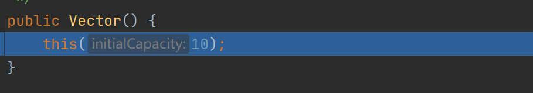

# JavaChapter4集合

# 1. 集合基本介绍

## （1）理解与优点

数组： 前面我们保存多个数据使用的是数组，那么数组有不足的地方：

- 长度开始时必须指定，而且一旦指定，不能更改

- 保存的必须为同一类型的元素


- 使用数组进行增加/删除元素的示意代码—比较麻烦

集合：


- 可以动态保存任意多个对象，使用比较方便

- 提供了一系列方便的操作对象的方法：add、remove、set、get等


- 使用集合添加，删除新元素的示意代码比较简洁

## （2）集合框架体系

- 集合主要是两组（单列集合，双列集合）

- Collection 接口有两个重要的子接口List Set ，他们的实现子类都是单列集合

- Map接口的实现子类是双列集合，存放的K—V

单列集合：


双列集合：


# 2. Collection 接口

## （1）说明

- Collection实现子类可以存放多个元素，每个元素可以是Object


- 有些Collection的实现类，可以存放重复的元素，有些不可以


- 有些Collection的实现类，有些是有序的（List），有些不是有序（Set）

- Collection接口没有直接的实现子类，是通过它的子接口Set和List来实现的


## （2）常用方法

> 以实现子类 ArrayList演示


```Java
package com.tommychan.javaselearning.collection_;

import java.util.ArrayList;
import java.util.List;

public class CollectionMethod {
    public static void main(String[] args) {

        List list = new ArrayList();
       ** 
        //add：添加单个元素** 
        list.add(18);
        list.add(29);
        System.out.println(list);

        **//remove(index)：删除index处的元素** 
        list.remove(0);
        System.out.println(list);

        **//contains：查找元素是否存在** 
        System.out.println(list.contains(9));

        **//size：获取元素个数** 
        System.out.println(list.size());

        **//isEmpty：判断是否为空** 
        System.out.println(list.isEmpty());

        **//clear：清空** 
        list.clear();
**
        //addALL：添加多个元素** 
        List list1 = new ArrayList();
        list1.add("tommy");
        list1.add("eric");
        list.addAll(list1);
        System.out.println(list);

        **//containsALL：查找多个元素是否都存在** 
        System.out.println(list.containsAll(list1));

        **//removeALL：删除多个元素** 
        list.removeAll(list1);
    }
}
```


## （3）迭代器（Iterator）遍历

小结：

- Iterator对象称为迭代器，主要用于遍历 Collection 集合中的元素

- 所有实现了Collection接口的集合类都有一个`iterator()`方法，用以返回一个实现了Iterator接口的对象，即可以返回一个迭代器。

- Iterator的结构 (见图)

- Iterator 仅用于遍历集合，Iterator本身并不存放对象。

执行原理：

```Java
Collection col = new ArrayList();
Iterator iterator = coll.iterator(); //得到 一个集合的迭代器
while(iterator.hasNext()){
//    hasNext() 判断是否有下一个元素
//    next()：
//(1) 指针下移 
//(2) 将下移以后集合位置上的元素返回
System.out.printin(iterator.next(); 
}

```


**提示：** 在调用`iterator.next()`方法之前必须要调用`iterator.hasNext()`进行检测。若不调用，且下一条记录无效，直接调用`iterator.next()`会抛出NoSuchElementException异常。


具体实现：<br /><br />

```Java
package com.tommychan.javaselearning.collection_;

import java.util.ArrayList;
import java.util.Iterator;
import java.util.List;

public class Iterator_ {
    public static void main(String[] args) {

        List bookList = new ArrayList();
        bookList.add(new Book("Green Book",30.5));
        bookList.add(new Book("TomRiddle's Diary", 12));

        Iterator iterator = bookList.iterator();

        while (iterator.hasNext()){//快捷键 itit 可以快速生成while来用迭代器遍历
            Object object = iterator.next();
            System.out.println(object); //默认调用toString方法
        }

        //退出while循环后 迭代器指向最后的元素
        //如要再次使用迭代器 需要重置迭代器
        iterator = bookList.iterator();
        while (iterator.hasNext()) {
            Object next = iterator.next();
            System.out.println(next);
        }

    }
}

class Book{
    private String name;
    private double price;

    public Book(String name, double price) {
        this.name = name;
        this.price = price;
    }

    public String getName() {
        return name;
    }

    public double getPrice() {
        return price;
    }

    @Override
    public String toString() {
        return "Book{" +
                "name='" + name + '\'' +
                ", price=" + price +
                '}';
    }
}

```


## （4）增强for循环遍历

简介：

增强for循环，可以代替iterator迭代器，特点：增强for就是简化版的iterator，底层仍是调用迭代器，本质一样。只能用于遍历集合或数组。 快捷键：iter

**基本语法** ：

```
for(元素类型 元素名：集合名或数组名) {
  访问元素
}
```


具体案例：

```Java
package com.tommychan.javaselearning.collection_;

import java.util.ArrayList;
import java.util.List;

public class CollectionFor {
    public static void main(String[] args) {
        List bookList = new ArrayList();
        bookList.add(new Book("Green Book",30.5));
        bookList.add(new Book("TomRiddle's Diary", 12));

        //增强for 在Collection集合
        for (Object book:bookList) {
            System.out.println(book);
        }
        //对数组也可以使用增强for
        int[] num = {1,3,45,63};
        for (int i:num) {
            System.out.println(i);
        }
    }
}


```


# 3. List 接口

### List 详解

#### （1）基本介绍

- List集合类中元素有序（即添加顺序和取出顺序一致）、且可重复

- List集合中的每个元素都有其对应的顺序索引，即支持索引

- List容器中的元素都对应一个整数型的序号记载其在容器中的位置，可以根据序号存取容器中的元素

- List接口的实现类


#### （2）常用方法

- void add（int index， Object ele）：在index位置插入ele元素 

- boolean addAll（int index，Collection eles）：从index位置开始将 eles中的所有元素添加进来


- Object get（int index）：获取指定index位置的元素


- int indexOf（Object obj）：返回obj在集合中首次出现的位置


- int lastlndexOf（Object obj）：返回obj在当前集合中末次出现的位置 

- Object remove（int index）：移除指定index位置的元素，并返回此元 素


- Object set（int index，Object ele）：设置指定index位置的元素为ele， 相当于是替换.


- List subList（int fromlndex，int tolndex）：返回从fromlndex到 tolndex位置的子集合


```Java
package com.tommychan.javaselearning.list_;

import java.util.ArrayList;
import java.util.Collection;
import java.util.List;

public class List01 {
    public static void main(String[] args) {
        List list = new ArrayList();

        list.add("tom");
        list.add("mike");
        list.add("jack");
        list.add("mike");

        //void add（int index， Object ele）
        //在index位置插入ele元素 原index处及之后的元素后移
        list.add(2,"mary");
        System.out.println(list);

        //size() 返回list的元素个数
        System.out.println(list.size());

        //boolean addAll（int index，Collection eles）
        //从index位置开始将 eles中的所有元素添加进来
        Collection collection = new ArrayList();
        collection.add("Chan");
        list.addAll(4,collection);
        System.out.println(list);

        //Object get（int index）：获取指定index位置的元素
        Object o1 = list.get(3);
        System.out.println(o1);

        //int indexOf（Object obj）：返回obj在集合中首次出现的位置
        System.out.println(list.indexOf("mike"));

        //int lastlndexOf(Object obj)：返回obj在当前集合中末次出现的位置
        System.out.println(list.lastIndexOf("mike"));

        //Object remove(int index)：移除指定index位置的元素，并返回此元素
        System.out.println(list.remove(5));
        System.out.println(list);

        //Object set(int index，Object ele)：设置指定index位置的元素为ele， 
        //相当于是替换
        list.set(3,"jackson");
        System.out.println(list);

        //List subList（int fromlndex，int tolndex）
        //返回从fromlndex到 tolndex位置的子集合
        System.out.println(list.subList(0,3));


    }
}

```


#### （3）List的三种遍历方式 [ArrayList , LinkedList , Vector]

- 方式一：Iterator 迭代器遍历

```Java
List list = new ArrayList();
Iterator iterator = list.iterator(); //得到 一个集合的迭代器
while(iterator.hasNext()){
//    hasNext() 判断是否有下一个元素
//    next()：
//(1) 指针下移 
//(2) 将下移以后集合位置上的元素返回
System.out.printin(iterator.next(); 
}
```


- 方法二：增强for循环

```Java
for (Object o:list) {
}
```


- 方法三：普通for循环

```Java
for (int i = 0; i < list.size(); i++) {
      Object obj = list.get(i);
      System.out.println(obj);
}
```


### ArrayList详解：

#### （1）注意事项

- permits all elements, including null, ArrayList可以加入`null`,并且多个 

- ArrayList是由数组来实现数据存储的

- 在多线程情况下，不建议使用ArrayList

- ArrayList基本等同于Vector，除了ArrayList是线程不安全的

&ensp;&ensp;&ensp;&ensp;> *对于一个经验丰富的Java程序员来说，在需要动态数组时，可能会使用Vector类。为什么要用ArrayList而不是Vector呢？原因很简单:Vector类的所有方法都是同步的。可以安全地从两个线程访问一个Vector对象。但是，* *如果只从一个线程访问Vector（这种情况更为常见），代码就会在同步操作上白白浪费大量的时间。而与之不同，ArrayList方法不是同步的，因此，建议在不需要同步时使用ArrayList，而不要使用 Vector* *  *                                             —《Java核心卷I》P384


#### （2）ArrayList底层操作机制与源码分析

①操作机制

- ArrayList中维护了一个Object类型的数组`elementData`.  `transient Object[] elementData;`

- 当创建ArrayList对象时，如果使用的是无参构造器，则初始elementData容量为0，第1次添加，则扩容elementData为10，如需要再次扩容，则扩容elementData为1.5倍。

- 如果使用的是指定大小的构造器，则初始elementData容量为指定大小，如果需要扩容，则直接扩容elementData为1.5倍。


②源码分析：

ArrayLIst 无参构造器： 完成创建一个空的Object类型的数组`elementData`


ArrayList有参构造器：


- add方法：  执行添加的方法


&ensp;&ensp;&ensp;&ensp;

&ensp;&ensp;&ensp;&ensp;1. 先确定是否扩容

&ensp;&ensp;&ensp;&ensp;2. 然后将元素添加

&ensp;&ensp;&ensp;&ensp;**确定是否扩容：** 


&ensp;&ensp;&ensp;&ensp;grow方法：


&ensp;&ensp;&ensp;&ensp;- 即第一次扩容 newCapacity = 10

&ensp;&ensp;&ensp;&ensp;- 第二次及其以后按照1.5倍扩容

&ensp;&ensp;&ensp;&ensp;- 扩容使用Arrays.copyOf（）可以保留原先的数据

&ensp;&ensp;&ensp;&ensp;然后一步步返回 至 add方法时：


### Vector详解

#### （1）基本介绍

- Vector底层也是一个对象数组 `protected Object[] elementData;`

- Vector是线程同步的，即线程安全， Vector类的操作方法带有synchronized

- 在开发中，需要线程同步安全时，考虑使用Vector


#### （2）源码解读

无参构造器：




add方法


grow方法：


#### （3）Vector和ArrayList的比较


### LinkedList详解

#### （1）基本介绍

- LinkedList实现了双向链表和双端队列特点

- 可以添加任意元素（元素可以重复），包括null


- 线程不安全，没有实现同步

#### （2）源码分析（暂时跳过）

[https://www.bilibili.com/video/BV1fh411y7R8?p=516](https://www.bilibili.com/video/BV1fh411y7R8?p=516)


### List集合的选择：

（1）如何选择ArrayList和LinkedList：

- 如果我们改查的操作多，选择ArrayList

- 如果我们增删的操作多，选择LinkedList

- 一般来说，在程序中，80％—90％都是查询，因此大部分情况下会选择ArrayList4）在一个项目中，根据业务灵活选择，也可能这样，一个模块使用的是ArrayList，另外一个模块是LinkedList，


| |底层结构|更改效率|改查效率|
|---|---|---|---|
|ArrayList|可变数组|较低（数组扩容）|较高|
|LinkedList|双向链表|较高（链表追加）|较低|


# 4. Set接口

## Set详解

### （1）基本介绍

- 无序（添加和取出的顺序不一致），没有索引

- 不允许重复元素，所以最多包含一个null

### （2）常用方法

- 和List接口一样，Set接口也是Collection的子接口，因此，常用方法和Collection接口一样

- Set接口的遍历方式同Collection的遍历方式一样，因为Set接口是Collection接口的子接口。 

&ensp;&ensp;&ensp;&ensp;1．可以使用迭代器
&ensp;&ensp;&ensp;&ensp;2．增强for
&ensp;&ensp;&ensp;&ensp;3．不能使用索引的方式来获取，因为无序（添加和取出的顺序不一致），没有索引

```Java
package com.tommychan.javaselearning.set_;

import java.util.HashSet;
import java.util.Iterator;
import java.util.Set;

/**
 *  以 HashSet 来实现 Set 的部分方法
 */
public class SetMethod {
    public static void main(String[] args) {

        Set set = new HashSet();
        set.add("tom");
        set.add("jack");
        set.add("mary");
        set.add(null);
        //set 接口的实现类的对象（Set接口对象），不能存放重复的元素，可以添加一个null
        //set 接口对象存放数据是无序（即添加的顺序和取出的顺序不一致 但取出的顺序是固定的）

        System.out.println(set);
        System.out.println(set);
        System.out.println("=================");

        //删除方法
        set.remove(null);
        System.out.println(set);
        System.out.println("=================");
        //1 迭代器遍历
        Iterator iterator = set.iterator();
        while (iterator.hasNext()){
            System.out.print(iterator.next()+" ");
        }

        System.out.println("\n=================");
        //2 增强for遍历
        for (Object name:set) {
            System.out.print(name+" ");
        }

        //3 不可通过索引遍历
    }
}

```


## HashSet详解

### （1）基本介绍

- HashSet实现了Set接口


- HashSet实际上是HashMap


- 可以存放null值，但是只能有一个null


- HashSet不保证元素是有序的，取决于hash后，再确定素引的结果.

- 不能有重复元素/对象，在前面Set接口使用已经讲过

&ensp;&ensp;&ensp;&ensp;如何理解：

```Java
set.add("yyy"); //ok
set.add("yyy");//不可加入

set.add(new Dog("tom")); //ok
set.add(new Dog("tom")); //ok

set.add(new String("jack"));// ok
set.add(new String("jack"));// 不可加入

原因 ： 看源码
```


### （2）底层机制

- 分析HashSet底层是HashMap，而HashMap底层是（数组＋链表＋红黑树）

- 为了理解，先模拟简单的数组＋链表结构

```Java
package com.tommychan.javaselearning.set_;

public class HashMapStructure {
    @SuppressWarnings({"all"})
    public static void main(String[] args) {

        Node[] table = new Node[10];

        Node john = new Node("john");
        table[2] = new Node("john");

        Node jack = new Node("jack");
        john.next = jack; //将jack结点挂载到john

        Node mary = new Node("mary");
        jack.next = mary;//将mary结点挂载到jack

        //每个table的索引位置都可以形成一条链表
        //当链表元素大于64时 将以树的形式存放
    }
}

class Node{
    Node next;
    Object item;

    public Node(Object item) {
        this.item = item;
    }
}

```


HashSet扩容机制：

1.HashSet底层是HashMap

2.添加一个元素时，先得到hash值会转成→索引值

3.找到存储数据表table ，看这个素引位置是否已经存放的有元素

4.如果没有，直接加入

5. 如果有，调用equals比较，如果相同，就放弃添加，如果不相同，则添加到最后

6. 在Java8中，如果一条链表的元素个数到达`TREEIFY_THRESHOLD`(默认是8），并且table的大小≥

`MIN_TREEIFY_CAPACITY`(默认64), 就会进行树化（红黑树）


1．HashSet底层是HashMap，第一次添加 时，table数组扩容到16，临界值（threshold）是16＊加载因子 ，（loadFactor）是0.75＝12
2．如果table数组使用到了临界值12，就会扩容到16＊2＝32，新的临界值就是32＊0.75＝24，依次类推
3．在Java 8中，如果一条链表的元素个数到达` TREEIFY_THRESHOLD`（默认是8）， 并且table的大小≥`MIN_TREEIFY_CAPACITY`（默认64），就会进行树化（红黑树），否则仍然采用数组扩容机制


add源码分析： 

[https://www.bilibili.com/video/BV1fh411y7R8?p=522&spm_id_from=pageDriver](https://www.bilibili.com/video/BV1fh411y7R8?p=522&spm_id_from=pageDriver)

```Java
HashSet hashSet = new HashSet();
        hashSet.add("java");
        hashSet.add("php");
        hashSet.add("java");
```


add方法第一次调用源码分析：

- Step 1 `add()`方法


- Step 2 `put()`方法


&ensp;&ensp;&ensp;&ensp;此处的value实际是个用于调用函数占位的对象


- Step 3 `hash()`方法  ： 得到一个hash值（不是hashcode）


- Step 4 `putVal()`方法

```Java
final V putVal(int hash, K key, V value, boolean onlyIfAbsent,
                   boolean evict) {
        Node<K,V>[] tab; Node<K,V> p; int n, i; //辅助变量
        if ((tab = table) == null || (n = tab.length) == 0) //table 是HashMap的属性 用于存放Node结点
            n = (tab = resize()).length;                    //此处if语句表示 如果表是空的 或者长度为0 则第一次扩容 到 16个空间
        if ((p = tab[i = (n - 1) & hash]) == null)          //根据key得到hash 去计算该key一个存放在table的哪个位置 并赋值给p
            tab[i] = newNode(hash, key, value, null);       //判断p是否为空 若p为空 表示没有存放元素 则创建一个Node 并放在该位置
        else {                                              //
            Node<K,V> e; K k;
            if (p.hash == hash &&
                ((k = p.key) == key || (key != null && key.equals(k))))
                e = p;
            else if (p instanceof TreeNode)
                e = ((TreeNode<K,V>)p).putTreeVal(this, tab, hash, key, value);
            else {
                for (int binCount = 0; ; ++binCount) {
                    if ((e = p.next) == null) {
                        p.next = newNode(hash, key, value, null);
                        if (binCount >= TREEIFY_THRESHOLD - 1) // -1 for 1st
                            treeifyBin(tab, hash);
                        break;
                    }
                    if (e.hash == hash &&
                        ((k = e.key) == key || (key != null && key.equals(k))))
                        break;
                    p = e;
                }
            }
            if (e != null) { // existing mapping for key
                V oldValue = e.value;
                if (!onlyIfAbsent || oldValue == null)
                    e.value = value;
                afterNodeAccess(e);
                return oldValue;
            }
        }
        ++modCount;
        if (++size > threshold)                   //如果size大于 threshold(临界值) resize()来再次扩容
            resize();
        afterNodeInsertion(evict);                
        return null;   //返回null则 代表true 因为add方法中的return 语句是 `return map.put(e,present) == null ;`
    }
```


add方法第二次调用源码分析：

-  `putVal()`方法

```Java
final V putVal(int hash, K key, V value, boolean onlyIfAbsent,
                   boolean evict) {
        Node<K,V>[] tab; Node<K,V> p; int n, i; //辅助变量
        if ((tab = table) == null || (n = tab.length) == 0) //第二次调用 tab 已经不是空的了 故不进入if语句
            n = (tab = resize()).length;                    
        if ((p = tab[i = (n - 1) & hash]) == null)          //根据key得到hash 去计算该key一个存放在table的哪个位置 并赋值给p
            tab[i] = newNode(hash, key, value, null);       
        else {                                              
            Node<K,V> e; K k;       //辅助变量
            if (p.hash == hash &&                                         
                ((k = p.key) == key || (key != null && key.equals(k))))  
                e = p;                                                    
                                                                         
            else if (p instanceof TreeNode)                             
                e = ((TreeNode<K,V>)p).putTreeVal(this, tab, hash, key, value); 
            else {
                for (int binCount = 0; ; ++binCount) {                   
                    if ((e = p.next) == null) {                           
                        p.next = newNode(hash, key, value, null);         
                        if (binCount >= TREEIFY_THRESHOLD - 1) // -1 for 1st
                            treeifyBin(tab, hash);
                        break;
                    }
                    if (e.hash == hash &&
                        ((k = e.key) == key || (key != null && key.equals(k))))
                        break;
                    p = e;
                }
            }
            if (e != null) { // existing mapping for key
                V oldValue = e.value;
                if (!onlyIfAbsent || oldValue == null)
                    e.value = value;
                afterNodeAccess(e);
                return oldValue;
            }
        }
        ++modCount;
        if (++size > threshold)                   //如果size大于 threshold(临界值) resize()来再次扩容
            resize();
        afterNodeInsertion(evict);                
        return null;   //返回null则 代表true 因为add方法中的return 语句是 `return map.put(e,present) == null ;`
    }
```


add方法第三次调用源码分析：

-  `putVal()`方法

```Java
final V putVal(int hash, K key, V value, boolean onlyIfAbsent,
                   boolean evict) {
        Node<K,V>[] tab; Node<K,V> p; int n, i; //辅助变量
        if ((tab = table) == null || (n = tab.length) == 0) //第三次调用 tab 已经不是空的了 故不进入if语句
            n = (tab = resize()).length;                    
        if ((p = tab[i = (n - 1) & hash]) == null)          //根据key得到hash 去计算该key一个存放在table的哪个位置 并赋值给p
            tab[i] = newNode(hash, key, value, null);       //此时 由于key = “java” 与第一次添加的相同 故 `i = (n - 1) & hash `相等 则此处索引处的链表不是空的
        else {                                              //所以这一步if跳过
            Node<K,V> e; K k;       //辅助变量
            if (p.hash == hash &&                                         //如果当前索引位置对应的链表的第一个元素和准备添加的key的hash值一样
                ((k = p.key) == key || (key != null && key.equals(k))))   //且满足以下条件之一 (1)准备加入的key和p指向的Node结点的key或同一个对象
                e = p;                                                    //                 (2)p 指向的Node结点的key的equals()和准备后的key比较后相同
                                                                          // 则不进行下面的else if判断 也不会添加
            else if (p instanceof TreeNode)                               // 判断是否是树
                e = ((TreeNode<K,V>)p).putTreeVal(this, tab, hash, key, value); //如果是红黑树 则调用该方法添加
            else {
                for (int binCount = 0; ; ++binCount) {                    //这种情况即该结点已经形成了链表
                    if ((e = p.next) == null) {                           //然后通过循环一个一个比较 比较的算法与上面算法类似
                        p.next = newNode(hash, key, value, null);         //如果每次比较都不相同 则将该元素加到链表最后
                        if (binCount >= TREEIFY_THRESHOLD - 1)            //注意在把元素添加到链表后，立即判断该链表是否已经达到8个结点 
                            treeifyBin(tab, hash);                        //就调用treeifyBin() 对当前这个链表进行树化（转成红黑树）
                        break;                                            //注意，在转成红黑树时，要进行判断，if (tab == nulL || (n= tab.Length) < MIN_TREEIFY-CAPACITY (64))
                    }                                                     //如果上面的条件成立 就扩容 不成立 再转红黑树
                    if (e.hash == hash &&                                 
                        ((k = e.key) == key || (key != null && key.equals(k))))
                        break;
                    p = e;
                }
            }
            if (e != null) { // existing mapping for key
                V oldValue = e.value;
                if (!onlyIfAbsent || oldValue == null)
                    e.value = value;
                afterNodeAccess(e);
                return oldValue;
            }
        }
        ++modCount;
        if (++size > threshold)                   //如果size大于 threshold(临界值) resize()来再次扩容
            resize();
        afterNodeInsertion(evict);                
        return null;   //返回null则 代表true 因为add方法中的return 语句是 `return map.put(e,present) == null ;`
    }
```


一个问题：


分析如下：

1. 由于重写了hashcode和equals方法，所以前两个对象顺利添加

2. 把p1.name改为“CC”时，不改变p1的存放的位置，因为存放是按照之前的id和name算的

3. 而此时想要remove的p1的位置是按新的name和id来算，故删除失败 **第一次输出：两个对象** 

4. 此时再次添加1001，“CC”对象时，会将此对象存放在table中不同于前两个对象的位置 *第二次输出：三个对象* 

5. 再添加1001，“AA”放在p1的链表上  *第三次输出：四个对象* 

## LinkedHashSet详解

### （1）基本介绍

- LinkedHashSet是HashSet的子类

- LinkedHashSet底层是一个LinkedHashMap，底层维护了一个数组+双句链表

- LinkedHashSet根据元素的hashCode值来决定元素的存储位置，同时使用链表维护元素的次序，这使得元素看起来是以插入顺序保存的。

- LinkedHashSet不允许添重复元素


- 在LinkedHastSet中维护了一个hash表和双向链表(LinkedHashSet有head和tail )

- 每一个节点有pre和next属性，这样可以形成双向链表

- 在添加一个元素时，先求hash值，在求索引.确定该元素在hashtable的位置，然后将添加的元素加入到双向链表（如果已经存在，不添加[原则和hashset一样]）


&ensp;&ensp;&ensp;&ensp;`tail.next = newElement;`

&ensp;&ensp;&ensp;&ensp;`newElement.pre = tail;`

&ensp;&ensp;&ensp;&ensp;`tail = newElement;`

- 这样的话，我们遍历LinkedHashSet也能确保插入顺序和遍历顺序一致


## TreeSet详解

案例：

```Java
package com.tommychan.javaselearning.set_;

import sun.reflect.generics.tree.Tree;

import java.util.Comparator;
import java.util.TreeSet;

@SuppressWarnings({"all"})
public class TreeSet_ {
    public static void main(String[] args) {

        //1.使用无参构造器创建TreeSet时 是默认按字母表排序
        //2.若希望改变排序规则，可用TreeSet提供的构造器，传入一个比较器（使用到匿名内部类）

        //(1)按字母表排序
        TreeSet treeSet = new TreeSet(new Comparator() {
            @Override
            public int compare(Object o1, Object o2) {
                return ((String)o2).compareTo((String)o1);
            }
        });

        //(2)按长度排序
        TreeSet treeSet1 = new TreeSet(new Comparator() {
            @Override
            public int compare(Object o1, Object o2) {
                return ((String)o1).length()-((String)o2).length();
            }
        });

        treeSet.add("tommy");
        treeSet.add("jack");
        treeSet.add("kevin");
        treeSet.add("mary");

        treeSet1.add("tom");
        treeSet1.add("jackson");
        treeSet1.add("kevin");
        treeSet1.add("mary");

        System.out.println(treeSet);
        System.out.println(treeSet1);

    }
}

```


有关比较器的源码：

```Java
Comparator<? super K> cpr = comparator;
        if (cpr != null) {
            do {
                parent = t;
                cmp = cpr.compare(key, t.key);
                if (cmp < 0)
                    t = t.left;
                else if (cmp > 0)
                    t = t.right;
                else //可以发现若比较器判断相等的话 则不会进行添加
                    return t.setValue(value);
            } while (t != null);
        }
```


# 5.Map接口

### （1）基本介绍

- Map用于保存具有映射关系的数据：Key — Value

- Map 中的 key和 value 可以是任何引用类型的数据，会封装到HashMap$Node对象中

- Map中的 key不允许重复，原因和HashSet一样，前面分析过源码

- Map中的value可以重复

- Map的key可以为null， value也可以为null，注意key为null，只能有一个 ; value为null, 可以多个

- 我们常用String类作为Map的key

- key和value之间存在单向一对一关系，即通过指定的key总能找到对应的value


解读：  一对Key — Value是放在一个HashMap$Node中的，因为Node实现了Entry接口，有些书上也说一对Key — Value就是一个Entry

- k - v 最后存入的地方其实是HashMap$Node 

- k - v 为了方便遍历，创建了一个EntrySet的集合

- EntrySet集合存放的是Entry，Entry是一个数据类型包含了key和value两部分      `EntrySet<Entry<K,V>>`  即 `transient Set<Map.Entry<K,V>> entrySet`

- entrySet中定义的类型是Map.Entry，但实际上存放的还是HashMap$Node （但并没有重新创建 而是直接指向已有的HashMap$Node）

- 这是因为Node 实现了Map.Entry的接口，而HashMap$Node是Node的实例化对象，（当有一个类实现了一个接口，则该对象的实例化对象就可以赋给该接口类型）

- Set 和 Collection 集合里面的 key 和 values 储存的其实是 Hash＄Node 中 key 和 values 的哈希地址


```Java
package com.tommychan.javaselearning.map_;

import java.util.HashMap;
import java.util.Map;

public class Map01 {
    public static void main(String[] args) {
        //1.Map用于保存具有映射关系的数据：Key — Value
        Map map = new HashMap();
        map.put("no1","tommy");
        map.put("no2","henry");

        System.out.println(map);
        //2.Map中的key和 value 可以是任何引用类型的数据，会封装到HashMap$Node对象中
        //3.Map中的key不允许重复，原因和HashSet一样，前面分析过源码,当有相同的k时会用相应的v替代
        map.put("no1","mary");
        System.out.println(map);

        //4.Map中的value可以重复
        map.put("no3","henry");
        System.out.println(map);

        //5.Map的key可以为null， value也可以为null，注意key为null，只能有一个 ; value为null, 可以多个
        map.put(null,"000");
        System.out.println(map);
        map.put(null,null);
        System.out.println(map);

        map.put("no4",null);
        map.put("no5",null);
        System.out.println(map);

        //6.常用String类作为Map的key

        //7.key和value之间存在单向一对一关系，即通过指定的key总能找到对应的value
        System.out.println("no3:"+map.get("no3"));


    }
}

```


## （2）常用方法

**Map的体系继承图** ：


- put：添加

- remove：根据健删除映射关系

- get：根据健获取值

- size：获取元素个数

- isEmpty:判断个数是否为0 

- clear:清除

- containsKey：查找键是否存在

- replace(key,value) :只有当目标映射到某个值时，才能替换指定键的条目

```Java
package com.tommychan.javaselearning.map_;

import java.util.HashMap;
import java.util.Map;

public class MapMethod {
    public static void main(String[] args) {

        Map map = new HashMap();

        //put：添加
        map.put("No1","Tommy");
        map.put("No2","Henry");
        map.put(null,"Ron");
        System.out.println(map);

        //remove：根据健删除映射关系
        map.remove("No2");
        System.out.println(map);

        //get：根据key获取值
        System.out.println(map.get(null));

        //size：获取元素个数
        System.out.println(map.size());

        //isEmpty:判断个数是否为0 boolean类型
        System.out.println(map.isEmpty());

        //clear:清除
        //map.clear();
        //System.out.println(map);

        //containsKey：查找键是否存在
        System.out.println(map.containsKey("No1"));


    }
}


```


## HashMap详解

### （1）六大遍历方法

```Java
package com.tommychan.javaselearning.map_;


import java.util.*;

public class MapFor {
    public static void main(String[] args) {

        Map map = new HashMap();
        map.put("No1","Tommy");
        map.put("No2","Henry");
        map.put("No3","Jack");
        map.put("No4","Jason");
        map.put(null,"Ron");

        //用到的方法：
        //containsKey：查找键是否存在
        //keySet：获取所有的键
        //entrySet：获取所有关系k—v
        //values：获取所有的值

        //Map.Entry 中的方法
        //getKey
        //getValue

        //第一组 ： 先取出所有的key 再通过key取出value 实质是Set的遍历
        Set keyset = map.keySet();
        //(1)用增强for
        System.out.println("==========way 1=============");
        for (Object key:keyset){
            System.out.print(map.get(key)+" ");
        }
        //(2)用迭代器
        System.out.println("\n==========way 2=============");
        Iterator iterator = keyset.iterator();
        while (iterator.hasNext()){
            System.out.print(map.get(iterator.next())+" ");
        }

        //第二组 ： 把所有的value取出来
        Collection values = map.values();
        //(1)for循环 与 (2)增强for都可以
        System.out.println("\n========way 3 & 4===========");
        for (Object o:values) {
            System.out.print(o+" ");
        }
        //(2)迭代器
        System.out.println("\n==========way 5=============");
        Iterator iterator1 = values.iterator();
        while (iterator1.hasNext()){
            System.out.print(iterator1.next()+" ");
        }

        //第三组 ： 通过EntrySet
        Set entrySet = map.entrySet();
        //(1)增强for
        System.out.println("\n==========way 6=============");
        for (Object o:entrySet) {
            //o 运行的类型是HashMap$Node
            //我们将它转为Map.Entry才可以使用getKey() getValue()
            Map.Entry entry = (Map.Entry) o;
            System.out.print(entry.getKey()+"-"+entry.getValue()+" ");
        }

        //(2)迭代器
        System.out.println("\n==========way 7=============");
        Iterator iterator2 = entrySet.iterator();
        while (iterator2.hasNext()){
            //iterator2.next()的类型是HashMap$Node (实现了Map.Entry接口)
            //我们将它转为Map.Entry才可以使用getKey() getValue()
            Map.Entry entry = (Map.Entry) iterator2.next();
            System.out.print(entry.getKey()+"-"+entry.getValue()+" ");
        }
    }
}

```


### （2）练习

```Java
package com.tommychan.javaselearning.map_;
/**
 * 使用HashMap添加3个员工对象，要求键：员工 id  值：员工对象
 * 并遍历显示工资 >9000的员工（遍历方式最少两种）员工类：姓名、工资、员工id
 */
import java.util.*;

public class MapExercise01 {
    public static void main(String[] args) {
        Map map = new HashMap();

        Employee tommy = new Employee("Tommy", 25000, "001");
        Employee jason = new Employee("Jason", 9000, "002");
        Employee charlie = new Employee("Charlie", 12000, "003");

        map.put(tommy.getId(),tommy);
        map.put(jason.getId(),jason);
        map.put(charlie.getId(),charlie);

        Collection collection = map.values();
        Iterator iterator = collection.iterator();
        while (iterator.hasNext()){
            Employee employee = (Employee) iterator.next();   //！！！next方法的返回类型是Object 要向下转型
            if (employee.getSalary()>9000){
                System.out.println(employee);
            }
        }


        Set employee2 = map.entrySet();
        for (Object o:employee2) {
            Map.Entry employee = (Map.Entry) o;                    //！！！getValue方法的返回类型是Object 要向下转型
            Employee employee1 = (Employee) employee.getValue();
            if (employee1.getSalary()>9000){
                System.out.println(employee1);
            }
        }
    }
}


class Employee{

    private String name;
    private double salary;
    private String id;

    public Employee(String name, double salary, String id) {
        this.name = name;
        this.salary = salary;
        this.id = id;
    }

    public String getName() {
        return name;
    }

    public double getSalary() {
        return salary;
    }

    public String getId() {
        return id;
    }

    @Override
    public String toString() {
        return "Employee{" +
                "name='" + name + '\'' +
                ", salary=" + salary +
                ", id='" + id + '\'' +
                '}';
    }
}
```


### （3）小结

1）Map接口的常用实现类：HashMap、Hashtable和Properties。
2）HashMap是Map接口使用频率最高的实现类。
3）HashMap是以key-value对（HashMap$Node类型）的方式来存储数据
4）key 不能重复，但是是值可以重复，允许使用null键和null值。
5）如果添加相同的key，则会覆盖原来的key—value，等同于修改．（key不会替换，value会替换）
6）与HashSet一样，不保证映射的顺序，因为底层是以hash表的方式来存储的．
7）HashMap没有实现同步，因此是线程不安全的

### （4）源码分析

结论：

- 扩容机制与HashSet一样

- HashMap底层维护了Node类型的数组table，默认为null

- 当创建对象时，将加载因子（loadfactor）初始化为0.75.

- 当添加key—val时，通过key的哈希值得到在table的索引。然后判断该索引处是否有元素如果没有元素直接添加。如果该索引处有元素，继续判断该元素的key和准备加入的key是否相等，如果相等，则直接替换val；如果不相等需要判断是树结构还是链表结构，做出相应处理。如果添加时发现容量不够，则需要扩容。

- 第1次添加，则需要扩容table容量为16，临界值（threshold）为12.


- 以后再扩容，则需要扩容table容量为原来的2倍，临界值为原来的2倍，即24，依次类推.6）在Java8中，如果一条链表的元素个数超过TREEIFY THRESHOLD（默认是8），并且table的大小>= MIN TREEIFY CAPACITY（默认64），就会进行树化（红黑树）


putValue方法

```Java
final V putVal(int hash, K key, V value, boolean onlyIfAbsent,
                   boolean evict) {
        Node<K,V>[] tab; Node<K,V> p; int n, i;
        if ((tab = table) == null || (n = tab.length) == 0) **//如果数组为空或者长度为零 则进行扩容** 
            n = (tab = resize()).length;
        if ((p = tab[i = (n - 1) & hash]) == null) //取出Hash值对应的table的索引位置的Node
            tab[i] = newNode(hash, key, value, null);//如果为null，就直接把k-v创建成一个Node 加入该位置
        else {
            Node<K,V> e; K k;
            if (p.hash == hash &&          //如果新加入的key的hash等于table当前位置的key的hash 且满足以下两条件任一条件
                ((k = p.key) == key || (key != null && key.equals(k)))) // （1）两者的key是同一个对象 （2）equals返回真 则不能加入新的k-v
                e = p;                                                  //然后会去下面30行的代码块 
            else if (p instanceof TreeNode) //如果当前的table 已有的Node是红黑树则按照红黑树加入该元素
                e = ((TreeNode<K,V>)p).putTreeVal(this, tab, hash, key, value);
            else {                           //如果找到的结点 后面是链表 就循环比较
                for (int binCount = 0; ; ++binCount) { //死循环
                    if ((e = p.next) == null) {  //如果找完了也没发现相同的 则将该k-v加到链表末尾
                        p.next = newNode(hash, key, value, null);
                        //加入后 判断当前链表个数 若已经达到8个 则进行树化 关于树化 并不是立即执行树化 而是在treeifyBin()会先判断
                        //如果table为nulL ，或者大小还没有到64，暂时不树化，而是进行扩容 否则才会真正的树化—>剪枝
                        if (binCount >= TREEIFY_THRESHOLD - 1) // -1 for 1st
                            treeifyBin(tab, hash); 
                        break;
                    }
                    if (e.hash == hash &&  //如果在循环过程中发现相同的 则不添加 进行30行的替换
                        ((k = e.key) == key || (key != null && key.equals(k))))
                        break;
                    p = e;
                }
            }
            if (e != null) { // existing mapping for key
                V oldValue = e.value;
                if (!onlyIfAbsent || oldValue == null)
                    e.value = value; //替换key对应的value
                afterNodeAccess(e);
                return oldValue;
            }
        }
        ++modCount; //每增加一个Node 则size++
        if (++size > threshold)
            resize();
        afterNodeInsertion(evict);
        return null;
    }
```


## Hashtable详解

### （1）基本介绍

- 存放的元素是键值对：即K—V

- Hashtable的键和值都不能为null，否则会抛出NullPointerException

- Hashtable使用方法基本上和HashMap一样

- Hashtable是线程安全的，HashMap是线程不安全的

### （2）扩容机制

- 底层有数组 `Hashtable$Entry［］` 初始化大小为 11 

- 临界值 threshold 8＝11 ＊0.75

- 扩容：按照自己的扩容机制来进行即可

### （3）比较

| |版本|线程安全（同步）|效率|允许使用null键与null值|
|---|---|---|---|---|
|HashMap|1.2|不安全|高|可以|
|Hashtable|1.0|安全|较低|不可以|


## TreeMap使用

源码分析涉及红黑树 暂时不看

```Java
package com.tommychan.javaselearning.map_;

import java.util.Comparator;
import java.util.TreeMap;

@SuppressWarnings({"all"})

public class TreeMap_ {
    public static void main(String[] args) {

        //使用默认构造器
        //TreeMap treeMap = new TreeMap();
        //treeMap.put("Jack","杰克");
        //treeMap.put("Tom","汤姆");
        //treeMap.put("Mary","玛丽");
        //无排序规则
        //System.out.println(treeMap);

        //带比较器的构造器
        TreeMap treeMap = new TreeMap(new Comparator() {
            @Override
            public int compare(Object o1, Object o2) {
                //return ((String)o1).compareTo((String)o2); 举例 ：按照传入的key(String)的默认比较方式
                return ((String)o1).length()-((String)o2).length(); //按照传入的key(String)的长度
            }
        });
        treeMap.put("Jack","杰克");
        treeMap.put("Tom","汤姆");
        treeMap.put("Mary","玛丽");

        System.out.println(treeMap);
    }
}

```


## Properties 介绍

- Properties类继承自Hashtable类并且实现了Map接口，也是使用一种键值对的形式来保存数据。

- 他的使用特点和Hashtable类似

- Properties 还可以用于从xxx.properties文件中，加载数据到Properties类对象， 并进行读取和修改

- 说明：工作后 xxx.properties 文件通常作为配置文件，这个知识点在IO流举例，有兴趣可先看文章


# 6.集合选型规则

> *在开发中，选择什么集合实现类，主要取决于* **业务操作特点** *，然后根据集合实现类特性进行选择* 


1. 先判断存储的类型（一组对象［单列］或一组键值对［双列］）

2. 一组对象［单列］：Collection接口
                 允许重复：List
                              增删多：LinkedList［底层维护了一个双向链表］

                                   改查多：ArrayList［底层维护Object类型的可变数组］ 

                     不允许重复：Set
                                   无序：HashSet ［底层是HashMap，维护了一个哈希表 即（数组＋链表＋红黑树）］

                                   排序：TreeSet

                                   插入和取出顺序一致：LinkedHashSet，维护数组＋双向链表

3. 一组键值对：Map                

          键无序：HashMap［底层是：哈希表 jdk7：数组＋链表，jdk8：数组＋链表＋红黑树］

          键排序：TreeMap


          键插入和取出顺序一致：LinkedHashMap 

          读取文件 Properties


# 7.Collections工具类

## （1）基本介绍

- Collections是一个操作Set、List和 Map等集合的工具类 

- Collections 中提供了一系列静态的方法对集合元素进行排序、查询和修改等操作 

## （2）常用方法

- `reverse（List）`：反转List中元素的顺序

- `shuffle（List）`：对 List集合元素进行随机排序

- `sort（List）`：根据元素的自然顺序对指定List集合元素按升序排序

- `sort（List， Comparator）`：根据指定的 Comparator 产生的顺序对List集合元素进行 排序

- `swap（List， int， int）`：将指定list集合中的i处元素和j处元素进行交换 


查找、替换

- `Object max（Collection）`：根据元素的自然顺序，返回给定集合中的最大元素

- `Object max(Collection, Comparator)` : 根据Comparator指定的顺序,返回给定集合中的最大元素

- `Object min(Collection)`

- `Object min(Collection, Comparator)`

- `int frequency（Collection， Object）`：返回指定集合中指定元素的出现次数

- `void copy（List dest，List src）`：将src中的内容复制到dest中

- `boolean replaceAll（List list， Object oldVal， Object newVal）`：使用新值替换List对象的所有旧值

