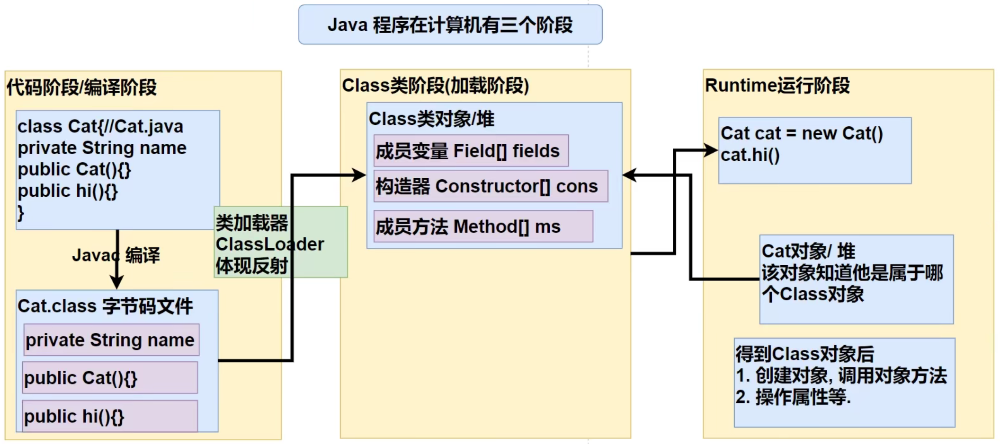
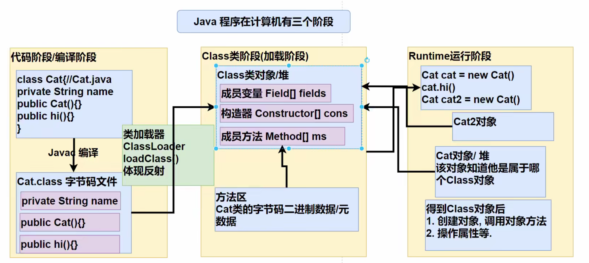
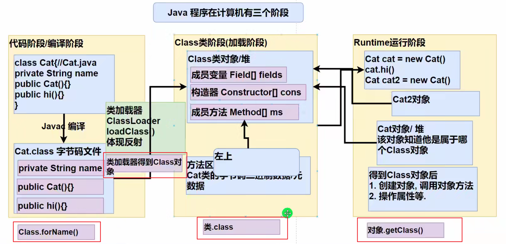
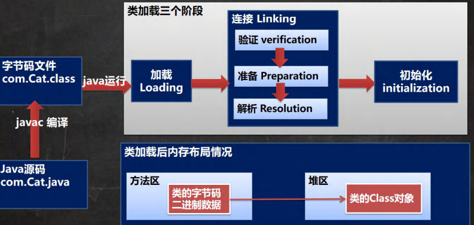
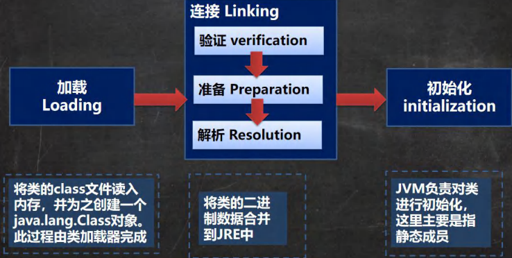

# JavaChapter8反射

# 一、基本介绍

## （1）问题引入

**问题** ：根据配置文件`re.properties`指定信息，创建对象并调用方法

```.properties
classfullpath=com.tommychan.javaselearning.intropart.Cat
method=hi
```


**Cat类：** 

```Java
public class Cat {
    private String name = "KiKi";
    public void hi() {
        System.out.println("I am KiKi!");
    }

    public void cry(){
        System.out.println("miao ~");
    }
}

```


**Solution类:** 

```Java
public class Solution {
    public static void main(String[] args) throws Exception {

        //先用Properties 类读写配置文件
        Properties properties = new Properties();
        properties.load(new FileInputStream("src\\re.properties"));
        String classPath = properties.get("classfullpath").toString();
        String methodName = properties.get("method").toString();

        //1.加载类 返回一个Class类型的对象 (Class 是一个类)
        Class cls = Class.forName(classPath);
        //2.通过 cls 去得到 com.tommychan.javaselearning.intropart.Cat 的对象实例
        Object o = cls.newInstance();
        //3.通过 cls 得到你加载的类的一个 methodName的方法对象
        //  即在反射中，可以把方法也视为对象，即万物届对象
        Method method = cls.getMethod(methodName);
        //4.通过method来调用方法
        //  即通过方法对象来调用方法
        method.invoke(o); //传统方法：对象.方法()
                          //反射机制：方法对象.invoke(对象)

    }
}
```


**说明** ：如果此时，希望调用`hi`方法，只需更改`re.properties`文件中的`method=hi`即可。

**小结** ：通过外部文件配置，在**不修改源码情况下，来控制程序** ，这样的需求在学习框架时特别多，也符合设计模式的 ocp原则（开闭原则：不修改源码，扩容功能）。

## （2）原理基本介绍

1. 反射机制允许程序在执行期借助于`ReflectionAPI`取得任何类的内部信息（比如成员变量，构造器，成员方法等等），并能操作对象的属性及方法。反射在设计模式和框架底层都会用到 

2. 加载完类之后，在堆中就产生了一个`Class`类型的对象（一个类只有一个Class对象），这个对象包含了类的完整结构信息。通过这个对象得到类的结构。这个Class对象就像一面镜子，透过这个镜子看到类的结构，因此，形象地称之为反射。

3. **原理图** 




4.  Java反射机制可以完成

- 在运行时判断任意一个对象所属的类


- 在运行时构造任意一个类的对象


- 在运行时得到任意一个类所具有的成员变量和方法


- 在运行时调用任意一个对象的成员变量和方法


- 生成动态代理

## （3）反射相关类

反射相关的主要类：    查看API在`java.lang.reflection`下

1. `java.lang.Class`：代表一个类， Class对象表示某个类加载后在堆中的对象

2. `java.lang.reflect.Method`：代表类的方法，Method对象表示某个类的方法

3. `java.lang.reflect.Field`：代表类的成员变量，Field对象表示某个类的成员变量

4. `java.lang.reflect.Constructor`：代表类的构造方法，Constructor对象表示构造器


## （4）反射调用**优点与缺点** 

- 优点：可以动态的创建和使用对象（也是框架底层核心）， 使用灵活，没有反射机制，框架技术就失去底层支撑

- 缺点：使用反射基本是解释执行，对执行速度有影响

# 二、Class类

## （1）Class类的分析

- Class也是类，因此也继承Object类

- Class类对象不是new出来的，而是系统创建的

- 对于某个类的Class类对象，在内存中只有一份，因为类只加载一次 

- 每个类的实例都会记得自己是由哪个 Class 实例所生成


- 通过Class对象可以完整地得到一个类的完整结构，通过一系列API


- Class对象是存放在堆的


- 类的字节码二进制数据，是放在方法区的，有的地方称为类的元数据（包括方法代码，变量名，方法名，访问权限等等）




## （2）Class常用方法

```Java
package com.tommychan.javaselearning.class_;

import com.tommychan.javaselearning.Car;

import java.lang.reflect.Field;

/**
 * @author TommyChan
 * @version 1.0
 * description 演示 Class 类的常用方法
 */
@SuppressWarnings({"all"})
public class Class01 {
    public static void main(String[] args) throws Exception {

        String classPath = "com.tommychan.javaselearning.Car";
        //1.获取到Car类对应的Class对象
        //<?>表示不确定的Java类型
        Class<?> cls = Class.forName(classPath);

        //2.输出cls
        System.out.println(cls); //显示cls是哪个类的Class对象 com.tommychan.javaselearning.Car
        System.out.println(cls.getClass());//输出cls的运行类型 class java.lang.Class

        //3.得到包名
        System.out.println(cls.getPackage()); //package com.tommychan.javaselearning

        //4.得到全类名
        System.out.println(cls.getName()); //com.tommychan.javaselearning.Car

        //5.通过cls创建一个对象实例
        Object o = cls.newInstance();
        Car car = (Car) o;
        System.out.println(car); //Car{brand='BWM', price=400000, color='Black'}

        //6.通过反射获取属性 -- 属性是存放在Field[] fields 里面的
        //  注意: getField不能拿到private的属性
        Field brand = cls.getField("brand");
        System.out.println(brand.get(car)); //BWM

        //7.通过反射给属性赋值
        brand.set(car, "Benz");
        System.out.println(brand.get(car)); //Benz

        //8.得到所有的属性
        Field[] fields = cls.getFields();
        for(Field f:fields){ //遍历拿到所有属性的名称
            System.out.println(f.getName());
        }

    }
}

```


## （3）获取Class对象的六种方法

1. 前提：已知一个类的全类名，且该类在类路径下，可通过Class类的静态方法`forName()`获取，可能抛出`ClassNotFoundException`，实例：`Class cls1 ＝ Class.forName(“java.lang.Cat");`

&ensp;&ensp;&ensp;&ensp;**应用场景** ：多用于配置文件，读取类全路径，加载类

2. 前提：若已知具体的类，通过类的class 获取，该方式**最为安全可靠，程序性能最高** 

&ensp;&ensp;&ensp;&ensp;实例：`Class cls2＝Cat．class;`

&ensp;&ensp;&ensp;&ensp;应用场景：多用于参数传递，比如通过反射得到对应构造器对象

3. 前提：已知某个类的实例，调用该实例的getClass（）方法获取Class对象，实例：

&ensp;&ensp;&ensp;&ensp;`Class cls3 = 对象.getClass(); //运行类型`

&ensp;&ensp;&ensp;&ensp;应用场景：通过创建好的对象，获取Class对象

4. 其他方式ClassLoader cl =对象.getClass().getClassLoader();

&ensp;&ensp;&ensp;&ensp;`Class cls4 = cl.loadClass( "类的全类名" );`

5. 基本数据类型也可以得到Class类对象

6. 基本数据类型对应的包装类 可以通过`.TYPE`得到Class对象





案例：

```Java
package com.tommychan.javaselearning.class_;

import com.tommychan.javaselearning.Car;

/**
 * @author TommyChan
 * @version 1.0
 * description 演示得到 Class 对象的六种方法
 */
@SuppressWarnings({"all"})
public class GetClass_ {
    public static void main(String[] args) throws Exception{

        //1.通过forName()获得
        Class cls1 = Class.forName("com.tommychan.javaselearning.Car");
        System.out.println(cls1);

        //2.通过类名.class     应用场景：通常用于参数传递
        Class cls2 = Car.class;
        System.out.println(cls2);

        //3.通过对象名.getClass() 应用场景：有对象实例了
        Car car = new Car();
        Class cls3 = car.getClass();
        System.out.println(cls3);

        //4.通过类加载器获得
        //(1)先得到类加载器
        ClassLoader classLoader = car.getClass().getClassLoader();
        //(2)通过类加载器得到Class对象
        Class<?> cls4 = classLoader.loadClass("com.tommychan.javaselearning.Car");
        System.out.println(cls4);

        //cls1 cls2 cls3 cls4 其实是同一个对象 因为对于一个类而言 堆中只有一个它的Class对象

        //5.基本数据类型也可以得到Class类对象
        // Class cls = 基本数据类型.class
        Class<Integer> integerClass = int.class;
        System.out.println(integerClass); //int
        System.out.println(integerClass.hashCode()); //与下面type.hashCode()的相同

        //6.基本数据类型对应的包装类 可以通过.TYPE得到Class对象
        Class<Integer> type = Integer.TYPE;
        System.out.println(type); //int
        System.out.println(type.hashCode());
        
    }
}
```


## （4）那些类有Class对象

- 外部类，成员内部类，静态内部类，局部内部类，匿名内部类

- interface ：接口


- 数组


- enum ：枚举

- annotation :注解 

- 基本数据类型


- void


# 三、类加载

## （1）基本说明

反射机制是java实现动态语言的关键，也就是通过反射实现类动态加载。

- 静态加载：**编译时加载** 相关的类，如果没有则报错，依赖性太强

- 动态加载：**运行时加载** 需要的类，如果运行时不该类，则不报错，降低了依赖性 

举例：

```Java
import java.util.*;
import java.lang.reflect.*;

public class ClassLoad_{

  public static void main(String[] args) throws Exception{
    
    System.out.println("Please input the key:");
    Scanner scanner = new Scanner(System.in);

    String key = scanner.next();
    switch(key){
      
      case "1":
        Dog dog = new Dog(); //静态加载
        dog.cry();       //没有编写Dog类 编译就会报错
        break;

      case "2":
        Class cls = Class.forName("People");//加载Person类是动态加载
        Object o = cls.newInstance();       //所以没有编写Person类编译不会报错
        Method m1 = cls.getMethod("Hi");    //只有当动态加载该类时才会报错
        m1.invoke(o);
        System.out.println("Case 2 is OK");
        break;

      default:
        System.out.println("Do nothing");
    }
  }
}
```


## （2）原理图

**类加载过程图** 




**类加载各阶段完成任务
** 




## （3）加载的五个阶段

- 加载阶段：JVM在该阶段的主要目的是将字节码从不同的数据源（可能是 class 文件、也可能是jar包，甚至网络）转化为二进制字节流加载到内存中，并生成一个代表该类的java.lang.Class 对象 


- 连接阶段—验证：目的是为了确保 Class 文件的字节流中包含的信息符合当前虚拟机的要求，并且不会危害虚拟机自身的安全。
包括：文件格式验证（是否以魔数 oxcafebabe开头）、元数据验证、字节码验证和符号引用验证
改进：可以考虑使用—Xverify：none 参数来关闭大部分的类验证措施，缩短虚拟机类加载的时间。


- 连接阶段-准备：JVM会在该阶段对静态变量，分配内存并默认初始化（对应数据类型的默认初始值，如0、0L、null、false 等）。这些变量所使用的内存都将在方法区中进行分配（此说法参考不同jdk版本不同）

```Java
class A{
   //此阶段不同属性有不同处理机制
   public int n1 = 10; //n1 是实例属性，不是静态变量，在准备阶段不分配内存
   public static int n2 = 20;//n2 是静态变量，分配内存，但赋初值为 0 
   public static final int n3 = 30;// n3 是常量，一旦赋值就不变，分配内存赋值30
}
```


- 连接阶段—解析：虚拟机将常量池内的符号引用替换为直接引用的过程。


- Initialization（初始化）

1．到初始化阶段，才真正开始执行类中定义的Java 程序代码，此阶段是执行`<clinit>()` 方法的过程

2.  `<clinit>()`方法是由编译器**按语句在源文件中出现的顺序** ，**依次自动收集类中的所有静态变量的赋值动作和静态代码块中的语句，并进行合并** ［举例说明]

```Java
package com.tommychan.javaselearning.classLoad_;

public class ClassLoad_01 {
    public static void main(String[] args) {

        //分析如下：
        //1.加载B类 并生成B类的Class对象
        //2.连接阶段 num = 0;
        //3.初始化阶段
        //  按语句在源文件中出现的顺序
        //  依次自动收集类中的所有静态变量的赋值动作和静态代码块中的语句并进行合并
        /*
            clinit(){
                System.out.println("Code Blocks is called");
                num = 300;
                num = 100;//合并后 -> num = 100
            }
         */
        //System.out.println(new B().num);构造器也会被调用
        System.out.println(B.num);//构造器不调
        //输出：
        //Code Blocks is called
        //100
    }
}

class B{
    static {
        System.out.println("Code Blocks is called");
        num = 300;
    }

    static int num = 100;

    public B(){
        System.out.println("B constructor is called");
    }
}

```


3. 虚拟机会保证一个类的 `<clinit>()`方法在多线程环境中被正确地加锁、同步，如果多个线程同时去初始化一个类，那么只会有一个线程去执行这个类的`<clinit>()` 方法，其他线程都需要阻塞等待，直到活动线 程执行`<clinit>()`方法完毕 ［debug源码］


## （4）通过反射获取类的结构信息

第一组：

- `getName`：获取全类名

- `getSimpleName`：获取简单类名

- `getFields`：获取所有public修饰的属性，包含本类以及父类的

- `getDeclaredFields`：获取本类中所有属性

- `getMethods`：获取所有public修饰的方法，包含本类以及父类的

- `getDeclaredMethods`：获取本类中所有方法

- `getConstructors`：获取所有本类public修饰的构造器 

- `getDeclaredConstructors`：获取本类中所有构造器

- `getPackage`：以Package形式返回 包信息 

- `getSuperClass`：以Class形式返回父类信息 

- `getInterfaces`：以Class［］形式返回接口信息

- `getAnnotations`：以Annotation［］形式返回注解信息 

```Java
package com.tommychan.javaselearning.getClassinfo;

import org.junit.jupiter.api.Test;

import java.lang.reflect.Field;
import java.lang.reflect.Method;

/**
 * @author TommyChan
 * @version 1.0
 * description 如何通过反射获取类的结果信息
 */
@SuppressWarnings({"all"})
public class GetInfo01 {
    public static void main(String[] args) throws Exception{

    }

    @Test
    public void api_01() throws Exception{
        Class cls = Class.
            forName("com.tommychan.javaselearning.getClassinfo.Person");
        //getName：获取全类名
        System.out.println(cls.getName()); 
        //com.tommychan.javaselearning.getClassinfo.GetInfo01.Person
        
        //getSimpleName：获取简单类名
        System.out.println(cls.getSimpleName()); //Person
        //getFields：获取所有public修饰的属性，包含本类以及父类的
        Field[] fields = cls.getFields();
        for(Field f:fields){
            System.out.println(f.getName());
        }
        //name
        //kind

        //getDeclaredFields：获取本类中所有属性
        Field[] declaredFields = cls.getDeclaredFields();
        for (Field declaredField : declaredFields) {
            System.out.println(declaredField.getName());
        }
        //name
        //age


        //getMethods：获取所有public修饰的方法，包含本类以及父类(不局限于直接父类)
        Method[] methods = cls.getMethods();
        for (Method method : methods) {
            System.out.println(method.getName());
        }


        //getDeclaredMethods：获取本类中所有方法
        Method[] declaredMethods = cls.getDeclaredMethods();

        //getConstructors：获取本类所有public修饰的构造器
        //getDeclaredConstructors：获取本类中所有构造器
        //getPackage：以Package形式返回 包信息
        //getSuperClass：以Class形式返回父类信息
        //getInterfaces：以Class［］形式返回接口信息
        Class[] interfaces = cls.getInterfaces();
        for (Class anInterface : interfaces) {
            System.out.println(interfaces);
        }
        //getAnnotations：以Annotation［］形式返回注解信息
    }
}

interface A{}

class Creature {
    public String kind;
}

class Person extends Creature implements A{
    public String name;
    protected int age;

}
```


第二组：`java.lang.reflect.Field`类

- `getModifiers`： 以int形式返回修饰符值

&ensp;&ensp;&ensp;&ensp;说明: 默认修饰符是0 , public是1 , private是2, protected是4, static是8, final是16

&ensp;&ensp;&ensp;&ensp;如果属性是public static 则返回9（1 + 8）

- `getType`：以Class形式返回类型

- `getName`：返回属性名


第三组：`java.lang.reflect.Method`类

- `getModifiers`：以int形式返回修饰符

&ensp;&ensp;&ensp;&ensp;说明: 默认修饰符是0, public是1 , private是2, protected是4, static是8, final 是16

- `getReturnType`：以Class形式获取返回类型 

- `getName`：返回方法名

- `getParameterTypes`：以Class返回参数类型数组


第四组： `java.lang.reflect.Constructor`类

- `getModifiers`：以int形式返回修饰符

- `getName`：返回构造器名（全类名）

- `getParameterTypes`: 以Class[]返回参数类型数组


# 四、反射暴破

## （1）创建对象

方式一：调用类中的public修饰的无参构造器

方式二：调用类中的指定构造器


Class类相关方法

- `newlnstance `：调用类中的无参构造器，获取对应类的对象

- `getConstructor `（Class ... clazz）: 根据参数列表，获取对应的**public** 构造器对象

- `getDecalaredConstructor`（Class ... clazz）: 根据参数列表，获取对应的所有构造器对象


Constructor类相关方法

- `setAccessible`: 暴破

- `newlnstance`（Object..obj）：调用构造器


案例：

> 测试1：通过反射创建某类的对象，要求该类中必须有public的无参构造
测试2：通过调用某个特定构造器的方式，实现创建某类的对象


```Java
package com.tommychan.javaselearning.reflection;

import java.lang.reflect.Constructor;

/**
 * @author TommyChan
 * @version 1.0
 * description 演示使用反射创建对象
 */
public class ReflectCreateInstance {
    public static void main(String[] args) throws Exception{
        //1.先获取到User的Class对象
        Class<?> cls = Class.forName("com.tommychan.javaselearning.reflection.User");

        //2.通过 public 无参构造器
        Object o = cls.newInstance();
        System.out.println(o); //User{age=10, name='Tommy'}

        //3.通过 public 有参构造器
        //  这个constructor对象就是 public User(String name)构造器
        //(1)先得到构造器
        //(2)再创建实例，并传入形参
        Constructor<?> constructor = cls.getConstructor(String.class);
        Object o1 = constructor.newInstance("Henry");
        System.out.println(o1); //User{age=10, name='Henry'}

        //4.通过 private 有参构造器
        //(1)先得到构造器
        //(2)再创建实例，并传入形参
        Constructor<?> declaredConstructor = cls.getDeclaredConstructor(int.class, String.class);
        //由于declaredConstructor是private的 需要借助暴破
        declaredConstructor.setAccessible(true); 
        //暴破：使用反射可以访问private构造器，方法，属性
        Object o2 = declaredConstructor.newInstance(18, "Charlie");
        System.out.println(o2);

    }
}

class User{

    private int age = 10;
    private String name = "Tommy";

    public User(){ // public 无参构造器

    }

    public User(String name) { //public 有参构造器
        this.name = name;
    }

    private User(int age, String name) { //private 有参构造器
        this.age = age;
        this.name = name;
    }

    @Override
    public String toString() {
        return "User{" +
                "age=" + age +
                ", name='" + name + '\'' +
                '}';
    }
}
```


## （2）操作属性

**根据属性名获取Field对象** 

1. ` Field f = cls.getDeclaredField(属性名);`

2. 暴破 ：`f.setAccessible(true): //f是Field`

3. 访问 ：`f.set(o,值);`  `syso(f.get(o)); ` o是对象

注意：如果是静态属性，则set和get中的参数o，可以写成null


案例：

```Java
package com.tommychan.javaselearning.reflection;

import java.lang.reflect.Field;

public class ReflectAccessProperty {
    public static void main(String[] args) throws Exception{

        //1.得到Student的Class对象
        Class<?> cls = Class.forName("com.tommychan.javaselearning.reflection.Student");

        //2.创建一个Student对象
        Object o = cls.newInstance();

        //3.使用反射得到 age 属性
        Field age = cls.getField("age");
        age.set(o, 18); //通过反射来操作属性
        System.out.println(age.get(o)); //输出age的值

        //4.使用反射操作 name 属性 (private static)
        Field name = cls.getDeclaredField("name");
        //先爆破 再操作
        name.setAccessible(true);
        name.set(o,"Tommy");
        //name.set(null,"Tommy"); o也可以写成null 因为name是static的属性
        System.out.println(name.get(o));
        //或 System.out.println(name.get(null));
        System.out.println(o);
    }
}

class Student{
    public int age = 0;
    private static String name;

    public Student() {}

    @Override
    public String toString() {
        return "Student{" +
                "age=" + age +
                ",name=" + name +
                '}';
    }
}
```


**访问方法** 

1. 根据方法名和参数列表获取Method方法对象：                                                                  `Method m = cls.getDeclaredMethod(方法名, XX.class);`

2. 获取对象: `Object o = cls.newlnstance();`

3. 暴破:  `m.setAccessible(true);`

4. 在反射中，如果有方法返回值，统一返回Object类，但是运行类型与方法的返回类型一致

注意：如果是静态方法，则invoke的第一个参数o，可以写成null


```Java
package com.tommychan.javaselearning.reflection;

import java.lang.reflect.Method;

/**
 * @author TommyChan
 * @version 1.0
 * description 演示反射调用方法
 */
public class ReflectAccessMethod {
    public static void main(String[] args) throws Exception{

        Class<?> cls = Class.forName("com.tommychan.javaselearning.reflection.Boss");

        //1. 根据方法名和参数列表获取Method方法对象:                                                                 `Method m = cls.getDeclaredMethod(方法名, XX.class);`
        Method hi = cls.getMethod("hi",String.class);
        //也可以使用Method hi = cls.getDeclaredMethod("hi",String.class);
        //得到private static的方法 只能用getDeclaredMethod
        Method say = cls.getDeclaredMethod("say", int.class, String.class, char.class);

        //2. 获取对象: Object o = cls.newInstance();
        Object o = cls.newInstance();
        //2.1 调用普通方法 hi(String s)
        hi.invoke(o,"Tommy");
        //2.2 想要调用非public的方法 say 需要暴破

        //3. 暴破: m.setAccessible(true);
        //   才可操作非public的方法
        say.setAccessible(true);
        System.out.println(say.invoke(o,19,"Tommy",'1'));
        //注意：如果是静态方法，则invoke的第一个参数o，可以写成null

        //4.在反射中，如果有方法返回值，统一返回Object类，但是运行类型与方法的返回类型一致
        //  Object returnValue = m.invoke(o，实参列表);
        Object sayReturn = say.invoke(o, 19, "Jack", '1');
        System.out.println(sayReturn.getClass());
    }
}

class Boss{

    public int age;
    private String name;

    public Boss() { }

    private static String say(int n, String s, char c){
        return n+" "+s+" "+c;
    }

    public void hi(String s){
        System.out.println("hi "+s);
    }
}
```


