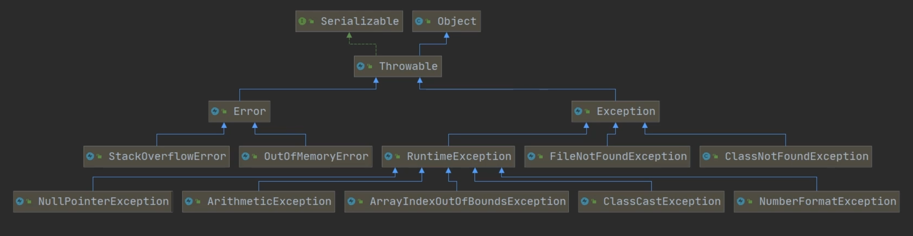
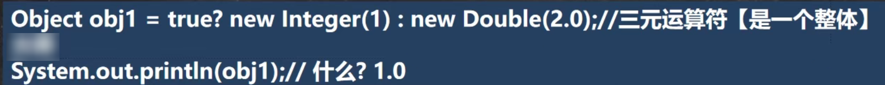
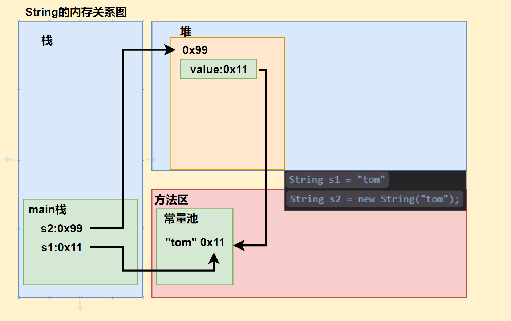
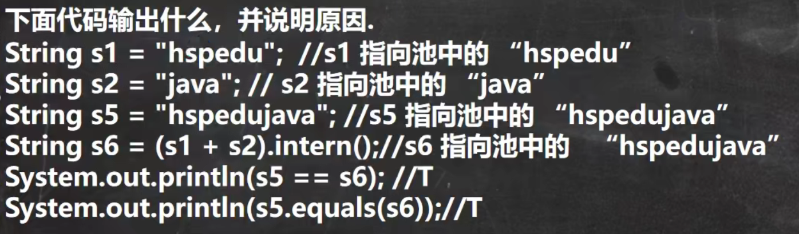
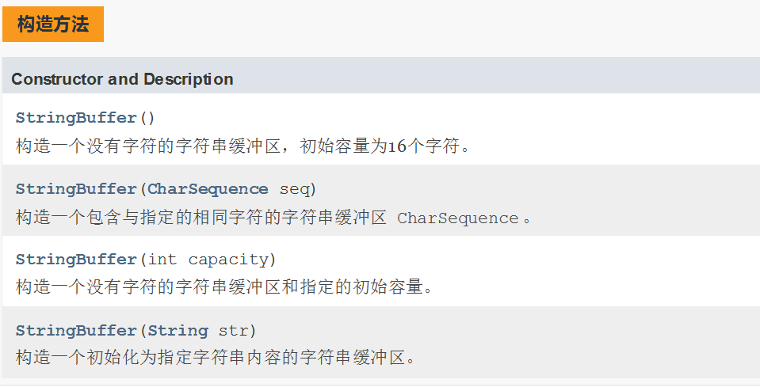

# Java Part Ⅲ 类的补充与常用类

# 第一部分：类的补充

# 1.枚举

## （1）基本介绍

- 枚举对应英文 (enumeration , 简写enum)

- 枚举是一组常量的集合。

- 可以这里理解：枚举属于一种特殊的类，里面只包含一组有限的特定的对象。


## （2）实现方式

实现方法：

- 自定义类实现枚举

- 使用enum关键字实现枚举


- ①自定义类实现实现枚举：

&ensp;&ensp;&ensp;&ensp;1. 构造器私有化

&ensp;&ensp;&ensp;&ensp;2. 本类内部创建一组对象

&ensp;&ensp;&ensp;&ensp;3. 对外暴露对象（通过为对象添加public final static修饰符） 

&ensp;&ensp;&ensp;&ensp;4. 可以提供get方法，但是不要提供set

```Java
package com.tommychan.enum_;
/**
 * 自定义枚举类的描述
 */
public class enum01 {
    public static void main(String[] args) {
        System.out.println(Season.SPRING);
    }
}

class Season {
    private String name;
    private String desc;

    //1.将构造器私有化 防止直接被 new 出来
    //2.不要用setXXX方法 防止更改属性 get可有
    //3.在内部直接创建固有对象
    //4.用final+static实现底层优化 避免类加载
    public final static Season SPRING = new Season("Spring","Warm");
    public final static Season WINTER = new Season("Winter","Cold");
    public final static Season SUMMER = new Season("Summer","Hot");
    public final static Season FALL = new Season("Fall","Cool");


    private Season(String name, String desc) {
        this.name = name;
        this.desc = desc;
    }

    @Override
    public String toString() {
        return "Season{" +
                "name='" + name + '\'' +
                ", desc='" + desc + '\'' +
                '}';
    }
}
```


- ②使用enum关键字实现

&ensp;&ensp;&ensp;&ensp;1. 当我们使用enum关键字开发一个枚举类时，默认会继承Enum类，而且是一个final 类
&ensp;&ensp;&ensp;&ensp;使用javap工具来演示 反编译

&ensp;&ensp;&ensp;&ensp;2. public static final Season02 SPRING ＝ new Season2（＂春天”，＂温暖 ＂）；简化成

&ensp;&ensp;&ensp;&ensp;&ensp;&ensp;&ensp;&ensp;SPRING（＂春天”，＂温暖＂），这里必须知道，它调用的是哪个构造器

&ensp;&ensp;&ensp;&ensp;3. 如果使用无参构造器 创建枚举对象，则实参列表和小括号都可以省略

&ensp;&ensp;&ensp;&ensp;4. 当有多个枚举对象时，使用逗号间隔，最后有一个分号结尾枚举对象必须放在枚举类的行首

&ensp;&ensp;&ensp;&ensp;5. 用enum，要将定义常量对象写在前面

```Java
package com.tommychan.enum_;
/**
 * enum关键字来实现枚举类的描述
 */
public class enum02 {
    public static void main(String[] args) {
        System.out.println(Season.SPRING);
    }
}

enum Season02 {

    //1.enum 代替 class
    //2.public final static Season SPRING = new Season("Spring","Warm");
    //  用 SPRING("Spring","Warm") 解读：常量名(形参)
    //3.如果有多个常量 则用 , 隔开
    //4.用enum，要将定义常量对象写在前面
    //5.若用无参构造器创建，可省略小括号和形参

    SPRING("Spring","Warm"),
    SUMMER("Summer","Hot"),
    FALL("Fall","Cool"),
    WINTER("Winter","Cold"),
    OtherSeason; //调用无参构造器 也可以OtherSeason();


    private String name;
    private String desc;


    private Season02(String name, String desc) {
        this.name = name;
        this.desc = desc;
    }

    private Season02(){  //无参构造器

    }

    @Override
    public String toString() {
        return "Season{" +
                "name='" + name + '\'' +
                ", desc='" + desc + '\'' +
                '}';
    }
}


```


## （3）Enum类常用方法

|toString|Enum类已经重写过了，返回的是当前对象名，子类可以重写该方法，用于返回对象的属性信息|
|---|---|
|name|返回当前对象名（常量名） ，子类中不能重写|
|ordinal|返回当前对象的位置号，默认从0开始|
|values|以数组形式返回当前枚举类中所有的常量|
|valueOf|将字符串转换成枚举对象，要求字符串必须为已有的常量名，否则报异常|
|compareTo|比较两个枚举常量，比较的就是编号，返回前一个对象编号与后一个对象的编号的差|


```Java
package com.tommychan.Enum_Method;

import com.tommychan.Enum_Method.Season02;


public class Enum_Method {
    public static void main(String[] args) {
        Season02 winter = Season02.WINTER;
        //toString()返回当前对象名
        System.out.println(winter.toString());
        System.out.println("===================");
        
        //name()返回当前对象名（常量名） ，子类中不能重写
        System.out.println(winter.name());
        System.out.println("===================");
        
        //以数组形式返回当前枚举类中所有的常量
        Season02[] values = Season02.values();
        //增强for
        for (Season02 season02 : values){
            System.out.println(season02);
        }
        System.out.println("===================");
        
        //ordinal()返回当前对象的位置号，默认从0开始
        //winter是第四个 所以输出3
        System.out.println("WINTER's Position:"+winter.ordinal());
        System.out.println("===================");

        //valueOf()将字符串转换成枚举对象，要求字符串必须为已有的常量名，否则报异常
        Season02 season02 = Season02.valueOf("FALL");
        System.out.println(season02);
        System.out.println("===================");

        //compareTo()比较两个枚举常量，比较的就是编号
        System.out.println(winter.compareTo(Season02.FALL));

    }
}

```


输出：

```纯文本
WINTER
===================
WINTER
===================
SPRING
SUMMER
FALL
WINTER
OtherSeason
===================
WINTER's Position:3
===================
FALL
===================
1
```


## （4）其他小结

- enum使用后，该类不能再被继承，因为enum类隐式继承了Enum类，而Java是单继承机制，但可以实现其他接口


# 2.注解

## （1）基本介绍

理解：

- 注解（Annotation）也被称为元数据（Metadata），用于修饰解释包、类、方法、属性、构造器、局部变量等数据信息。

- 和注释一样，注解不影响程序逻辑，但注解可以被编译或运行，相当于嵌入在代码中的补充信息。

- 在JavaSE中，注解的使用目的比较简单，例如标记过时的功能，忽略警告等。

- 在JavaEE中注解占据了更重要的角色，例如用来配置应用程序的任何切面，代替java EE 旧版中所遗留的繁冗代码和XML配置等。

介绍：使用Annotation时要在其前面增加@符号，并把该Annotation当成一个修饰符使用，用于修饰它支持的程序元素

三个基本的Annotation、

1. **@Override** ：限定某个方法，是重写父类方法，该注解只能用于方法

&ensp;&ensp;&ensp;&ensp;使用说明：

&ensp;&ensp;&ensp;&ensp;-  @Override表示指定重写父类的方法（从编译层面验证） ，如果父类没有fly方

&ensp;&ensp;&ensp;&ensp;法，则会报错如果不写@Override注解，而父类仍有public void fly01，仍然构成重写

&ensp;&ensp;&ensp;&ensp;- @Override只能修饰方法，不能修饰其它类，包，属性等等

&ensp;&ensp;&ensp;&ensp;- 查看@Override注解源码为@Target（ElementType.METHOD），说明只能修饰

&ensp;&ensp;&ensp;&ensp;- 方法@Target是修饰注解的注解，称为元注解

&ensp;&ensp;&ensp;&ensp;

2. **@Deprecated** ：用于表示某个程序元素（类，方法等）已过时

&ensp;&ensp;&ensp;&ensp;使用说明：

&ensp;&ensp;&ensp;&ensp;- 用于表示某个程序元素（类，方法等）已过时，但可以使用

&ensp;&ensp;&ensp;&ensp;- 可以修饰方法，类，字段，包，参数 等等

&ensp;&ensp;&ensp;&ensp;- @Target(value={CONSTRUCTOR, FIELD,LOCAL VARIABLE,METHOD，

&ensp;&ensp;&ensp;&ensp;PACKAGE,PARAMETER,TYPE})

&ensp;&ensp;&ensp;&ensp;- ＠Deprecated的作用可以做到新旧版本的兼容和过渡

&ensp;&ensp;&ensp;&ensp;

3. @SuppressWarnings：抑制编译器警告

&ensp;&ensp;&ensp;&ensp;- @SuppressWarning 中的属性介绍以及属性说明

&ensp;&ensp;&ensp;&ensp;&ensp;&ensp;&ensp;&ensp;all，抑制所有警告
&ensp;&ensp;&ensp;&ensp;&ensp;&ensp;&ensp;&ensp;boxing，抑制与封装/拆装作业相关的警告
&ensp;&ensp;&ensp;&ensp;&ensp;&ensp;&ensp;&ensp;cast，抑制与强制转型作业相关的警告
&ensp;&ensp;&ensp;&ensp;&ensp;&ensp;&ensp;&ensp;dep-ann，抑制与淘汰注释相关的警告
&ensp;&ensp;&ensp;&ensp;&ensp;&ensp;&ensp;&ensp;deprecation，抑制与淘汰的相关警告
&ensp;&ensp;&ensp;&ensp;&ensp;&ensp;&ensp;&ensp;fallthrough，抑制与switch陈述式中遗漏break相关的警告
&ensp;&ensp;&ensp;&ensp;&ensp;&ensp;&ensp;&ensp;finally，抑制与未传回finally区块相关的警告
&ensp;&ensp;&ensp;&ensp;&ensp;&ensp;&ensp;&ensp;hiding，抑制与隐藏变数的区域变数相关的警告
&ensp;&ensp;&ensp;&ensp;&ensp;&ensp;&ensp;&ensp;incomplete-switch，抑制与switch陈述式(enum case)中遗漏项目相关的警告
&ensp;&ensp;&ensp;&ensp;&ensp;&ensp;&ensp;&ensp;javadoc，抑制与javadoc相关的警告
&ensp;&ensp;&ensp;&ensp;&ensp;&ensp;&ensp;&ensp;nls，抑制与非nls字串文字相关的警告
&ensp;&ensp;&ensp;&ensp;&ensp;&ensp;&ensp;&ensp;null，抑制与空值分析相关的警告
&ensp;&ensp;&ensp;&ensp;&ensp;&ensp;&ensp;&ensp;rawtypes，抑制与使用raw类型相关的警告
&ensp;&ensp;&ensp;&ensp;&ensp;&ensp;&ensp;&ensp;resource，抑制与使用Closeable类型的资源相关的警告
&ensp;&ensp;&ensp;&ensp;&ensp;&ensp;&ensp;&ensp;restriction，抑制与使用不建议或禁止参照相关的警告
&ensp;&ensp;&ensp;&ensp;&ensp;&ensp;&ensp;&ensp;serial，抑制与可序列化的类别遗漏serialVersionUID栏位相关的警告
&ensp;&ensp;&ensp;&ensp;&ensp;&ensp;&ensp;&ensp;static-access，抑制与静态存取不正确相关的警告
&ensp;&ensp;&ensp;&ensp;&ensp;&ensp;&ensp;&ensp;static-method，抑制与可能宣告为static的方法相关的警告
&ensp;&ensp;&ensp;&ensp;&ensp;&ensp;&ensp;&ensp;super，抑制与置换方法相关但不含super呼叫的警告
&ensp;&ensp;&ensp;&ensp;&ensp;&ensp;&ensp;&ensp;synthetic-access，抑制与内部类别的存取未最佳化相关的警告
&ensp;&ensp;&ensp;&ensp;&ensp;&ensp;&ensp;&ensp;sync-override，抑制因为置换同步方法而遗漏同步化的警告
&ensp;&ensp;&ensp;&ensp;&ensp;&ensp;&ensp;&ensp;unchecked，抑制与未检查的作业相关的警告
&ensp;&ensp;&ensp;&ensp;&ensp;&ensp;&ensp;&ensp;unqualified-field-access，抑制与栏位存取不合格相关的警告
&ensp;&ensp;&ensp;&ensp;&ensp;&ensp;&ensp;&ensp;unused，抑制与未用的程式码及停用的程式码相关的警告


## （2）四种元注解(了解即可)

基本介绍：JDK的元Annotation用于修饰其他Annotation，元注解本身作用不大，看源码时，可以知道他是干什么即可。
元注解的种类：（使用不多，了解，不用深入研究）
1） Retention //指定注解的作用范围，三种SOURCE，CLASS，RUNTIME

2） Target //指定注解可以在哪些地方使用


3） Documented //指定该注解是否会在javadoc体现

4)   Inherited //子类会继承父类注解


# 3.异常

引入：

```Java
package com.tommychan.exception_;
/** 异常 exception 的引入案例 */
public class Exception_Induct {
    public static void main(String[] args) {
        int n1 = 10;
        int n2 = 0;

        double result = 0;          
        try {                       // n1/n2时 n2 = 0 程序会抛出异常 ArithmeticException 并终止运行
            result = n1/n2;         // 如此一来 程序的健壮性比价差
        } catch (Exception e) {     // java设计者提供了 异常处理机制 来解决该问题
            e.printStackTrace();    // 当程序员认为某段代码可能出现异常 可用try-catch异常处理机制来解决
        }                           // 快捷键为 ctrl + alt + T
        System.out.println("Program continues"); //即使出现异常 程序也可以继续执行
        System.out.println("Result:"+result);
    }
}
```


## （1）异常的概念

基本概念: Java语言中，将程序执行中发生的不正常情况称为“异常” 。（开发过程中的语法错误和逻辑错误不是异常)
运行过程中所发生的异常事件可分为两大类：

- **Error（错误）** ： Java虚拟机无法解决的严重问题。

&ensp;&ensp;&ensp;&ensp;如：JVM系统内部错误、资源耗尽等严重情况。

&ensp;&ensp;&ensp;&ensp;具体来说: StackOverflowError[栈溢出]和OOM(out of memory）， Error是严重错误，程序会崩溃。

- **Exception** ：其它因编程错误或偶然的外在因素导致的一般性问题，可以使用针对性的代码进行处理如：空指针访问，试图读取不存在的文件，网络连接中断等等

&ensp;&ensp;&ensp;&ensp;Exception分为两大类：运行时异常（程序运行时发生的）和编译时异常（编程时由编译器检查出的）


## （2）异常体系图（部分）

体现了类的继承和实现关系



  小结：

- 异常分为两大类，运行时异常和编译时异常

- 运行时异常，编译器不要求强制处置的异常。一般是指编程时的逻辑错误，是程序员应该避免其出现的异常。java.lang.RuntimeException类及它的子类都是运行时异常

- 对于运行时异常，可以不作处理，因为这类异常很普遍，若全处理可能会对程序的可读性和运行效率产生影响

- 编译时异常，是编译器要求必须处置的异常。


## （3）五大运行时异常

### ① NullPointerException — 空指针异常

当应用程序试图在需要对象的地方使用null时，抛出该异常

```Java
package com.tommychan.exception_;

public class NullPointerException_ {
    public static void main(String[] args) {
        String name = null;
        System.out.println(name.length());
    }
}

```


### ② ArithmeticException — 数学运算异常

当出现异常的运算条件时，抛出此异常。例如，一个整数“除以零”时，抛出此类的一个实例

### ③ ArraylndexOutOfBoundsException数组下标越界异常

用非法索引访问数组时抛出的异常。如果索引为负或大于等于数组大小，则该索引为非法索引

```Java
package com.tommychan.exception_;

public class ArraylndexOutOfBoundsException_ {
    public static void main(String[] args) {
        int[] arr = {1,2,4};
        for (int i = 0; i <= arr.length; i++) {
            System.out.println(arr[i]+" ");
        }
    }
}
```


### ④ ClassCastException — 类型转换异常

当试图将对象强制转换为不是实例的子类时，抛出该异常。例如，以下代码将生成一个ClassCastException

```Java
package com.tommychan.exception_;

public class ClassCastException_ {
    public static void main(String[] args) {
        A b = new B(); //向上转型
        B b1 = (B) b;   //向下转型
        C b2 = (C) b; //ClassCastException
    }
}

class A{}
class B extends A{}
class C extends A{}
```


### ⑤ NumberFormatException — 数字格式不正确异常

当应用程序试图将字符串转换成一种数值类型，但该字符串不能转换为适当格式时，抛出该异常，使用异常我们可以确保输入是满足条件数字.

```Java
package com.tommychan.exception_;

public class NumberFormatException_ {
    public static void main(String[] args) {
        String str = "Student";
        int num = Integer.parseInt(str);
        System.out.println(num);
    }
}
```


## （4）编译异常

介绍：编译异常是指在编译期间，就必须处理的异常，否则代码不能通过编译。

常见的编译异常：

- SQLException  操作数据库时，查询表可能发生异常

- IOException  操作文件时，发生的异常

- FileNotFoundException  当操作一个不存在的文件时，发生异常 

- ClassNotFoundException 加载类，而该类不存在时，异常 

- EOFException  操作文件，到文件末尾，发生异常

- lllegalArguementException 参数异常 


## （5）try—catch

介绍：Java提供try和catch块来处理异常。try块用于包含可能出错的代码。catch块用于处理try块中发生的异常。可以根据需要在程序中有多个try...catch块。


基本语法：

```Java
try{
  //可疑代码
  //将异常生成对应的异常对象，传递给catch块
  }catch(异常 e){
  //对异常的处理 e.getmessage()可返回异常信息
  }finally{
  //不管是否发生异常，都执行某段代码
  }
```


小结：

- 如果异常发生了，则异常发生后面的代码不会执行，直接进入到catch块

- 如果异常没有发生，则顺序执行try的代码块，**不会进入到catch** 

- 如果希望不管是否发生异常，都执行某段代码（比如关闭连接，释放资源等）

      则使用如下代码—finally｛｝

- 可以进行try—finally 配合使用，这种用法**相当于没有捕获异常** ，因此程序会直接崩掉，应用场景就是执行一段代码，不管是否发生异常，都必须执行某个业务逻辑

- 可以有多个catch语句，捕获不同的异常（进行不同的业务处理），要求父类异常在后，子类异常在前，比如（Exception在后， NullPointerException在前），如果发生异常，只会匹配一个catch，案例演示


实践： 

让用户输入整数，如果输入的不是整数，则一直输入

```Java
package com.tommychan.exception_;

import java.util.Scanner;

public class TryCatchExercise01 {
    public static void main(String[] args) {
        Scanner scanner = new Scanner(System.in);
        int num = 0;

        while (true){
            System.out.println("Please input a int");
            try {
                Integer.parseInt(scanner.next());
                break;
            } catch (NumberFormatException e) {
                System.out.println("Wrong input");
            }
        }
    }
}

```


## （6）throws

基本介绍：

- 如果一个方法（中的语句执行时）可能生成某种异常，但是并不能确定如何处理这种异常，则此方法应显示地声明抛出异常，表明该方法将不对这些异常进行处理，而由该方法的调用者负责处理。

- 在方法声明中用throws语句可以声明抛出异常的列表，throws后面的异常类型可以是方法中产生的异常类型，也可以是它的父类。


# 第二部分： 常用类

# 4.八大Wrapper类

## （1）包装类的分类

介绍：

- 针对八种基本数据类型相应的引用类型一包装类


- 有了类的特点，就可以调用类中的方法


|boolean |Boolean |
|---|---|
|char |Character |
|byte|Byte|
|short|Short|
|int|Integer|
|long|Long|
|float|Float|
|double|Double|


## （2）包装类和基本数据的转换

装箱： 基本类型→包装类型 

拆包： 包装类型→基本类型

- jdk5 前是手动装箱插箱

- jdk5（含jdk5）后是自动装箱拆箱

int类型装箱及拆箱：（其他类型类推）

```Java
public class Wrapper01 {
    public static void main(String[] args) {
        //int 装箱及拆箱
        //手动装箱 int->Integer
        int n1 = 10;
        Integer integer = new Integer(n1);
        Integer integer1 = Integer.valueOf(n1);

        //手动拆箱 Integer->int
        int n2 = integer.intValue();

        //自动装箱
        Integer integer2 = n1;//底层调用的仍然是Integer.valueOf(n1)
        //自动拆箱
        int n3 = integer2; //底层调用的仍然是integer.intValue()
    }
}
```


**一个问题：** 




## （3）包装类方法

**以String和Integer的转换为例** ：

```Java
package com.tommychan.Wrapper_;

public class Wrapper02 {
    public static void main(String[] args) {
        //包装类（Integer）-> String
        Integer i = 100;
        //方法1
        String s1 = i+"";
        //方法2
        String s2 = i.toString();
        //方法3
        String s3 = String.valueOf(i);

        //String -> Integer
        String s = "111";
        //方法1
        Integer i1 = Integer.parseInt(s);
        //方法2
        Integer i2  = new Integer(s);
    }
}
```


## （4）Integer类

创建机制：

```Java
package com.tommychan.Wrapper_;

@SuppressWarnings("all")
public class Wrapper01 {
    public static void main(String[] args) {
        //示例一
        Integer i1=new Integer( 127);
        Integer i2=new Integer( 127);
        System.out.println(i1==i2); //false
        //示例二
        Integer i3=new Integer( 128);
        Integer i4=new Integer( 128);
        System.out.println(i3==i4); //false
        //示例三
        Integer i5=127; //底层用的是Integer.valueOf(127)
        Integer i6=127; //-128~127 就是直接返回 在此范围外则new一个
        System.out.println(i5==i6); //true
        //示例四
        Integer i7=128;
        Integer i8=128;
        System.out.println(i7==i8); //false
        //示例五
        Integer i9=127;
        Integer i10=new Integer(127);
        System.out.println(i9==i10);//false
        //示例六
        Integer i11=127;
        int i12=127;//只要有基本数据类型，判断的是值是否相等
        System.out.println(i11==i12);//true
        //示例七
        Integer i13 =128;
        int i14=128;
        System.out.println(i13==i14);//true
    }
}

```


System.out.println(  Integer.MIN_VALUE);

&ensp;&ensp;&ensp;&ensp;System.out.println(  Integer.MAX_VALUE);


## （5）String类

### ① **结构剖析：** 

1．String 对象用于保存字符串，也就是一组字符序列


2．“ jack＂ 字符串常量，双引号括起的字符序列


3．字符串的字符使用Unicode字符编码，一个字符（区分字母还是汉字）占两个字节

4．String 类有很多构造器，构造器的重载常用的有 

```Java
String s1 = new String(); 
String s2 = new String(String original); 
String s3 = new String(char[] a); 
String S4 = new String(char[] a,int startIndex,int count); 
String s5 = new String(byte[]b);

```


5．String 类实现了接口 Serializable   [String 可以串行化：可以在网络传输]
                          接口 Comparable［String 对象可以比较大小］

6．String 是final 类，不能被其他的类继承


7．String 有属性` private final char value[];`用于存放字符串内容

8．一定要注意：value 是一个final类型，不可以修改：即value不能指向新的地址，但是单个字符内容是可以变化


### ② 两种创建String对象的区别

方式一 :  直接赋值     `String s1 = "tom"`
方式二 ：调用构造器  `String s2 = new String("tom");`

1.方式一：先从常量池查看是否有“tom”数据空间，如果有，直接指向；如果没有则重新创建，然后指向。s1最终指向的是常量池的空间地址
2.方式二：先在堆中创建空间，里面维护了value属性，指向常量池的“tom”空间, 如果常量池没有“tom”，重新创建，如果有，直接通过value指向。最终指向的是堆中的空间地址
3.两种方式的内存分布图




### ③ String对象的特性




### ④ String常用方法

- equals：区分大小写，判断内容是否相等, 且区分大小写

- equalslgnoreCase：忽略大小写的判断内容是否相等

- length：获取字符的个数，字符串的长度

- indexOf：获取字符或者子字符串（第一个字母）在字符串中第1次出现的索引，索引从0开始，如果找不到，返回-1

- lastlndexOf：获取字符或者子字符串（第一个字母）在字符串中最后1次出现的索引，索引从0开始，如找不到，返回-1

- substring：截取指定范围的子串 substring(index) 

&ensp;&ensp;&ensp;&ensp;- `substring（index）` 截取0—index的字串

&ensp;&ensp;&ensp;&ensp;- `substring（from , to）` 截取from—（from-to）位置的字串

- trim：去前后空格

- charAt：获取某索引处的字符，注意不能使用Str［index］这种方式

```Java
String str = "Hello";
//str[0] ×
//str.charAt(0) => 'H' √

```


- toUpperCase 将字符串转换为大写

- toLowerCase 将字符串转换为小写 

- concat 拼接字符串

- replace替换字符串中的字符

&ensp;&ensp;&ensp;&ensp;- `str = str.replace("Jack","Tommy");` 将str中的所有`"Jack"`替换成`“Tommy”`

&ensp;&ensp;&ensp;&ensp;- 此方法对str本身没有影响，除非重新赋值。即返回的结果才是修改后的结果

- split分割字符串

```Java
String poem = "锄禾日当午,汗滴禾下土,谁知盘中餐,粒粒皆辛苦";
String[] spilt = poem.spilt(","); //以,为标准，对poem进行分割，并将每一部分存入数组

//对于某些分割字符，我们需要转义比如|  \\等
String path = "E:\\aaa\\bbb";
String[] spilt01 = poem.spilt("\\\\"); 
 


```


- toCharArray 字符串转换成字符数组

```Java
String s = "abcde";
char[] ch = s.toCharArray();
```


- compareTo 比较两个字符串的大小

&ensp;&ensp;&ensp;&ensp;- 若长度相同，前者大则返回正数。后者大则返回负数，相等返回0

&ensp;&ensp;&ensp;&ensp;- 若长度不一，若`s1 = "jack";` `s2 = "jcck";`

```Java
String s1 = "jack";
String s2 = "jcck";

System.out.println(s1.compareTo(b)); //返回'a'-'c' = 2

```


- format  格式字符串       %s字符串  %c字符  %d整型  %.2f(只保留两位小数，按四舍五入) 浮点型

```Java
String name = "Jack";
int age = 19;
double grade = 98.5;

String info = String.format("My name is %s ,age is %d, grade is %.2f");
```


# 5.StringBuffer类

## （1）基本介绍

- StringBuffer的直接父类是AbstractStringBuilder

- StringBuffer实现了SerializabLe，即StringBuffer的对象可以串行化

- 在父类中AbstractStringBuilder有属性`char[] value`，不是final属性，该`value`数组存放字符串内容，引出存放在堆中的

- StringBuffer是一个final类，不能被继承


StringBuffer & String

- String保存的是字符串常量，里面的值不能更改，每次String类的更新实际上就是更改地址，效率较低 `private final char value[];`指向池

- StringBuffer保存的是字符串变量，里面的值可以更改，每次StringBuffer的更新实际上可以更新内容，不用每次都更新地址，（除非空间不够了），效率较高`char[] value；`这个放在堆也指向堆


## （2）StringBuffer的构造器




## （3）String和StringBuffer的转换

```Java
package com.tommychan.StringBuffer_;

public class StringBufferToString {
    public static void main(String[] args) {
        //String -> StringBuffer

        //1. By Constructor
        String s1= "abc";
        StringBuffer stringBuffer = new StringBuffer(s1);

        //2. By append
        StringBuffer stringBuffer1 = new StringBuffer();
        stringBuffer1 = stringBuffer1.append(s1);

        //StringBuffer -> String

        //1. By StringBuffer.toString()
        StringBuffer stringBuffer2 = new StringBuffer("xyz");
        String s2 = stringBuffer2.toString();

        //2. By Constructor
        String s3 = new String(stringBuffer2);

    }
}

```


## （4）StringBuffer常用方法

- 增append

- 删delete(start,end)

- 改replace(start,end,string)//将 start——end间的内容替换掉，不含end

- 查indexof //查找子串在字符串第1次出现的索引，如果找不到返回—1

- 插insert

- 获取长度length

```Java
package com.tommychan.StringBuffer_;

public class Methods {
    public static void main(String[] args) {
        //1. append 增
        StringBuffer hello = new StringBuffer("Hello");
        hello.append(" World");
        System.out.println(hello);
        hello.append(" I am").append(" Tommy");
        System.out.println(hello); //hello = "Hello World I am Tommy"

        //2. delete 删除索引为 >=from <to 的处的字符 即 [from,to)
        hello.delete(0,12);
        System.out.println(hello);//hello = "I am Tommy"

        //3. replace 替换索引为 [from,to)的字符
        hello.replace(2,4,"was");
        System.out.println(hello);//hello = "I was Tommy"

        //4. indexOf 查找字串在字符串第一次出现的位置 若没有返回-1
        int indexOf = hello.indexOf("was");
        System.out.println("'was' index =  "+indexOf); //'was' index =  2

        //5. insert 插入 insert(index,"sss") index处及之后的内容自动后移
        hello.insert(5," cool");
        System.out.println(hello); //hello = I was cool Tommy

        //6. length 长度  length()方法可以得到当前StringBuffer的长度。
        System.out.println("length = " + hello.length());//length = 16

        //7.capacity 空间 而通过调用capacity()方法可以得到总的分配
        System.out.println("capacity = "+hello.capacity());//capacity = 44
    }
}

```


# 6. StringBuilder 类

## （1）基本介绍

- 一个可变的字符序列。此类提供一个与StringBuffer兼容的API，但不保证同步（StringBuilder不是线程安全）。该类被设计用作StringBuffer的一个简易替换，用在字符串缓冲区被单个线程使用的时候。如果可能，建议优先采用该类，因为在大多数实现中，它比StringBuffer要快

- 在StringBuilder上的主要操作是append和insert方法，可重载这些方法，以接受任意类型的数据


## （2）结构剖析

- StringBuilder继承AbstractStringBuilder类

- 实现了Serializable ，说明StringBuilder对象是可以串行化（对象可以网络传输，可以保存到文件

- stringBuilder是final类，不能被继承


- stringBuilder对象字符序列仍然是存放在其父类AbstractstringBuilder的char[] value；因此，字符序列是堆中


- StringBuilder的方法，没有做互斥的处理，即没有synchronized关键字，因此在单线程的情况下使用StringBuilder


## （3）StringBuffer String 与StringBuilder的选择

- StringBuilder 和StringBuffer非常类似，均代表可变的字符序列，而且方法 也一样

- String：**不可变** 字符序列，效率低，但是复用率高

- StringBuffer：可变字符序列、效率较高（增删）、线程安全

- StringBuilder：可变字符序列、效率最高、线程不安全

- String使用注意说明：

&ensp;&ensp;&ensp;&ensp;- `String s＝"a"；` 创建了一个字符串

&ensp;&ensp;&ensp;&ensp;- `s＋＝"b"；` 实际上原来的＂a＂字符串对象已经丢弃了，现在又产生了一个字符串s＋＂b＂（也就是＂ab＂）。如果多次执行这些改变串内容的操作，会导致大量副本字符串对象存留在内存中，降低效率。如果这样的操作放到循环中，会极大影响程序的性能

&ensp;&ensp;&ensp;&ensp;- 结论：如果我们对String 做大量修改，不要使用String


小结：   ** 效率：StringBuilder > StringBuffer > String** 

- 如果字符串存在大量的修改操作，一般使用 StringBuffer 或StringBuilder 

- 如果字符串存在大量的修改操作，并在单线程的情况，使用 StringBuilder

- 如果字符串存在大量的修改操作，并在多线程的情况，使用 StringBuffer

- 如果我们字符串很少修改，被多个对象引用，使用String，比如配置信息等


# 7. Math 类

常用方法：

- abs 绝对值

- pow 求幂  `pow(2,4)` 2的4次方

- ceil 向上取整  返回≥该参数的最小整数 （转成double）

- floor 向下取整  返回≤该参数的最大整数 （转成double）

- round 四舍五入 

- sqrt 求开方

- random 求随机数 返回的是[0,1）的一个随机小数

- max 求两个数的最大值


- min 求两个数的最小值


# 8. Arrays 类

```Java
package com.tommychan.Arrays_;

import java.util.Arrays;
import java.util.Comparator;
import java.util.List;

public class Arrays01 {
    public static void main(String[] args) {
        Integer[] num= {1,334,12,43,32};
        //1. toString方法可以显示数组
        System.out.println(Arrays.toString(num));

        //2. sort 排序
        //(1) 升序排序
        Arrays.sort(num);
        System.out.println(Arrays.toString(num));

        //(2)定制排序
        Arrays.sort(num, new Comparator() {
            @Override
            public int compare(Object o1, Object o2) {
                Integer i1 = (Integer) o1;
                Integer i2 = (Integer) o2;
                return i2-i1;
            }
        });
        System.out.println(Arrays.toString(num));

        //3. binarySearch
        // 二分搜索来查找 要求必须排好顺序
        // 不存在则返回 -(low+1) 例如：
        // 7 不在数组中 如果7存在这应该在6和88之间 故low=5 返回-6
        Integer[] nums= {1,3,4,5,6,88};
        int index = Arrays.binarySearch(nums,3);
        System.out.println("index="+index);

        //4.copyOf(nums,newLength) 使用的是底层的System.arraycopy()
        //  完成数组复制
        //  从nums拷贝newLength个元素
        //  如果 newLength > nums.length 则在末尾加上 null
        //  如果 newLength <  0 则报错 NegativeArraySizeException
        Integer[] nums2 = Arrays.copyOf(nums,6);
        System.out.println(Arrays.toString(nums2));

        //5.fill 数组填充
        //  使用99去填充原有数据
        Integer[] nums3 = {9,1,null,null};
        Arrays.fill(nums3,99);
        System.out.println(Arrays.toString(nums3)); //[99,99,99,99]

        //6.equals 比较两个数组的元素是否完全一致
        Integer[] nums4 = {99,99,99,99};
        System.out.println(Arrays.equals(nums3,nums4)); //true

        //7.asList 将一组值转换为list
        List list1 = Arrays.asList(nums4);
        List list2 = Arrays.asList(2,34,54,35);
        System.out.println("list1 = "+list1);
        System.out.println("list2 = "+list2);

    }
}

```


# 9. System类

## 常用方法

- exit 退出当前程序


- arraycopy：复制数组元素，比较适合底层调用，一般使用Arrays.copyOf完成复制数组.


&ensp;&ensp;&ensp;&ensp;`int[]src={1,2,3}; `

&ensp;&ensp;&ensp;&ensp;`int[]dest=new int[3];`

&ensp;&ensp;&ensp;&ensp;`System.arraycopy(src,0,dest,0,3);`

- currentTimeMillis：返回当前时间距离1970-1-1的毫秒数 

- gc：运行垃圾回收机制 System.gc（）；

```Java
package com.tommychan.system_;

import java.util.Arrays;

/**
 * System 类的常用方法
 */
public class System01 {
    public static void main(String[] args) {

        //1. exit 退出程序
        System.out.println("hello");
//        System.exit(0); //参数 0 表示正常退出

        //2. arraycopy 拷贝数组
        int[]src = {1,2,3};
        int[]dest = new int[3];
        System.arraycopy(src,0,dest,0,3);
        //参数解读： (源数组 , 源数组开始拷贝的索引 , 目标数组 , 目标数组开始参加拷贝的索引 , 拷贝数据的个数 )
        System.out.println(Arrays.toString(dest));

        //3. currentTimeMillis 返回当前时间距离1970-1-1的毫秒数
        System.out.println(System.currentTimeMillis());

        //4. gc 运行垃圾回收机制 System.gc（）;
    }
}
```


# 10. BigInteger 与 BigDecimal 类

## （1）基本介绍

- BigInteger适合保存比较大的整型


- BigDecimal适合保存精度更高的浮点型（小数）


## （2）常用方法

```Java
public class BigInteger01 {
    public static void main(String[] args) {

        //创建BigInteger
        BigInteger bigInteger = new BigInteger("29000000000000000000");
        BigInteger bigInteger1 = new BigInteger("1000000000000000000");
        System.out.println(bigInteger);

        //对BigInteger进行加减乘除需要用对应的方法 不能使用+-*/
        //1. add 加
        bigInteger = bigInteger.add(bigInteger1);
        System.out.println(bigInteger);
        //2. subtract 减
        bigInteger = bigInteger.subtract(bigInteger1);
        System.out.println(bigInteger);
        //3. multiply 乘
        //4. divide 除

    }
}
```


```Java
package com.tommychan.bigNum;

import java.math.BigDecimal;

public class BigDecimal01 {
    public static void main(String[] args) {

        //当我们需要保存一个精度很高的数 double不够用
        //我们使用BigDecimal
        BigDecimal bigDecimal = new BigDecimal("9.99999999999999999");
        BigDecimal bigDecimal1 = new BigDecimal("0.00000000000000001");
        System.out.println(bigDecimal);

        //对BigDecimal进行加减乘除需要用对应的方法 不能使用+-*/
        //1. add 加
        bigDecimal = bigDecimal.add(bigDecimal1);
        System.out.println(bigDecimal);

        //2. subtract 减
        bigDecimal = bigDecimal.subtract(bigDecimal1);
        System.out.println(bigDecimal);

        //3. multiply 乘
        bigDecimal = bigDecimal.multiply(bigDecimal1);
        System.out.println(bigDecimal);

        //4. divide 除
        //bigDecimal = bigDecimal.divide(bigDecimal1);
        //可能会抛出异常 (除不尽时 无限循环小数)
        //可以通过指定精度 BigDecimal.Round_CEILING 保留为 分子 的精度
        bigDecimal = bigDecimal.divide(bigDecimal1,BigDecimal.ROUND_CEILING);
        System.out.println(bigDecimal);

    }
}

```


# 11. Date类 `import java.util.Date;`

&ensp;&ensp;&ensp;&ensp;不要引入`import java.sql.Date;`

## （1）第一代Date类 

- Date：精确到毫秒，代表特定的瞬间

- SimpleDateFormat：格式和解析日期的类

&ensp;&ensp;&ensp;&ensp;SimpleDateFormat格式化和解析日期的具体类。它允许进行格式化（日期→文本）、解析（文本→日期）和规范化

```Java
package com.tommychan.date_;

import java.text.ParseException;
import java.text.SimpleDateFormat;
import java.util.Date;

/**
 *  Date 类使用方法
 */
public class Date01 {
    public static void main(String[] args) throws ParseException {

        Date date = new Date(); //获取当前时间
        System.out.println("Date:"+date); //默认输出格式为国外方式
        Date date1 = new Date(232390);//通过毫秒数获取时间
        System.out.println(date1);

        //创建SimpleDateFormat对象，可以指定对应的格式
        //这里的格式中使用的字母是严格规定的，参照api或data_包下的jpg
        SimpleDateFormat simpleDateFormat = new SimpleDateFormat("yyyy年MM月dd日 hh:mm::ss E");
        String format = simpleDateFormat.format(date);
        System.out.println("Date:"+format);

        //把一个格式化的String转换成对应的Date
        //得到的 date2 还是国外的格式
        //可以通过上面的方法转换来格式化输出
        String s = "2020年12月23日 12:23::23 星期日";
        Date date2 = simpleDateFormat.parse(s);
        System.out.println(simpleDateFormat.format(date2));
    }
}
```


## （2）第二代日期类 Calender 类

- 第二代日期类，主要就是Calendar类（日历）

- Calendar类是一个抽象类，它为特定瞬间与一组诸如YEAR，MONTH , DAY_OF_MONTH， HOUR等日历字段之间的转换提供了一些方法，并为操作日历字段（例如获得下星期的日期）提供了一些方法。


```Java
package com.tommychan.date_;

import java.util.Calendar;

/**
 *  Calendar 类的使用
 */

public class Calender01 {
    public static void main(String[] args) {

        //Calendar 类是一个抽象类 且构造器为private
        //可以通过 getInstance() 来获取实例

        Calendar calendar = Calendar.getInstance();
        System.out.println(calendar);

        //获取Calendar对象的某个日历字段
        System.out.println("Year:"+calendar.get(calendar.YEAR));
        System.out.println("Month:"+((calendar.get(calendar.MONTH))+1));
        //Calendar 返回月时 从 0 开始 故+1
        System.out.println("Day:"+calendar.get(calendar.DAY_OF_MONTH));
        System.out.println("Hour:"+calendar.get(calendar.HOUR));
        System.out.println("Minute:"+calendar.get(calendar.MINUTE));
        System.out.println("Second:"+calendar.get(calendar.SECOND));
        //Calender 没有专门的格式化方法，所以需要程序员自己来组合显示
        
    }
}
```


## （3）第三代Date类

- LocalDate（日期／年月日）、LocalTime（时间／时分秒）、LocalDateTime（日期时 间／年月日时分秒）JDK8加入


- LocalDate只包含日期，可以获取日期字段

- LocalTime只包含时间，可以获取时间字段


- LocalDateTime包含日期＋时间，可以获取日期和时间字段

```Java
package com.tommychan.date_;

import java.time.LocalDateTime;

public class LocalDate01 {
    public static void main(String[] args) {

        //1. 用 LocalDateTime 的now获取当前时间
        LocalDateTime localDate = LocalDateTime.now();
        System.out.println(localDate);

        System.out.println("Year:"+localDate.getYear());
        System.out.println("Month:"+localDate.getMonth());
        System.out.println("Month:"+localDate.getMonthValue());
        System.out.println("Day:"+localDate.getDayOfMonth());
        System.out.println("Day:"+localDate.getDayOfWeek());
        System.out.println("Hour:"+localDate.getHour());
        System.out.println("Minute:"+localDate.getMinute());
        System.out.println("Second:"+localDate.getSecond());

        //2. LocalDate 只有年月日
        //3. LocalTime 只有时分秒
    }
}

```


