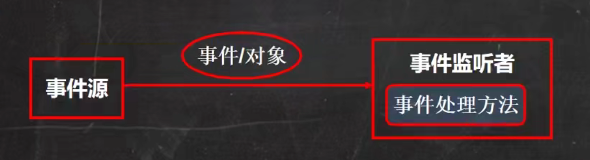

# Project1_Tank 

# 1.为什么是Tank

- Java面向对象编程

- 多线程

- 文件i/o操作

- 数据库 [ ] 

# 2.Java绘图体系 （了解即可）

## （1）坐标体系基本介绍

如下图说明了Java坐标系：坐标原点位于左上角，以**像素** 为单位。在Java坐标系中，第一个是x坐标，表示当前位置为水平方向，距离坐标原点x个像素；第二个是y坐标，表示当前位置为垂直方向，距离坐标原点y个像素。


## （2）像素的概念

问题：绘图还必须要搞清一个非常重要的概念—像素一个像素等于多少厘米？<br />解答：像素是一个密度单位而厘米是长度单位两者无法比较。

计算机在屏幕上显示的内容都是由屏幕上的每一个像素组成的。例如，计算机显示器的分辨率是800x600，表示计算机屏幕上的每一行由800个点组成，共有600行，整个计算机屏幕共有480 000个像素。<br /><br />

## （3）绘图原理

Component类提供了两个和绘图相关最重要的方法：

- `paint(Graphics g)`绘制组件的外观

- `repaint()`刷新组件的外观。

当组件第一次在屏幕显示的时候，程序会自动的调用paint（）方法来绘制组件。

在以下情况`paint()`将会被调用：

- 窗口最小化，再最大化

- 窗口的大小发生变化

- `repaint()`方法被调用


## （4）Graphics类常用方法

- 画直线`drawLine(int x1,int y1,int x2,int y2)`

- 画矩形边框`drawRect(int x, int y, int width, int height)`

- 画椭圆边框`drawOval(int x, int y, int width, int height)`

- 填充矩形`fillRect(int x, int y, int width, int height)`

- 填充椭圆`fillOval(int x, int y, int width, int height)`

- 画图片`drawlmage(lmage img, int x, int y, ..)`

- 画字符串`drawString(String str, int x, int y)`

- 设置画笔的字体`setFont（Font font）`

- 设置画笔的颜色`setColor(Color c)`<br /><br />

```Java

```


# 3.Java事件处理机制

## （1）基本介绍

Java事件处理是采取“委派事件模型” 。当事件发生时，产生事件的对象，会把此“信息"传递给“事件的监听者”处理，这里所说的“信息”实际上就是 `java.awt.event` 事件类库里某个类所创建的对象，把它称为＂事件的对象＂。




## （2）深入解析

1. 事件源：事件源是一个产生事件的对象，比如按钮，窗口等。

2. 事件：事件就是承载事件源状态改变时的对象，比如当键盘事件、鼠标事件、窗口事件等等，会生成一个事件对象，该对象保存着当前事件很多信息，比如KeyEvent对象含义被按下键的Code值。`java.awt.event`包和`javax.swing.event`包中定义了各种事件类型。

3. 事件监听器接口：

（1）当事件源产生一个事件，可以传送给事件监听者处理

（2）事件监听者实际上就是一个类，该类实现了某个事件监听器接口，它实现了`KeyListener`接口，它就可以作为一个事件监听者，对接受到的事件进行处理

（3）事件监听器接口有多种，不同的事件监听器接口可以监听不同的事件，一个类可以实现多个监听接口

（4）这些接口在`java．awt．event`包和`javax．swing．event`包中定义。 列出常用的事件监听器接口，查看jdk 文档。

 

# 4.多线程基础

## （1）线程相关概念

- **进程** ：1．进程是指运行中的程序，比如我们使用QQ，就启动了一个进程，操作系统就会为该进程分配内存空间。当我们使用迅雷，又启动了一个进程，操作系统将为迅雷分配新的内存空间。

  ​             2．进程是程序的一次执行过程，或是正在运行的一个程序。是动态过程：有它自身的产生、存在和消亡的过程。

- **线程** **：** 1．线程由进程创建的，是进程的一个实体。

  ​              2． 一个进程可以拥有多个线程，如下图。


- **单线程** ：同一个时刻，只允许执行一个线程。

- **多线程** ：同一个时刻，可以执行多个线程，比如：一个qq进程，可以同时打开多个聊天窗口，一个迅雷进程，可以同时下载多个文件。

- **并发** **：** 同一个时刻，多个任务交替执行，造成一种“貌似同时”的错觉，简单的说，单核cpu实现的多任务就是并发。

- **并行** ：同一个时刻，多个任务同时执行。多核cpu可以实现并行。可能出现并发和并行同时存在的情况。

## （2）线程基本使用

- **创建线程的两种方法** **：** 

1．继承`Thread `类，重写 run方法

2．实现`Runnable`接口，重写 run方法


多线程机制：


```Java
package com.tommychan.javaselearning.thread_;
/**
 * @author TommyChan
 * @version 1.0
 * description: 通过继承 Thread 类实现创建线程
 *
*/ 
public class CreateThread01 {
    public static void main(String[] args) {

        Cat cat = new Cat();//创建Cat对象 作线程使用
        cat.start();//启动线程 源码中的start0 方法才是实现多线程的核心
        //当main线程启动一个子线程Thread-0 子线程不会阻塞main线程
        //可用j console检测

        //为什么不用cat.run(); 而是start 这样是从main线程中直接调用cat的某个方法 并不会启动新线程
        //这样只有将cat.run()执行完毕才会继续执行以下代码

        for (int i = 0; i < 80; i++) {
            System.out.println(i + Thread.currentThread().getName());
            try {
                Thread.sleep(1000);
            } catch (InterruptedException e) {
                e.printStackTrace();
            }
        }
    }
}
//1.当一个类继承了 Thread 类 ，则可以把该类当做线程使用
//2.重写 run 方法，来实现自己的业务代码
//3.Thread 类实现了 Runnable 接口的 run方法
class Cat extends Thread{
    @Override
    public void run() {
        int times = 0;
        //重写 run 方法，来实现自己的业务代码
        while (true){
            System.out.println("\"miao ~\": "+currentThread().getName());
            times++;
            try {
                Thread.sleep(1000); //线程休息 1s 此处只写Tread.sleep(1000) 会报错
            } catch (InterruptedException e) {//使用 try-catch 保证程序继续运行
                e.printStackTrace();
            }
            if (times == 80){
                break;
            }
        }
    }
}
```


```Java
package com.tommychan.javaselearning.thread_;*
/**
 * @author TommyChan
 * @version 1.0
 * description: 通过实现 Runnable 接口实现创建线程
 *
 */
public class CreatThread02 {
    public static void main(String[] args) {
        Dog dog = new Dog();
        Thread thread = new Thread(dog);
        thread.start();
        //使用了一种设计模式：[代理模式]
    }
}

class Dog implements Runnable{

    int count = 0;
    @Override
    public void run() {
        while (true){
            System.out.println("第"+(++count)+"只汪 "+Thread.currentThread().getName());
            try {
                Thread.sleep(1000);
            } catch (InterruptedException e) {
                e.printStackTrace();
            }

            if (count == 80) {
                break;
            }
        }
    }
}
```


## （3）继承Thread与实现Runnable

- 从java的设计来看，通过继承Thread或者实现Runnable接口来创建线程本质上没有区别，从jdk帮助文档我们可以看到Thread类本身就实现了Runnable接口
- 实现Runnable接口方式更加适合多个线程共享一个资源的情况，并且避免了单继承的限制


## （4）线程终止

1．当线程完成任务后，会自动退出。

2．还可以通过使用变量来控制run方法退出的方式停止线程，即通知方式

```Java
public class CreatThread02 {
    public static void main(String[] args) {
        Dog dog = new Dog();
        Thread thread = new Thread(dog);
        thread.start();
        //使用了一种设计模式：[代理模式]
        try {
            Thread.sleep(3000);
        } catch (InterruptedException e) {
            e.printStackTrace();
        }

        dog.setLoop(false);**//进程结束** 
    }
}

class Dog implements Runnable{

    private int count = 0;
    private boolean loop = true; //控制进程结束
    @Override
    public void run() {
        while (loop){
            System.out.println("第"+(++count)+"只汪 "+Thread.currentThread().getName());
            try {
                Thread.sleep(1000);
            } catch (InterruptedException e) {
                e.printStackTrace();
            }
        }
    }

    public void setLoop(boolean loop) {//控制进程结束
        this.loop = loop;
    }
}
```


## （5）线程常用方法

### **第一组：** 

1．`setName` 设置线程名称，使之与参数 name 相同

2．`getName`返回该线程的名称

3．`start `使该线程开始执行；Java 虚拟机底层调用该线程的 start0 方法

4．`run`调用线程对象 run 方法；

5．`setPriority`更改线程的优先级

6．`getPriority`获取线程的优先级

7 .  `sleep`在指定的毫秒数内让当前正在执行的线程休眠（暂停执行）

8．`interrupt` 中断线程 而不是终止

**注意事项：** 

1． start 底层会创建新的线程，调用run，run 就是一个简单的方法调用，不会启动新线程

2．线程优先级的范围

3．`interrupt`，中断线程，但并没有真正的结束线程。所以一般用于中断正在休眠线程

4．`sleep`：线程的静态方法，使当前线程休眠

### **第二组：** 

1. `yield`: 线程的礼让。让出CPU,让其他线程执行,但礼让的时间不确定，所以也不一定礼让成功（与CPU有关）

2. `join`：线程的插队。插队的线程一旦插队成功，则肯定先执行完插入的线程所有的任务

**案例** ：创建一个子线程，每隔1s输出hello，输出20次，主线程每隔1秒，输出hi，输出20次.要求：两个线程同时执行，当主线程输出5次后，就让子线程运行完毕，主线程再继续。

```Java
package com.tommychan.javaselearning.thread_;

public class ThreadMethod {
    public static void main(String[] args) throws InterruptedException {

        int times = 0;
        Say say = new Say();
        Thread thread = new Thread(say);
        thread.start();
        while (true){
            System.out.println("Hi *"+(times++)+" from "+Thread.currentThread().getName());
            Thread.sleep(1000);
            if (times == 5){
                thread.join();
            }

            if (times == 20) break;
        }
    }
}

class Say implements Runnable{

    private boolean loop = true;
    private int count = 0;
    @Override
    public void run() {
        while (loop){
            System.out.println("Hello * "+(++count));
            try {
                Thread.sleep(1000);
            } catch (InterruptedException e) {
                e.printStackTrace();
            }
            if (count == 20) loop = false;
        }
    }
}

```


### **用户线程和守护线程** 

- 用户线程：也叫工作线程，当线程的任务执行完或以通知方式结束

- 守护线程：一般是为工作线程服务的，当所有的用户线程结束，守护线程自动结束<br />

- 常见的守护线程：垃圾回收机制<br />


设置守护线程：`setDaemon()` 

## （6）线程生命周期

**线程七大状态：** 


## （7）线程同步机制

1．在多线程编程中，一些敏感数据不允许被多个线程同时访问，此时就使用同步访问技术，保证数据在任何同一时刻，最多只有一个线程访问，以保证数据的完整性。

2.  也可以这样理解：线程同步，即当有一个线程在对内存进行操作时，其他线程都不可以对这个内存地址进行操作，直到该线程完成操作，其他线程才能对该内存地址进行操作。


**同步具体方法-** **synchronized** :

1．同步代码块

```Java
synchronized (对象){ //得到对象的锁，才能操作同步代码
  //需要被同步代码；
}
```


<br />2．synchronized还可以放在方法声明中，表示整个方法—为同步方法

```Java
public synchronized void m (String name){
           //需要被同步的代码
}
```


3．如何理解：<br />就好像某小伙伴上厕所前先把门关上（上锁），完事后再出来（解锁），那么其它小伙伴就可在使用厕所了

4．使用`synchronized `解决售票问题

```Java
package com.tommychan.javaselearning.synchronized_;

public class TicketSelling {
    public static void main(String[] args) {
        Sell sell = new Sell();

       new Thread(sell).start();
       new Thread(sell).start();
       new Thread(sell).start();

    }
}

class Sell implements Runnable{

    private int ticketNum = 50;

    public synchronized void sellTicket(){
        if (ticketNum <= 0){
            return;
        }
        System.out.println(Thread.currentThread().getName()+" Available Ticket : " + --ticketNum);
    }

    @Override
    public void run() {
        while (true){
            if (ticketNum <= 0){
                System.out.println("Tickets sold out");
                break;
            }
            sellTicket();
            try {
                Thread.sleep(100);
            } catch (InterruptedException e) {
                e.printStackTrace();
            }
        }
    }
}
```


**分析同步原理：** 

## （8）**互斥锁** 

**基本介绍：** 

- Java语言中，引入了对象互斥锁的概念，来保证共享数据操作的完整性。<br />

- 每个对象都对应于一个可称为“互斥锁”的标记，这个标记用来保证在任一时刻，只能有一个线程访问该对象。<br />

- 关键字`synchronized`来与对象的互斥锁联系。当某个对象用`synchronized`修饰时，表明该对象在任一时刻只能由一个线程访问

- 同步的局限性：导致程序的执行效率要降低<br />

- 同步方法（非静态的）的锁可以是`this`，也可以是其他对象（要求是同一个对象）

```Java
class Sell implements Runnable{

    private int ticketNum = 50;

    public void sellTicket(){
        if (ticketNum <= 0){
            return;
        }
        synchronized (this){
            System.out.println(Thread.currentThread().getName()+" Available Ticket : " + --ticketNum);
        }
    }
}
```


- 同步方法（静态的）的锁为当前类本身。

```Java
class Sell implements Runnable{

    private static int ticketNum = 50;

    public static void sellTicket(){
        if (ticketNum <= 0){
            return;
        }
        synchronized (Sell.class){
            System.out.println(Thread.currentThread().getName()+" Available Ticket : " + --ticketNum);
        }
    }
}
```


**注意事项和细节** 

- 同步方法如果没有使用static修饰：默认锁对象为this

- 如果方法使用static修饰，默认锁对象：当前类．class

- 实现的落地步骤：

&ensp;&ensp;&ensp;&ensp;1. 需要先分析上锁的代码<br />

&ensp;&ensp;&ensp;&ensp;2. 选择同步代码块或同步方法<br />

&ensp;&ensp;&ensp;&ensp;3. 要求多个线程的锁对象为同一个即可！


## （9）线程死锁

**基本介绍：** 多个线程都占用了对方的锁资源，但不肯相让，导致了死锁，编程一定要避免死锁的发生。

```Java
package com.tommychan.javaselearning.synchronized_;

public class Locked {
    public static void main(String[] args) {
        new T(true).start();
        new T(false).start();
    }
}

class T extends Thread{

    static Object o1 = new Object();
    static Object o2 = new Object();
    boolean flag ;

    public T(boolean flag) {
        this.flag = flag;
    }

    @Override
    public void run() {
        if (flag){
            synchronized (o1){
                System.out.println(Thread.currentThread().getName()+" is into A");
                synchronized (o2){
                    System.out.println(Thread.currentThread().getName()+" is into B");
                }
            }
        }else {
            synchronized (o2){
                System.out.println(Thread.currentThread().getName()+" is into C");
                synchronized (o1){
                    System.out.println(Thread.currentThread().getName()+" is into D");
                }
            }
        }
    }
}

```


## （10）释放锁

1. 当前线程的同步方法、同步代码块执行结束

   案例:上厕所,完事出来

2. 当前线程在同步代码块、同步方法中遇到break， return 案例：没有正常的完事，经理叫他修改bug，不得已出来

3. 当前线程在同步代码块、同步方法中出现了未处理的Error或Exception，导致异常结束 案例：没有正常的完事，发现忘带纸，不得已出来

4. 当前线程在同步代码块、同步方法中执行了线程对象的wait）方法，当前线程暂停，并释放锁。案例：没有正常完事，觉得需要酝酿下，所以出来等会再进去

**下面操作不会释放锁** 

1，线程执行同步代码块或同步方法时，程序调用`Thread.sleep()` `Thread.yield()`方法暂停当前线程的执行，不会释放锁

案例：上厕所，太困了，在坑位上眯了一会

2，线程执行同步代码块时，其他线程调用了该线程的suspend（）方法将该线程挂起，该线程不会释放锁。

提示：应尽量避免使用`suspend()`和`resume()`来控制线程，方法不再推荐使用

**小练习：** 


```Java
package com.tommychan.javaselearning.synchronized_;

public class Exercise02 {
    public static void main(String[] args) {
        Account account = new Account();
        new Thread(account).start();
        new Thread(account).start();
    }
}

class Account implements Runnable{
    private double account = 1000;
    private boolean loop = true;

    @Override
    public void run() {
        while (loop){
            if (account<=0) {
                loop = false;
                return;
            }
            //1．这里使用 synchronized 实现了线程同步
            //2．当多个线程执行到这里时，就会去争夺 this对象锁
            //3．哪个线程争夺到（获取）this对象锁，就执行 synchronized 代码块
            //4．争夺不到this对象锁，就blocked，准备继续争夺
            //5. this对象锁是非公平锁
            synchronized (this){
                account-=100;
                System.out.println(Thread.currentThread().getName()+" take out 100 , balance:"+account);
            }

            try {
                Thread.sleep(1000);
            } catch (InterruptedException e) {
                e.printStackTrace();
            }
        }
    }
}

```


# 5. IO流

## （1）文件的相关概念

文件：简单来说，文件就是**保存数据** 的地方。

**文件流** ：

- 文件是以流的形式来操作的

- 流：数据在数据源（文件）和程序（内存）之间经历的路径

- 输入流：数据从数据源（文件）到程序（内存）的路径

- 输出流：数据从程序（内存）到数据源（文件）的路径


## （2）常见文件操作

### **创建文件** ：

- `File(String pathname)` 通过将给定的路径名字符串转换为抽象路径名来创建新的`File`实例

- `File(File parent, String child)` 从父抽象路径名和子路径名字符串创建新的`File`实例

- `File(String parent, String child)`从父路径名字符串和子路径名字符串创建新的`File`实例


```Java
package com.tommychan.javaselearning.iostream_;

import org.junit.jupiter.api.Test;

import java.io.File;
import java.io.IOException;

*/**
  * @author TommyChan
  * @version 1.0
  * description:  演示用文件操作在 D 盘中新建文件
 */* 
@SuppressWarnings({"all"})
public class CreateFiles {

    public static void main(String[] args) {

    }
    
    //方法一 : file(String pathName)
    @Test
    public void createTxt01(){
        String path = "d:\\tempFiles\\test1.txt";
        File file = new File(path); //仅仅是在内存中创建了对象

        try {
            file.createNewFile(); //这一步才在硬盘里新建文件
            System.out.println("txt is successfully created!");

        } catch (IOException e) {
            e.printStackTrace();
        }
    }

    //方法二：file(File parentFile, String newFileName)
    @Test
    public void createTxT02(){
        File parentFile = new File("d:\\tempFiles");
        String newFileName = "test2.txt";
        File newFile = new File(parentFile,newFileName); //仅仅是在内存中创建了对象

        try {
            newFile.createNewFile();  //这一步才在硬盘里新建文件
            System.out.println("txt is successfully created!");
        } catch (IOException e) {
            e.printStackTrace();
        }
    }

    //方法三 ：file(String parentFile, String newFileName) 父目录 + 子路径
    @Test
    public void createTxT03(){
        String parentFile = "d:\\tempFiles";
        String newFileName = "test3.txt";

        File file = new File(parentFile, newFileName);
        try {
            file.createNewFile();
            System.out.println("txt is successfully created!");
        } catch (IOException e) {
            e.printStackTrace();
        }
    }
}
```


### 获取文件信息：

- `getName()` 获取文件名

- `getAbsolutelyPath()` 获取绝对路径

- `getParent()` 获取父目录

- `length()` 获取长度—按字节统计

- `exists()` 是否存在

- `isFile()` 是否是文件

- `isDirectory()` 是否是目录

  更多方法参考api ... ...


## （3）目录操作

- 创建一级目录用`mkdir()`

- 创建多级目录用`mkdirs()`

```Java
public void m1(){

        String pathName = "d:\\tempFiles\\txtFiles";
        File file = new File(pathName);

        String pathName02 = "d:\\txtFiles";
        File file1 = new File(pathName02);

        if (file.exists()){
            System.out.println("Directory existed");
        }else{
            file.mkdirs();//创建多级目录用 mkdirs()
            System.out.println("Can't find this Directory ... Created successfully");
        }

        if (file1.exists()){
            System.out.println("Directory existed");
        }else{
            file1.mkdir();//创建一级目录用 mkdir()
            System.out.println("Can't find this Directory ... Created successfully");
        }
    }

```


## （4）IO流原理和分类

  **Java IO流原理** 

1. I/O是Input/Output的缩写，I/O技术是非常实用的技术，用于处理数据传输如读/写文件，网络通讯等。

2. Java程序中，对于数据的输入/输出操作以“ 流（stream）”的方式进行。

3. java.io包下提供了各种“流”类和接口，用以获取不同种类的数据，并通过方法输入或输出数据。

4. 输入input：读取外部数据（磁盘、光盘等存储设备的数据）到程序（内存）中。

5. 输出output：将程序（内存）数据输出到磁盘、光盘等存储设备或是网络、数据库中。


**流的分类** 

- 按操作数据单位不同分为：字节流（8 bit）（通常用于二进制文件），字符流（按字符）（常用于文本文件）

- 按数据流的流向不同分为：输入流，输出流

- 按流的角色的不同分为：节点流，处理流／包装流

小结：

- Java的IO流共涉及40多个类，实际上非常规则，都是从如上4个抽象基类派生的。

- 由这四个类派生出来的子类名称都是以其父类名作为子类名后缀。

|抽象基类|                  字节流|字符流|
|---|---|---|
|输入流|InputStream|Reader|
|输出流|OutputStream|Writer|


## （5）InputStream 字节输入流

```Java
package com.tommychan.javaselearning.fileinputstream;

import org.junit.jupiter.api.Test;

import java.io.FileInputStream;
import java.io.FileNotFoundException;
import java.io.IOException;

/**
  * @author TommyChan
  * @version 1.0
  * description: 演示 FileInputStream 的使用 (字节输入流 文件 --> 程序 )
 */
public class FileInputStream_ {
    public static void main(String[] args) {

    }

    /**
      * 单个字节读取 效率较低
     */
    @Test
    public void reaFile01(){

        String filePath = "d:\\tempFiles\\test1.txt";
        int readData = 0;
        FileInputStream fileInputStream = null;    //创建FileInputStream对象 用于读取文件
        try {
            fileInputStream = new FileInputStream(filePath);
            //从该输入流中读取  一个字节  的数据 如果没有数据可读取 此方法将阻止
            //由于不同编码格式中 汉字所占字节不一 故采用单个字节读取可能会出现乱码
            //所以我们通常不用FileInputStream读取文本文件
            //如果返回 -1 代表读取完毕
            while ((readData = fileInputStream.read())!=-1){
                System.out.print((char)readData); //转成char显示
            }

        } catch (FileNotFoundException e) {
            e.printStackTrace();
        } catch (IOException e) {
            e.printStackTrace();
        } finally {
            //关闭文件流，释放资源
            try {
                fileInputStream.close();
            } catch (IOException e) {
                e.printStackTrace();
            }
        }
    }


    /**
     * 使用 read (byte[] b) 读取文件 效率较高
     */
    @Test
    public void readFile02(){
        String filePath = "d:\\tempFiles\\test1.txt";
        int readLen = 0; //接收read(byte[] b)返回的数
        byte[] buf = new byte[4]; //新建byte数组 用于控制每次读取的字节长度
        FileInputStream fileInputStream = null;    //创建FileInputStream对象 用于读取文件
        try {
            fileInputStream = new FileInputStream(filePath);
            //从该输入流读取最多b.length字节的数据到字节数组 ，此方法用于阻塞 ，直到某些输入可用
            //如果读取正常 返回实际读取的字节数
            //如果返回 -1 则表示读取正常
            while ((readLen = fileInputStream.read(buf))!=-1){
                System.out.print(new String(buf, 0, readLen)); //转成char显示
            }

        } catch (FileNotFoundException e) {
            e.printStackTrace();
        } catch (IOException e) {
            e.printStackTrace();
        } finally {
            //关闭文件流，释放资源
            try {
                fileInputStream.close();
            } catch (IOException e) {
                e.printStackTrace();
            }
        }
    }
}


```


## （6）OutputStream 字节输出流

```Java
package com.tommychan.javaselearning.fileoutputstream;

import org.junit.jupiter.api.Test;

import java.io.FileNotFoundException;
import java.io.FileOutputStream;
import java.io.IOException;

public class FileOutputStream_ {
    public static void main(String[] args) {

    }

    /**
     * 演示 FileOutputStream
     * write(byte[] b) 将 b.length 个字节从指定字节数组写入此文件输出流
     */
    @Test
    public void writeFile() throws IOException {

        //创建FileOutputStream对象
        FileOutputStream fileOutputStream = null;
        String filePath = "d:\\tempFiles\\test2.txt";

        try {
            //1.new FileOutputStream（filePath）创建方式，当写入内容是，会覆盖原来的内容
            //2.new FileOutputStream（filePath， true）创建方式，当写入内容是，是追加到文件后面

            fileOutputStream = new FileOutputStream(filePath, true); //得到一个FileOutputStream对象

            //(1)写入一个字节
            fileOutputStream.write(':');

            //(2)写入一个字符串 write(byte[] b) 将 b.length 个字节从指定字节数组写入此文件输出流
            String s = "Hello World";
            fileOutputStream.write(s.getBytes()); //getBytes() 返回的是String的byte数组

            //(3) write(byte[] b, int off, int len) 将len字节从位于偏移量off的指定字节数组写入
            fileOutputStream.write(s.getBytes(),6,5);

        } catch (FileNotFoundException e) {
            e.printStackTrace();
        } finally {
            try {
                fileOutputStream.close();
            } catch (IOException e) {
                e.printStackTrace();
            }
        }

    }
}


```


**实例：完成文件的拷贝** —图片的拷贝


```Java
package com.tommychan.javaselearning.fileoutputstream;


import java.io.FileInputStream;
import java.io.FileNotFoundException;
import java.io.FileOutputStream;
import java.io.IOException;

public class FileCopy {
    public static void main(String[] args) throws IOException {

        //完成文件的拷贝 ，将 d:\\tempFiles\\harrypotter.jpg 拷贝到 d:\\TommyChan\\Pic
        //思路：
        //1.创建文件的输入流 将文件读入程序
        //2.创建文件的输出流 将读取的文件数据 写入指定的文件
        FileInputStream fileInputStream = null;
        FileOutputStream fileOutputStream = null;

        String srcFilePath = "d:\\tempFiles\\thumb.jpg";
        String destFilePath = "d:\\TommyChan\\Pics\\thumb.jpg"; 
        //一定要写完整 带上最终的文件名 而不能只是目录

        try {

            fileInputStream = new FileInputStream(srcFilePath);
            fileOutputStream = new FileOutputStream(destFilePath,true);

            int readLen = 0;
            byte[] b = new byte[1024];//定义一个byte数组 提高读取效率

            while ((readLen = fileInputStream.read(b))!=-1){
                fileOutputStream.write(b, 0, readLen);
                //这里不能用 write(byte[] b)
                //而要用write(byte[] b, int off, int len)
                //因为第一种方法每次将一个完整的byte数组写入 如果最后一次读入不够1024 但最后写入为1024
                //会使拷贝文件损坏
            }


        } catch (FileNotFoundException e) {
            e.printStackTrace();
        } finally {
            try {
                fileInputStream.close();
                fileOutputStream.close();
                System.out.println("copied successfully");
            } catch (IOException e) {
                e.printStackTrace();
            }
        }
    }
}

```


## （7）FileReader

**FileReader相关方法：** 

- `new FileReader(File/String)`

- `read()`：每次读取单个**字符** ，返回该字符，如果到文件未属返回 -1

- `read(char[])`：批量读取**多个字符** 到数组，返回读取到的字符数，如果到文件未尾返回 -1

**相关API：** 

- `new String(char[] ch) `: 将ch转换成String

- `new String(char[] ch，int off，int len)`：将ch的指定部分转换成String

```Java
package com.tommychan.javaselearning.filereader;

import org.junit.jupiter.api.Test;

import java.io.FileReader;
import java.io.IOException;

public class FileReader_ {
    public static void main(String[] args) {

    }

    */**
     * 用 read () 单个字符读取
     * read() 返回的是一个 int (读取的字符 ch 的 ASCII值)
     * 返回 -1 表示读取完毕
     */* 

    @Test
    public void readFile1(){
        FileReader fileReader = null; //创建一个FileReader对象
        String srcPath = "d:\\tempFiles\\test1.txt"; //文件路径

        try {
            fileReader = new FileReader(srcPath);
            int data = 0;

            while ((data = fileReader.read())!= -1){
                System.out.print((char)data);
            }

        } catch (IOException e) {
            e.printStackTrace();
        } finally {
            try {
                fileReader.close();
            } catch (IOException e) {
                e.printStackTrace();
            }
        }
    }


    */**
     * 用 read (char[] ch) 以字符串读取
     * read(char[] ch) 返回的是一个 int (读取的字符的个数)
     * 返回 -1 表示读取完毕
     */* 
    @Test
    public void readFile2(){
        FileReader fileReader = null; //创建一个FileReader对象
        String srcPath = "d:\\tempFiles\\test1.txt"; //文件路径

        try {
            fileReader = new FileReader(srcPath);
            int readLen = 0;
            char[] chars = new char[4];

            while ((readLen = fileReader.read(chars))!=-1) {
                System.out.println(new String(chars, 0, 4));
            }

        } catch (IOException e) {
            e.printStackTrace();
        } finally {
            try {
                fileReader.close();
            } catch (IOException e) {
                e.printStackTrace();
            }
        }
    }
}
```


## （8）FileWriter

**FileWriter常用方法** 

-  `new FileWriter(File/String)`: 覆盖模式，相当于流的指针在首端

-  `new FileWriter(File/String，true)`：追加模式，相当于流的指针在尾端

-  `write(int)` :写入单个字符

-  `write(char[])`：写入指定数组

-  `write(char[],off,len)`：写入指定数组的指定部分

-  `write (string)` ：写入整个字符串

-  `write(string, off, len)`：写入字符串的指定部分

相关API： String类： `toCharArray`：将String转换成char[]

注意:  FileWriter使用后，**必须要关闭（close）或刷新（flush），否则写入不到指定的文件！** 

```Java
package com.tommychan.javaselearning.filewriter;

import org.junit.jupiter.api.Test;

import java.io.FileWriter;
import java.io.IOException;

public class FileWriter_ {
    public static void main(String[] args) {

    }

    */**
     *   write(int) :写入单个字符
     *   write(String) : 写入整个字符串
     *   write(string, off, len)：写入字符串的指定部分
     *   write(char[])：写入指定数组
     *   write(char[], off, len)：写入指定数组的指定部分
     */* 
    @Test
    public void fileWrite(){

        String desPath = "d:\\tempFiles\\test3.txt";
        FileWriter fileWriter = null;

        try {
            fileWriter = new FileWriter(desPath, true);
            fileWriter.write(':');
            fileWriter.write("hello fuck",6,4);
            fileWriter.write("the world");
            System.out.println("写入成功");
        } catch (IOException e) {
            e.printStackTrace();
        } finally {
            try {
                //fileWriter.flush(); -> 会调用 fileWriter.close()
                fileWriter.close();
            } catch (IOException e) {
                e.printStackTrace();
            }
        }
    }
}
```


## （9）节点流与处理流

### **基本介绍：** 

- 节点流可以从一个特定的数据源读写数据，如FileReader、FileWriter

- 处理流（也叫包装流）是“连接”在已存在的流（节点流或处理流）之上，为程序提供更为强大的读写功能，如BufferedReader、BufferedWriter

- 节点流与处理流一览表


### 节点流和处理流的区别和联系

**区别：** 

1. 节点流是底层流／低级流，直接跟数据源相接。

2. 处理流（**包装流** ）包装节点流，既可以消除不同节点流的实现差异，也可以提供更方便的方法来完成输入输出。

3. 处理流（也叫包装流）对节点流进行包装，使用了修饰器设计模式，不会直接与数据源相连［**模拟修饰器设计模式** ］


```Java
public abstract class Reader_ { //抽象类
    public void readFile() {
    }
    public void readString() {
    }

    //在Reader_ 抽象类，使用read方法统一管理.
    //后面在调用时，利于对象动态绑定机制， 绑定到对应的实现子类即可.
    //public abstract void read();
}
```


```Java
public class FileReader_ extends Reader_ {
        public void readFile() {
        System.out.println("对文件进行读取...");
    }
}

```


```Java
public class StringReader_ extends Reader_ {
    public void readString() {
        System.out.println("读取字符串..");
    }

}

```


```Java
**/** 
 * 做成处理流/包装流
 */** 
public class BufferedReader_ extends Reader_{

    private Reader_ reader_; //属性是 Reader_类型

    //接收Reader_ 子类对象
    public BufferedReader_(Reader_ reader_) {
        this.reader_ = reader_;
    }

    public void readFile() { //封装一层
        reader_.readFile();
    }

    //让方法更加灵活， 多次读取文件, 或者加缓冲byte[] ....
    public void readFiles(int num) {
        for(int i = 0; i < num; i++) {
            reader_.readFile();
        }
    }

    //扩展 readString, 批量处理字符串数据
    public void readStrings(int num) {
        for(int i = 0; i <num; i++) {
            reader_.readString();
        }
    }

}
```


```Java
public class Test_ {
    public static void main(String[] args) {


        BufferedReader_ bufferedReader_ = new BufferedReader_(new FileReader_());
        bufferedReader_.readFiles(10);
        //bufferedReader_.readFile();
        //Serializable
        //Externalizable
        //ObjectInputStream
        //ObjectOutputStream
        //这次希望通过 BufferedReader_ 多次读取字符串
        BufferedReader_ bufferedReader_2 = new BufferedReader_(new StringReader_());
        bufferedReader_2.readStrings(5);
    }
}
```


**处理流的功能** 

主要体现在以下两个方面：

1. 性能的提高：主要以增加缓冲的方式来提高输入输出的效率。

2. 操作的便捷：处理流可能提供了一系列便捷的方法来一次输入输出大批量的数据，使用更加灵活方便

## （10）BufferedReader 与 BufferedWritter

- BufferedReader 和 BufferedWriter 属于字符流，是按照字符来读取数据的<br />

- 关闭时处理流，只需要关闭外层流即可［后面看源码］

```Java
package com.tommychan.javaselearning.filewriter;

import java.io.*;

*/**
  * @author TommyChan
  * @version 1.0
  * description: 演示用包装流进行文件拷贝
  * BufferedReader 与 BufferedWriter 是按照字符操作
  * 不要去操作二进制文件 (声音 视频 等) 
 */* 
public class BufferedCopy_ {
    public static void main(String[] args) throws IOException {

        String srcPath = "d:\\tempFiles\\test1.txt";
        String desPath = "d:\\tempFiles\\test2.txt";

        BufferedReader bufferedReader = new BufferedReader(new FileReader(srcPath));
        BufferedWriter bufferedWriter = new BufferedWriter(new FileWriter(desPath));

        String line;
        //边读取边写入
        try {
            while ((line = bufferedReader.readLine())!=null){
                bufferedWriter.write(line);
                bufferedWriter.newLine();//写入一个换行
            }
            System.out.println("写入成功");
        } catch (IOException e) {
            e.printStackTrace();
        } finally {
            try {
                bufferedReader.close();
                bufferedWriter.close();
                System.out.println("流已关闭");
            } catch (IOException e) {
                e.printStackTrace();
            }
        }

    }
}
```


## （11）BufferedlnputStream与BufferedOutputStream

- BufferedlnputStream是字节流，在创建BufferedlnputStream时，会创建一个内部缓冲区数组

- BufferedOutputStream是字节流，实现缓冲的输出流，可以将多个字节写入底层输出流中，而不必对每次字节写入调用底层系统<br />

```Java
package com.tommychan.javaselearning.fileoutputstream;

import java.io.*;

*/**
  * @author TommyChan
  * @version 1.0
  * description: 使用 BufferedOutputStream 和 BufferedInputStream
  *              完成对图片 , 音乐等二进制文件的拷贝
  *              实际上也是可以操作文本文件的
 */* 
public class BufferedCopy_ {
    public static void main(String[] args) {

        String srcPath = "d:\\tempFiles\\时间与落叶.mp3";
        String desPath = "d:\\tempFiles\\Files\\时间与落叶.mp3";

        BufferedOutputStream bufferedOutputStream = null;
        BufferedInputStream bufferedInputStream = null;

        try {
            bufferedInputStream = new BufferedInputStream(new FileInputStream(srcPath));
            bufferedOutputStream = new BufferedOutputStream(new FileOutputStream(desPath));

            byte[] bff = new byte[1024];
            int readLen = 0;
            //返回-1时 表示读取完毕
            while ((readLen = bufferedInputStream.read(bff))!= -1){
                bufferedOutputStream.write(bff,0, readLen);
            }
            System.out.println("Copy Successfully");
        } catch (IOException e) {
            e.printStackTrace();
        } finally {
            try {
                bufferedInputStream.close();
                bufferedOutputStream.close();
                System.out.println("Over");
            } catch (IOException e) {
                e.printStackTrace();
            }
        }
    }
}
```


## （12）对象流 ObjectInputStream  ObjectOutputStream

看一个**需求** ：

1. 将int num = 100这个int数据保存到文件中，注意不是100数字，而是`int 100`，并且，能够从文件中直接恢复`int 100`

2. 将`Dog dog = new Dog( "小黄" , 3)` 这个dog对象保存到文件中，并且能够从文件恢复

上面的要求，就是能够将基本数据类型或者对象进行序列化和反序列化操作


**序列化和反序列化** 

- 序列化就是在保存数据时，保存数据的值和数据类型

- 反序列化就是在恢复数据时，恢复数据的值和数据类型<br />

- 需要让某个对象支持序列化机制，则必须让其类是可序列化的，为了让某个类是可序列化的，该类必须实现如下两个接口之一：

`Serializable `：这是一个标记接口 没有方法

`Externalizable `：该接口有方法需要实现 *因此我们一般实现上面的接口* 

